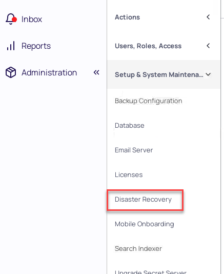
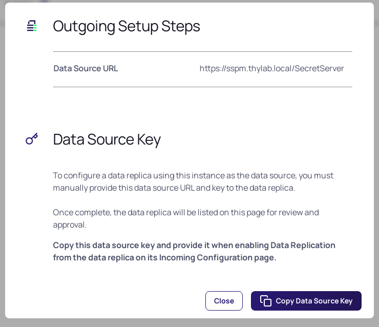
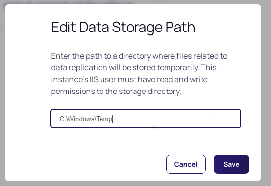
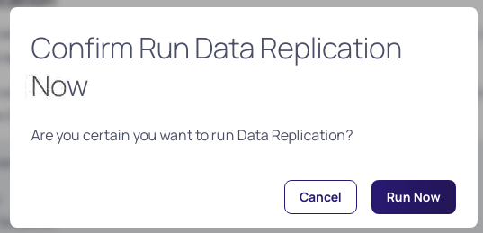
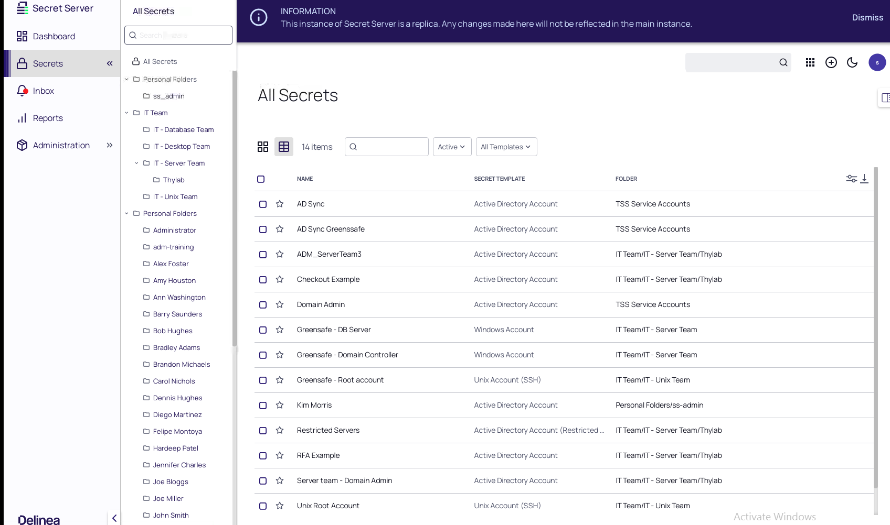

# Disaster Recovery

Since version 11.2 of Delinea Secret Server, Disaster Recovery (DR) has been added. This option makes it possible to have a standby instance available for Secrets. This part of the lab is on how to setup DR between On-Prem instances. The following scenario's can be setup in real life and are supported:

- On-Prem to Secret Server Cloud (but is an edge case)
- On-Prem to On-Prem
- Secret Server Cloud to Secret Server Cloud
- Secret Server Cloud to On-Prem 

---

**Remark**

In the DR scenario's the receiving side of the solution is PULLING the secrets. This means that in the last scenario, On-Prem to Secret Server Cloud, the On-Prem instance needs to aacessible AND have a valid certificate! Without this, that scenario can NOT be implemented.

In the current version the following can be replicated:

- Secrets
- Secret Templates
- Folders
- Launchers
- Roles

---

The following steps are described:

1. Set the correct role permissions for DR
2. Create a User Group that can access the Replicated information
3. Setup DR
4. Test DR

## Set the correct role permissions

As the DR permissions is by default not enabled  in any of the OOTB roles, it needs to be assigned to a role. The Administrator is going to be assigned this permission.

1. Open the console of **sspm-dr**
2. Start Chrome and open the UI at **https://sspm-dr.greensafe.lab/SecretServer**
3. Login using the below information:
 
   - **Username:** ss_admin
   - **Password:** *Provided by trainer*

4. Navigate to **Administration >> > Users, Roles, Access > Roles**
5. Click **Administrator**
6. Click the *Permissions* tab
7. Click **Add** and add the **Administer Disaster Recovery** permission

   

8. Close the panel on the right hand side by clicking the **X** in the topright corner
9. Refresh the browser and navigate to **Administration >> > Setup & System Maintenace** a new option will now be available **Disaster Recovery**

   

7. Open a new tab in Chrome and navigate to **https://sspm.thylab.local/SecretServer** and login as **ss-admin** with the corresponding password
8. Repeat steps 4 - 9 to set the permissions on the sspm server

## Create User Group

To make sure the Replication is only available for a certain group of people and not all, a group will be created and users will be assigned to the group that are alloowed to see/access the replicated secrets. As the DR side is a clean installtion, only the ss_admin account does exist. As this lab is about how to setup DR bewteen Secret Server instances, we are going to assign the ss_admin account to the group.

1. Switch back to the sspm-dr UI tab in Chrome, navigate to **Administration >> > Users, Roles, Access > Roles**
2. Click the *Groups* tab and click **Create Group**
3. Name the Group **DR-Users**
4. In the new window click **Add** to add the **ss_admin** user
## Setup DR

Now that we have the permissions set on both systems and we have a group, we can start to configure the DR.

1. Switch back to the sspm-dr UI tab, the first tab in Chrome and navigate to **Administration >> > Setup & System Maintenace**
2. Click on **Disaster Recovery** and **make sure you are in the *Incoming Configuration***
3. Click **Edit**
4. Set the following parameters:

   - **Enabled:** Checked
   - **Data Source URL:** https://sspm.thylab.local/SecretServer
   - **Group:** DR Users
   - **Data Source Key:** To get this Key, follow the next steps:

     1. Switch to the Second tab where the SSPM UI is located
     2. Click *Disaster Recovery* after you navigated to **Administration >> > Setup & System Maintenace**
     3. Click *Outgoing Configuration* tab
     4. Click **Outgoing Setup Steps**
     5. In the new screen, click **Copy Data Source Key**

        

     6. Switch back to the first tab (sspm-dr UI) and copy the information

        

5. Click **Save**
6. Switch back to the sspm UI and while still in **Disaster recovery**, refresh the browser. A message will be shown in the *Outgoing Configuration* tab
7. For the replication to be able to run, a Data Store Path has to be set. Click the text **< Not Set >** and set the path to **C:\Windows\Temp**

   

8. Click **Save**
9. Click the *Small Down Pointing arrow* next to the **Data Replica** to see details

   

10. In the details click the **Approve** button, also in the **Confirm Approve Data Replica** screen that apears

    

11. The status should change to Enabled with a Green checkbox in front of it

    

12. Switch back to the sspm-dr UI in Chrome and a message is shown stating *"This instance of Secret Server is a replica. Any changes made here will not be reflected in the main instance."*
13. Click **Test Connection** and a new screen will appear that the Connection was approved

    

14. Click **Close**
15. Click Secrets in the left hand side navigation bar and see that there are no secrets available

    

16. Navigate back to **Administration >> > Setup & System Maintenace > Disaster Recovery**
17. Click **Run data Replication** to start the replication
18. Click **Run Now** in the *Confirm Run data Replication Now* screen
19. Click **Close** in the Data Replication screen to close the screen
20. Click **Secrets** and after a few seconds all Folders, including all personal ones, and their corresponding secrets will be available in the sspm-dr UI

    
    

  
  

  
<H1 style="color:#00FF59">This concludes this part of the lab</H1>
