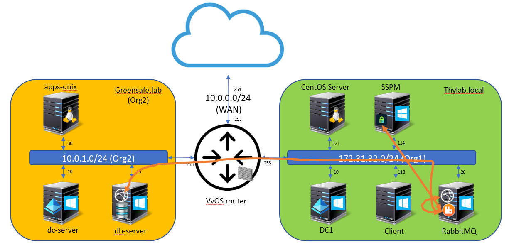

# Summarize the lab

To summarize what has been done:

1. Setup a Site Connector based on RabbitMQ
2. Define a site thylab.local
3. Deploy a Distributed Engine in the site
4. Define a second site greensafe.lab
5. Deploy a Distributed Engine in the site
6. Run discovery on the second site for users and computers
7. Configure and test SSH and RDP proxied sessions
8. Creating and testing Secrets Policies
9. Creating and testing Secret Server Teams and their setting and how that impacts what users can/can't do using Lists and Site restrictions
10. Create hooks on check out/in actions
12. Custom discovery to discover SQL Server accounts
13. Create a custom RPC for the existing VyOS router
14. Setup and use Disater Recovery of the Secret Server between the two domains

The total network traffic with respect to the Secret Server, the RabbitMQ and the DEs is shown below

Which simplified, is the same as the earlier shown picture

  
  

  
<H1 style="color:#00FF59">This concludes the lab</H1>
