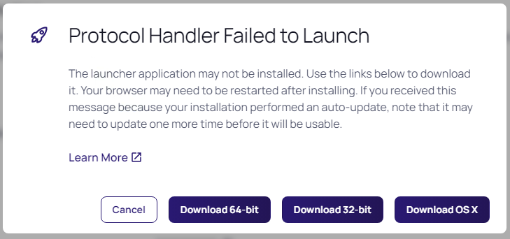
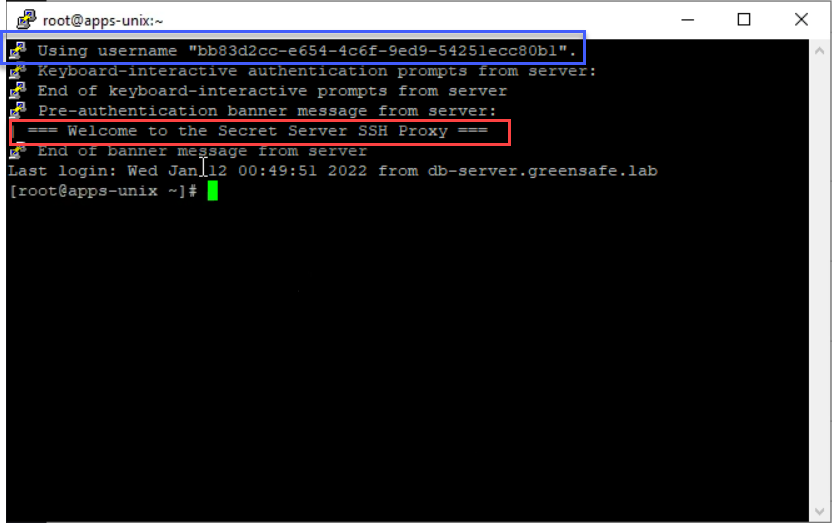

# Proxying SSH and RDP
To be able to connect to the second organisation Secret Server needs to be configured. There a couple a ways to do this. One is to keep the secrets in the Vault and use them to connect to the servers via RDP or SSH via the client machines of the users, but this will send the credentials over the network to the server. This means that the machine you are starting the connection from needs to have a direct connection to the server. 

Another option is to use the Secret Server instance and/or DE to proxy the connection towards the server. This will NOT have the user's machine connect directly to the server, but use the proxy as the endpoint of the connection. This last option is what is the most secure path. Credentials are NOT send towards the servers. Instead a temporary account is being used to make the connection to the server. After the session is done, the account will be deleted and there is no connection anymore possible to the server using that account.

## Overview of the traffic
Below diagram show the traffic for SSH and RDP and the involved machines from the infrastructure

### Scenario 1:
Connect to greensafe.lab ssh host, apps-unix.greensafe.lab, from the client VM in a SSH proxied connection


### Scenario 2:
Connect to greensafe.lab RDP host, dc-server.greensafe.lab, from the client VM in a RDP proxied connection


## Enabling Proxying
1. Navigate to **Administration >> > Actions > Proxying > SSH Proxy** tab and click **Edit** next to *Enable SSH Proxy*
2. Enable SSH Proxy and click **Save**

    

3. Navigate to **RDP Proxy** tab and click **Edit** next to *Enable RDP Proxy*
4. Enable RDP Proxy and click Save
5. The RDP port has been set to 3390 as 3389 is taken by Windows self
6. Click **Edit** next to *RDP Server Certificate*

    

7. Click **Change**
8. *Navigate to Downloads* in the popup screen
9. Select the **sspm.thylab.local** certificate
10. Provide the password **Thycotic**
11. Click **Save**
12. As both orgnisations use self-signed certificates and might use the same computernames, small changes need to be made for RDP to work
    - Click Edit on Validate Remote Certificates and uncheck it, then click **Save**
    - Click Edit on Allow AD Site Selection and check it, then click **Save**
12. Click the **Endpoints tab**
13. Click **Edit** behind the SSPM machine
14. Fill the *Public Hostname or IP* as **172.31.32.114**

    

15. Click **Save**
16. Under **SITES**, click the **Edit** (to the far right) next to thylab.local
17. Enable SSH and RDP proxy, leave the default ports

    

18. Click **Save**
19. Repeat the steps for the greensafe.lab site
20. Both sites should now have RDP and SSH enabled and respectively port 3390 and 22

    

## Test the proxy

In this part of the lab we are going to check that we are using the proxy to connect to the server. Firstly SSH and then RDP connections. To connect to the remote machines secrets are needed. Then these secrets can be used to connect the machines using Secret Server and/or the DEs as proxy.

### Creating Extra Secrets
1. Navigate to Secrets >> > IT Team > IT - Unix Team

    

2. Create a secret with the following parameters:
    - **Secret Template:** Unix Account (SSH)
    - **Secret name:** Greensafe - Root account
    - **Machine:** apps-unix.greensafe.lab
    - **Username:** root
    - **Password:** password1
    - **Site:** greensafe.lab

    

3. Click **Create Secret**
4. click the **Security Tab**
5. See that the Enable proxy is enabled (scroll down to see the setting)
6. Navigate to Secrets >> > IT Team > IT - Server Team
7. Create a secret with the following parameters:
    - **Secret Template:** Windows Account
    - Secret name: Greensafe - Domain Controller
    - Machine: dc-server
    - Username: Administrator
    - Password: Centr1fy
    - Site: greensafe.lab

    

8. Click **Create Secret**
9. Due to a policy that is running on this folder, comments have to be given. Click **Comment** and provide some text and click **Check Out Secret**
10. Under the *Security Tab*, make sure the Proxy is enabled, if not, make it so and return to the General tab

    

---

**NOTE**
Make sure that the **apps-unix and CentOS Server** VMs are in a running state before proceeding!

---
### Proxied SSH connection
1. Switch to the **Client** machine and login using the **adm-training** account
2. Open Chrome and navigate to the Secret Server UI (you can set chrome as the default browser) and login as **ss-admin**
3. Navigate to **Secrets >> > IT Team > IT Unix team**
4. Click the **Greensafe - Root account** secret
5. Run the **PuTTY Launcher**
6. On the *Protocol Handler Failed to Launch* message, click **Download 64-bit**

    

7. Run the downloaded MSI, no interaction, other than the UAC, is needed
8. Click **Cancel** and relaunch the PuTTY Launcher
9. On the Open RDPWinBootstrapper screen that opens, check the box and click the Open RDPWinBootstrapper

    

10. Click **Yes** on the warning for the connection
11. Click **Accept** on the Putty Security Alert
2. When you are logged into the Linux server, a banner has been shown that says **=== Welcome to the Secret Server SSH Proxy ===**. Also the temporary user name is shown in the screen (in the blue box)

    

3. Run ```netstat -a | grep ssh``` you will see that you have now a connection via the Distributed Engine in the greensafe.lab domain (db-server.greensafe.lab) 

    

4. There is no direct connection from the client (172.31.32.118)

    

4. Logout from the server using CTRL+D

### Proxied RDP connection
1. Wile still being on the *Client VM*, navigate to **Secrets >> > IT Team > IT - Server Admin > Greensafe - Domain Controller** and provide a comment
2. Launch the RDP launcher and you should see a connection being made to the Desktop of the dc-server
3. When you get Warning Messages, agree on all of them for the connection. This is due to self signed certificates that have not been embedded in the environment
3. Open a CMD prompt and type ```netstat -a | findstr /c:3389```
4. This command shows the RDP session that is established. Only from DB-SERVER (our Distributed Engine in the domain) is shown, not the client machine

    

2. Close the session by signing out

  <HR>
  <center><H1 style="color:#00FF59">This concludes this part of the lab</H1></center>