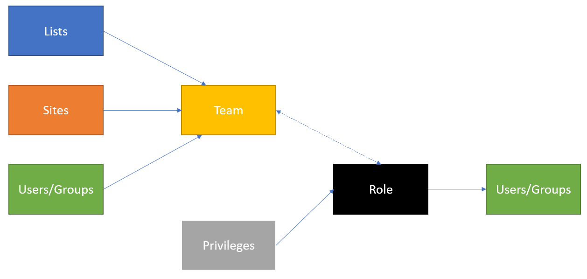
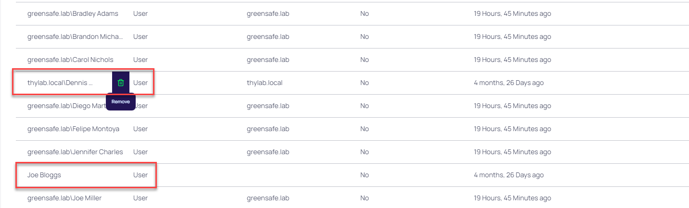
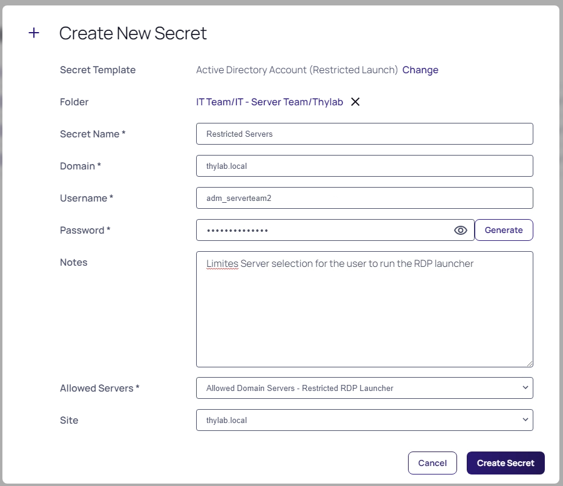
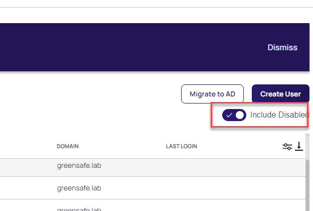

# Teams
With Secret Server teams, administrators can create special groups called teams to restrict what users can see. A team bundles users and groups to assign them the same rules as to what other users and sites are visible to them. For example, a managed service provider could isolate their customers from seeing other customer’s user accounts or a large company could "firewall" their users by department. Site visibility can also be restricted by teams. 

The scenario we are solving is that Dennis Hughes and Joe Bloggs, even though they can see all Windows Servers in the Secret Server instance, we want to limit their view on the use of the Server Team - Domain Admin secret to allow only one server. Also they can not have the choice of selecting which Proxy to use for the connection as that might lead into issues for them when they selected the wrong one and more WAN traffic, or even errors might occur. The rest of the IT Admins have to have normal use, not limited by anything.

Use the below diagram to understand what is being configured in this lab.

## Create a Team Role
1. In the Secret Server UI log out from Denis Hughes' account and log back in as **ss-admin**, navigate to **Administration >> > Users, Roles, Access > Roles**
2. Create a role named **Role - Teams Assigned** by clicking **Create Role** and click on the newly created role. Set the following rights (on the **Permissions** tab):
    - Add Secret
    - Allow Access Challenge
    - Assign Secret Policy
    - Copy Secret
    - Delete Secret
    - Delete Secrets from Reports
    - Edit Secret
    - Own Secret
    - Personal Folders
    - User Audit Expire Secrets
    - View About
    - View Advanced Dashboard
    - View Advanced Secret Options
    - View Launcher Password
    - View Password Requirements
    - View Secret
    - View Secret Audit
    - View Secret Password and Private Key History
3. Click the **X** icon in the to be *Add Permission* navbar

   

## Create Teams
1. In the Secret Server UI, navigate to **Administration >> > user, Roles, Access > Teams**
2. Click **Create Team**
3. Use the following parameters:
    - Team Name: Thylab domain
    - Team Description: Thylab domain
4. Click **Create Team**
5. Click the **Sites** tab and click **Edit**
6. Check the **Should Restrict Sites**
7. Under Add Site, select the **thylab.lab** site (the users available in Secret Server)

    

8. Click **Save**
9. Click *Members* tab and click **Edit** next to Members
10. Add user Joe Bloggs and Dennis Hughes to the team

    

11. Click **Save**

## Assigning the Team role to the users
1. Navigate to **Administration >> > User, Roles, Access > Roles**
2. Click **Role - Teams Assigned**
3. Open the **Assingment** tab, if you are not on it
4. Click **Add**
5. Drag **thylab.local\Dennis Hughes** and **Joe Bloggs** from the pane on the right hand side
6. Close the **Add Users and Groups** panel to "save" the changes
7. Click the **Roles** text in the top of the screen and click the **User Role**
9. Delete **thylab.local\Dennis Hughes** and **Joe Bloggs** from the pane by hoovering over their names and click the **Bin** icon

    

## Testing the set Teams
1. Log out from the Secret Server UI
2. Log back in as **dhughes** with the password **Thycotic@2022!** in the **Thylab** domain 
3. Navigate to **Secrets >> > IT Team > IT - Server Team > Thylab**
4. Open the **Server team - Domain Admin** secret
5. Fill out the Comment (as the policy requires this)
6. Run the **RDP Launcher**
7. Due to the teams restriction only the dropdown box for **Enter Computer** has been given
    
    

8. Click **Cancel**, **Check in the secret** and **log out** of the UI
8. Login as user JBloggs (**Thycotic/4u**) on the **Local** domain has no access at all. 

   ---
   
   **NOTE**
   You will have to change the password of this user

   ---

9. Log out Joe Bloggs
9. Log in as user **hpatel** with password **Thycotic@2022!** in the **Thylab** domain has no limitation on using the **Server team - Domain Admin** Secret other than the dropdown list of the server to connect to. Click **Cancel**
1. Log out hpatel

## Change to the existing list

One of the items that we can manipulate to limit the amount of servers a user can see is using a feature called Lists. These can be used to limit the possibilities for connections.

1. Log in to the Secret Server UI as ss-admin
2. Navigate to **Administration >> > Ations > Lists**
3. Open the **Allowed Domain Servers- Restricted RDP Launcher**
4. Remove DC1 and SSPM by clicking the three dots on the right side of the name and click **Delete** Option, click **OK** on the warning screen

    

5. Click Add > Create Option

    

6. In the Option Name provide **RabbitMQ**, leave the *Parent Category* as **Uncategorized** and click **Save**
    
    

7. Click **Save**

## Changing the Secret Template
As the existing secret Server team - Domain Admin secret has been created using a specific Secret Template, changes need to be made. The outcome should be that the people in the IT team can see and use the secret with no limitation. Joe Bloggs and Dennis Hughes (a Junior Admin) should have a limitation to a secret. These changes are:

- Change the Secret Template that has been used while the Server team - Domain Admin was created
- Change the Group membership that Dennis Hughes has been assigned to in AD. This has been a mistake.
- Create a secret that uses the restricted list for its Launcher

1. Log in the Secret Server UI as **ss-admin** and navigate to **Secrets >> > IT Team > IT - Server Team > Thylab**
2. Check the **Server Team - Domain Admin** and click **Bul Actions** in the bottom of the screen

    

3. Select **Convert Secret Template**

    

4. Select **Active Directory Account**, in the next screen leave all default. The *Allow Servers will be removed*

    

5. Click **Create Secret**
6. Wait till the Bulk Progress is ready and click **Close**

    

7. Click the + sign to create a new Secret
8. Select **Active Directory Account (Restricted Launch)**
9. Use the following parameters for the secret
    - Secret name: Restricted Servers
    - Domain: thylab.local
    - Username: adm_serverteam2
    - Password: Thycotic@2022!
    - Notes: Limited Server selection for the user to run the RDP Launcher
    - Allowed Servers: Allowed Domain Servers - Restricted RDP Launcher
    - Site: thylab.local

    

10. Click **Create Secret**
11. Provide a comment and click **Check Out Secret**
12. Click the **Sharing** tab click **Edit** 
12. Uncheck *Inherit Permission* from folder and *remove all but the ss-admin account*
13. Add accounts JBloggs and Dennis Hughes

    

13. Click **Add**
14. Make sure both accounts have *View rights* (default)
15. Click **Save**

    

16. Check the secret back in

## Changing Dennis Hughes account
After a few weeks in Dennis has been given the full admin rights on all servers in the domain using Secret Server by putting his account in Active Directory in the IT- Team Server groups. To limit what he can do, his manager decided to take him out of the group and let him start slowly.

1. Login to the **DC1** machine with the **thylab\administrator** account
2. Open **Active Directory Users and Computers** and find **Dennis Hughes under Users**

    

3. Double click the account and click **Member Of**
4. Remove the **IT - Server Team** from his account so that he becomes a normal Domain User. Click **Yes** on the warning message
5. Click **OK**
6. Logout of the DC1 console and return to the Client machine
7. Back in the Secret Server UI navigate to **Administration >> > Users, Roles, Access > Directory Services** and click **Sync Now** to make the changes known to Secret Server
8. This Sync will disable Dennis' account that needs to be reneabled. Navigate to **Administration >> > Users, Roles, Access > User Management**
9. Switch the **Include Disabled** to show the disabled users

    

10. Find **DHughes** and set the checkbox in front of him. To get the checkbox, hoover over the account
11. Click the **Select Bulk Action** and select **Enable Users**

    

12. When asked to Confirm click **OK** and **Close** the Bulk Progress message
## Test the account
1. To test the effects of Teams, log the current user out of the Secret Server UI
2. Log back is as **DHughes** in the **Thylab** domain
3. There is only one secret available, the one created earlier Restricted Servers, with no folders

    

4. Open the Secret, click Enter Comment and enter some Comment (this due to policies set earlier)
5. Click the **RDP Launcher**
6. Due to the list and the used Secret Template, the user can only select a server. The possibility of providing a server is not possible

    

7. Click **Launch Now**
8. After clicking **Connect** and **Yes** the RDP session to the RabbitMQ should be shown
9. Close the session
10. Check the secret back in

  
  

  
<H1 style="color:#00FF59">This concludes this part of the lab</H1>
