# Secret Server advanced Lab

This lab will be a sequel to the Secret Server Training Lab where the thylab.local domain has been fully configured.

This lab is emulating a scenario in which an organisation (thylab.local) has merged with a second organisation (greensafe.lab domain) and the administrators for the first organisation need the ability to control the second AD using Secret Server.

Below is a diagram of the two organisation as it has been build in the lab infrastructure.

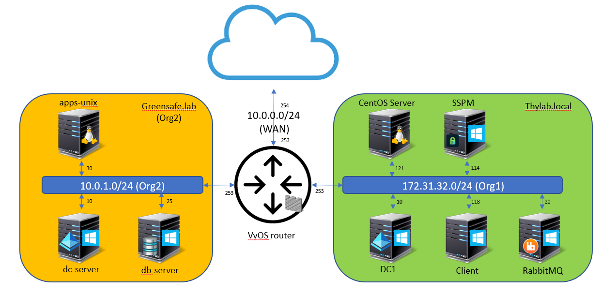

This lab will highlight the following topics:
1. Installing RabbitMQ
2. Use of Sites
3. Use of Distributed Engines
4. Use of Lists
5. Use of Teams
6. Use of the combination of Teams and lists

# Configure Site Connector

A site Connector is what binds the Secret Server instance with its Distributed Engine(s). The Site Connector is using the message queueing mechanism to make sure jobs and results are exchanged in a modular fashion between the DEs and Secret Server. This also makes it possible to implement Secret Server as a High Availability solution.

The supported two Message Queueing (MQ) mechanisms are MemoryMQ and Rabbit MQ. The first one is suitable for very small or testing/demo installations. The problem with this MQ is that it runs in the memory of the Secret Server and is therefore limited. It can not be clustered is one of its limitations. The other solution, highly recommended, is using [RabbitMQ](https://rabitmq.com). This MQ is a dedicated instance that is specially built for the task and seen as one of the popular open source MQ.


## Installation process high level:
1. Configuration for the new Site Connector to be using RabbitMQ
2. Install RabbitMQ using the [RabbitMQ helper](https://docs.thycotic.com/ss/11.1.0/secret-server-setup/installation/installing-rabbitmq/index.md)
3. Configuration check on connectivity
4. Create site and install Distributed Engine in one site
5. Create Site and install Distributed Engine in second sites

## Configure Secret Server
1. Open the SSPM and login as adm-training 
2. Open Secret Server at https://sspm.thylab.lab/SecretServer
3. Login as ss-admin with the password Thycotic
4. You may be asked to reset the password. Use you own password as long as you remember it ;)..
5. Navigate to Admin > Distributed Engine
6. Click Configure
8. Use the following settings for the Site Connector

    - Queue Type: RabbitMQ
    - Name: rabbitmq
    - Active: Checked
    - SSL: Unchecked
    - Host name: rabbitmq.thylab.local
    - Port: 5672

    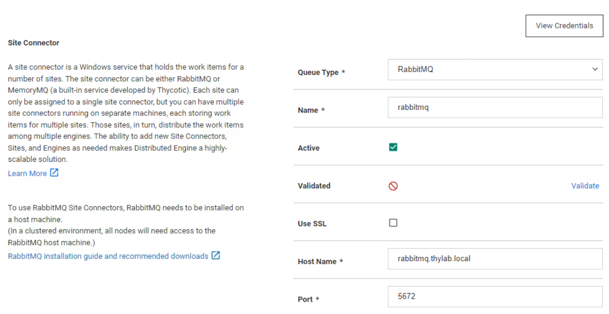

9. Click Save

## Installation of RabbitMQ
1. Open the RabbitMQ server and login as adm-training
2. Open the URL https://updates.thycotic.net/links.ashx?RabbitMqInstaller to download the RabbitMQ Helper
3. Run the downloaded MSI file
4. Open Secret Server at https://sspm.thylab.lab/SecretServer 
5. Login as ss-admin with the password you set (this will log you out of the SSPM Secret Server UI if you refresh that browser on the SSPM server)
6. Navigate to Admin > Distributed Engine
7. Click Configure
8. Click View Credentials. Keep this open as it needed in the next steps
   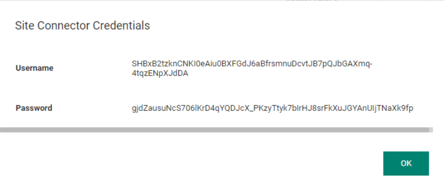
9. Open Windows Explorer
10. Navigate to %PROGRAMFILES% > Thycotic Software Ltd > RabbitMq Helper and run Thycotic.RabbitMq.Helper.exe
11. This will open a PowerShell command line
12. Copy these lines into the PowerShell session:

```powershell
$cred = Get-Credential -Message "Enter the initial RabbitMq user username and password";
#if you don't want to be prompted you can hardcode your credential in the script
#$password = ConvertTo-SecureString "PlainTextPassword" -AsPlainText -Force
#$cred = New-Object System.Management.Automation.PSCredential ("CustomUserName", $password)

Install-Connector `
    -Credential $cred `
    -UseThycoticMirror -Verbose
```
---

**Note**
This script assumes your environment has an internet connection. If not, please check https://thycotic.github.io/rabbitmq-helper/installation/ for you Scenario.

--- 
13. Hit Enter to execute the lines
14. The user name and the password are provided by the Secret Server as shown after clicking View Credentials
    
    

15. Copy the username and password in the Messagebox (you can click them and a popup box at the bottom of the screen will show telling it copied respectively the username and password) and click OK
16. When warnings are given on Agree on Licenses, type Y and Enter
17. This will Download, install and Configure RabbitMQ on the machine. The process takes approx. 5 minutes
18. The RabbitMQ Management webpage should open of RabbitMQ. This means RabbitMQ has been installed and configured. You can close this interface as we don't need it
    
    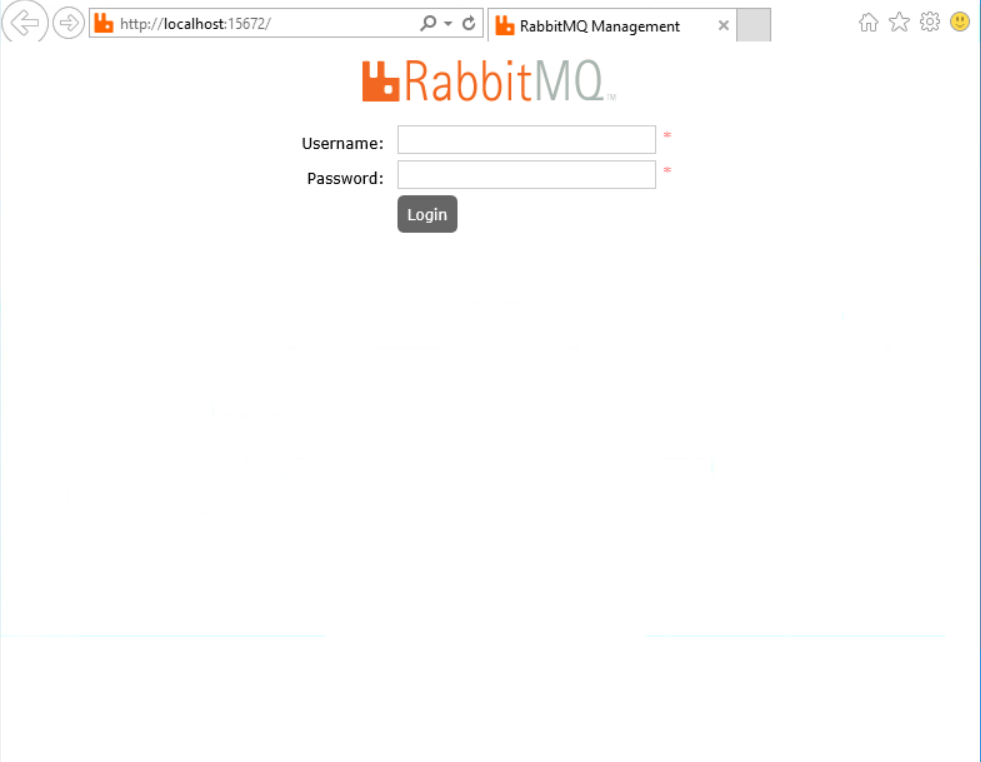

19. Back in your Secret Server UI (on RabbitMQ), click OK to close the credentials screen
20. Click Validate, next to validated to make sure the RabbitMQ is correctly installed

    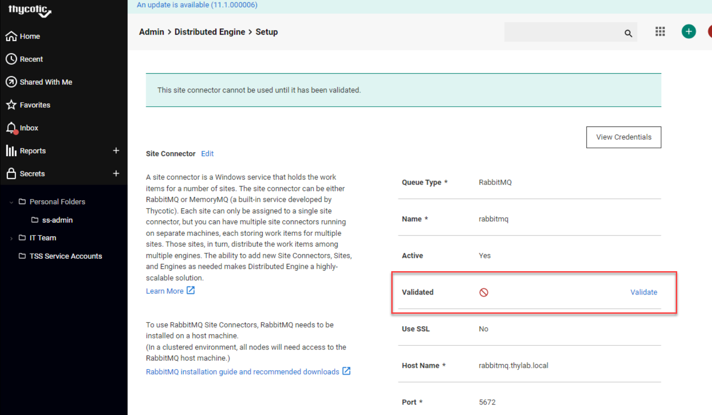

21. In the next screen click Validate
22. Click Save

    

23. If no errors have been detected, you will be presented with the Site screen configuration

## Add thylab.local site
1. In the Site screen name the site thylab.local
3. Set the Site Connector to rabbitmq
4. Set the Engine callback Interval to 30 (seconds). This is just for testing/demoing purpose. In production this would be 5 minutes, depending on the organization and the jobs that need to be run in the site.
    
    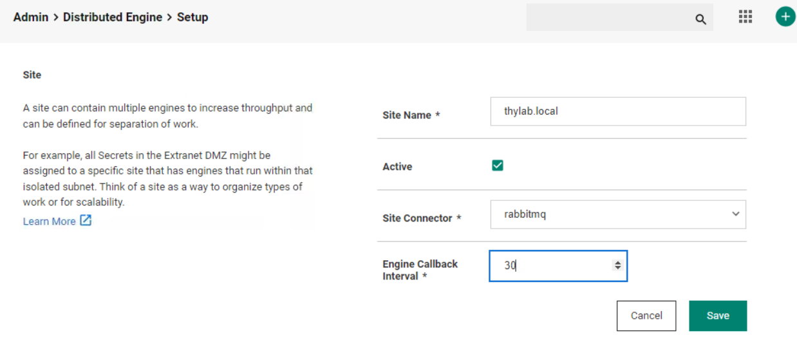

5. Click Save


## First Distributed Engine (DE)
1. In the next screen make sure that:
    - Processor Architecture is 64-bit
    - Preconfigured Site: thylab.local

    

2. Click Download Now
3. After the download, goto the Downloads directory using Windows Explorer and Extract the download ZIP file (Right-click the file and Extract...)
4. When the extraction has been done, open the extract folder and run the setup.exe (no interaction is needed)

    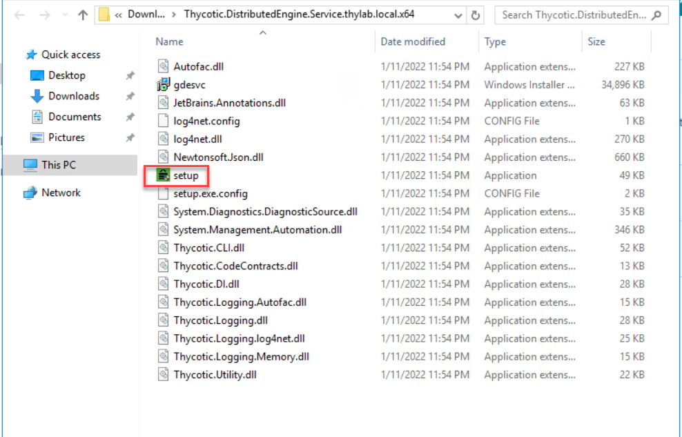

5. Close the Windows Explorer screen and return to the Secret Server UI
6. In Site: thylab.local there should be a amber "warning" of 1 Engine Pending

    

7. Expand the section and hoover the mouse of the RabbitMQ.thylab.local DE.
8. On the right side of that DE, click the three dots and select Activate

    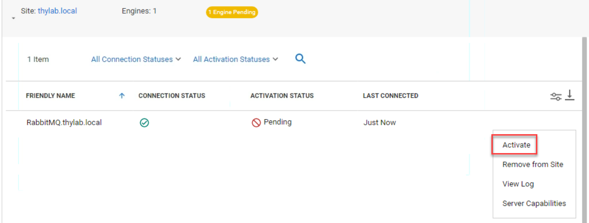

9. Click OK in the confirmation message. This will now, if all configured correct, will have two green check marks

    

10. Close the Browser screen and logout as we are ready for now on this server
# Add second site

There is now one site (thylab.local) configured with a DE assigned to it. 


As the organisation has merged with a second organisation, Greensafe, we now need to configure Secret Server that there is another site that needs to be managed by Secret Server via a DE. This will be done by:

1. Defining another site
2. Install and assign a DE to the greensafe.lab site

## Add site
1. Open the console of the db-server server, login as Alex Foster (afoster) with the password Centr1fy and open the URL using Chrome (you can set Chrome as the default browser)of the Secret Server and login using the ss-admin account with your set password
2. Navigate to Admin > Distributed Engine
1. Click Add Site
2. Name the site greensafe.lab
3. Set the Site Connector to rabbitmq

   

4. Set the Engine callback Interval to 30 (seconds). This is just for testing/demoing purpose. In production this would be 5 minutes, depending on the organization and the jobs that need to be run in the site.
5. Click Add Site

## Install a DE in the second infrastructure
Now that the second organisation is added as a site, it needs to be provided with a DE, that way Secret Server can communicate over port 443 with the Greensafe infrastructure using the distributed engine. An other reason for deploying a DE is that it will allow us to scan and run Remote Password Changers (RPC) decentralised in the Greensafe Infrastructure.

2. Navigate to Admin > Distributed Engine
3. Click Add Engine
4. Check the Processor Architecture and make sue it says 64-bit
5. Set the Preconfigured site to greensafe.lab

    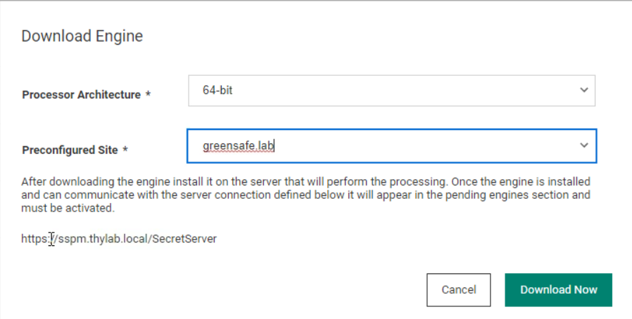

6. Click Download Now to download a ZIP file
8. Open a Windows Explorer and navigate to Downloads
9. Copy the ZIP file to Downloads and extract it
10. Extract the ZIP file and run the setup.exe Application

    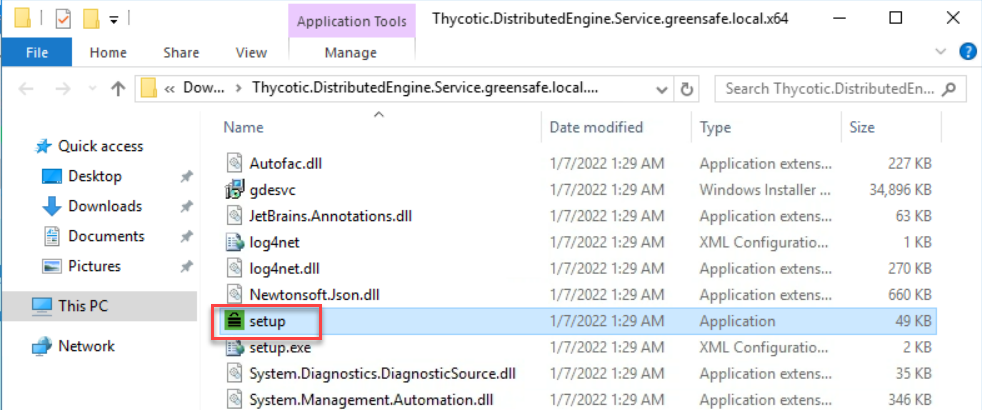

11. Close the Windows Explorer screens
11. Return to the Secret Server UI and make sure you are at Admin > Distributed Engine
12. After a few seconds, your deployed engine should be seen in the UI in the Pending Engines section. If the DE isn't shown, refresh your browser

    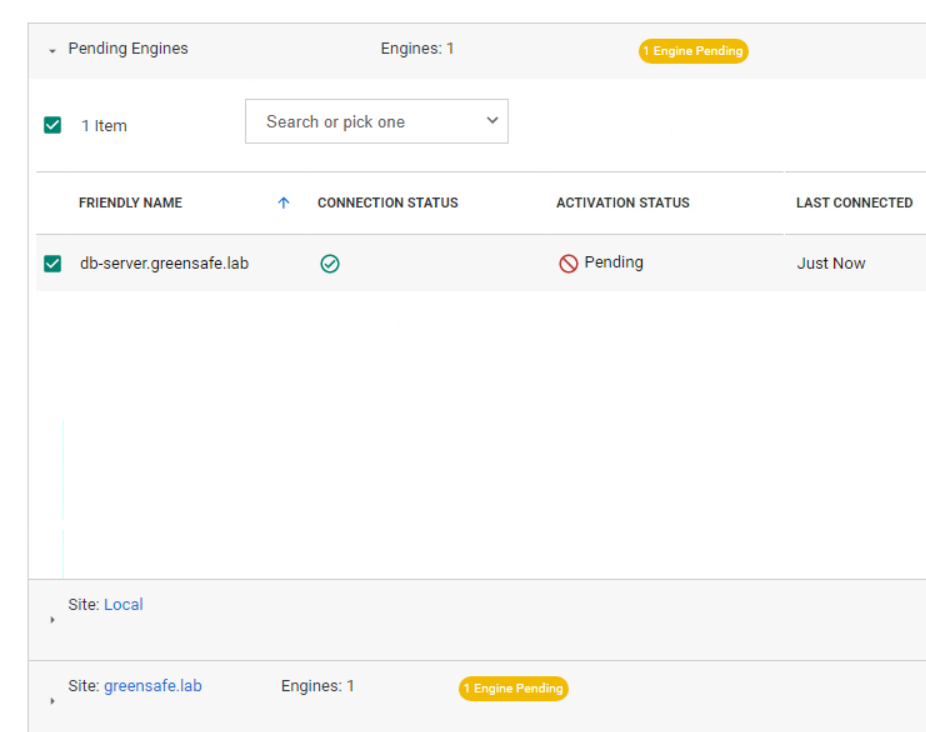

13. Open the greensafe.lab site
14. Hoover over the db-server.greensafe.lab engine and click the three dots on the right

    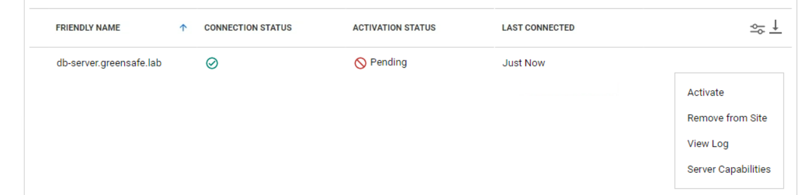

15. Click Activate and OK
16. If there is still a warning box next to the greensafe.lab site, refresh your browser
17. Your UI should look like the below screenshot if all went well

    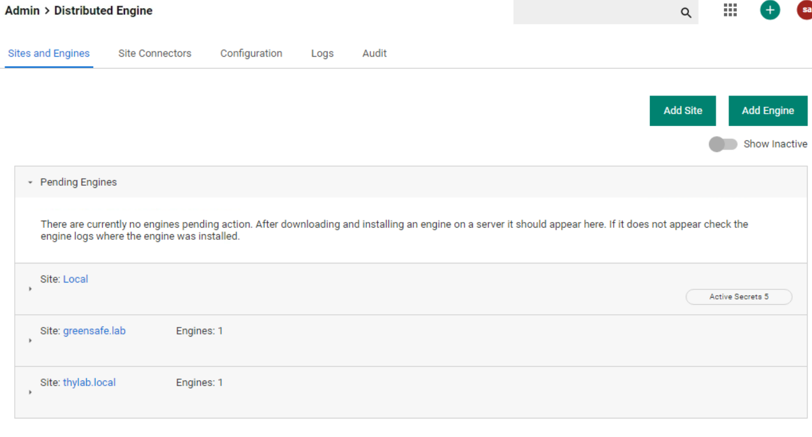

# Discovery of the second domain

Now that both organisations have been added to the Secret Server instance it is time to start the Discovery of the domains.

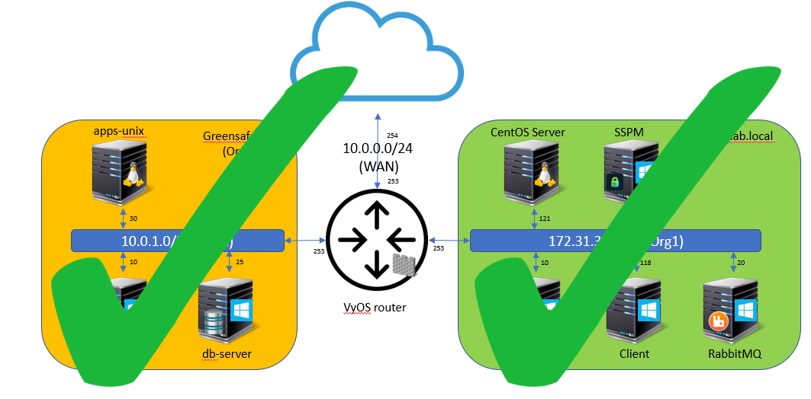

To be able to manage the second infrastructure via the DE, discovery needs to be configured for that domain. After the discovery of Machine, Dependencies and Accounts the next configuration step can take place, defining the correct access rights to the Domain admins of the two different organisations.

## Adding secret for AD Sync Greensafe
1. Log out of the db-server
2. Switch back to the SSPM server and refresh your browser
3. Login as ss-admin (as we have been logged out due to the login on the db-server, re-login is needed)
4. Navigate to Secrets > TSS Service Accounts and add a new secret
5. Make sure the template to use is Active Directory
6. Use the following parameters
    - Secret Name: AD Sync Greensafe
    - Domain: greensafe.lab
    - Username: cfyadmin
    - Password: Centr1fy
    - Notes: Account used for Discovery Scan Greensafe
    - Site: greensafe.lab
7. Click Create Secret


## Configure Directory Service Greensafe

1. Navigate to Admin > Directory Services
2. Add Domain > Active Directory Domain
3. Use the following parameters
    - Fully Qualified Domain Name: greensafe.lab
    - Friendly name: Greensafe
    - Synchronization Secret: AD Sync Greensafe
    - Site: greensafe.lab

    

4. Click Validate & Save
5. In the groups select the following groups:
    - Domain Admins
    - Team_Auditors
    - Team_Contractors
    - Team_Finance
    - Team_Helpdesk
    - Team_IT
    - Team_Sales
    - Team_Security
    - Team_UnixAdmins
    - Team_UNIXDBA
    - Team_WindowsDBA
6. Run Sync Now

## Configure and run Discovery Scanner for Greensafe
1. Navigate to Admin > Discovery
2. Click Create Discovery Source > Active Directory
3. Use the following parameters
    - Discovery Source Name: greensafe.lab
    - Fully Qualified Domain Name: greensafe.lab
    - Friendly name: Greensafe
    - Discovery Secret: AD Sync Greensafe
    - Discovery Site: greensafe.lab

    

4. Click Create
5. In the next step, under Find Dependencies, select all options

    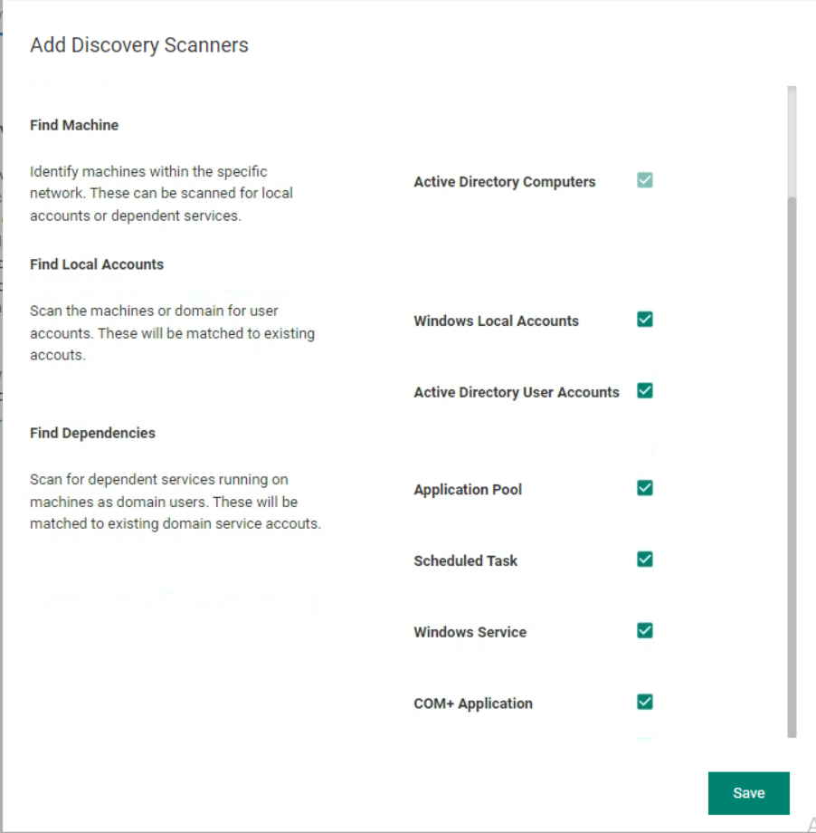

6. Click Save
7. Navigate back to Admin > Discovery
8. Click Run Discovery Now > Run Discovery Scan
9. Wait till the status from Running has switched to Last Run: Just Now

    

10. Repeat the same steps, but now Run Computer scan, this will detect local accounts

## See the discovered accounts
1. Click Discovery Network View 
2. You should now have two domains being mentioned
3. Expand both domain and have a look around. Click the tabs (Local Account, Public Keys, Service Accounts and Domain\Cloud Accounts) all should have some info.

    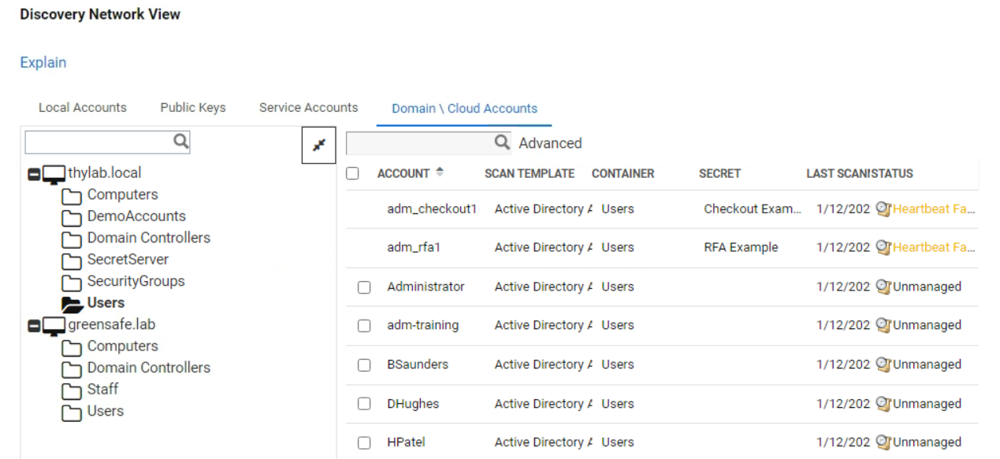

4. This means the Discovery scan has run successfully and Secret Server can now start to control the accounts.

# Proxying SSH and RDP
To be able to connect to the second organisation Secret Server needs to be configured. There a couple a ways to do this. One is to keep the secrets in the Vault and use them to connect to the servers via RDP or SSH via the client machines of the users, but this will send the credentials over the network to the server. This means that the machine you are starting the connection from needs to have a direct connection to the server. 

Another option is to use the Secret Server instance and/or DE to proxy the connection towards the server. This will NOT have the user's machine connect directly to the server, but use the proxy as the endpoint of the connection. This last option is what is the most secure path. Credentials are NOT send towards the servers. Instead a temporary account is being used to make the connection to the server. After the session is done, the account will be deleted and there is no connection anymore possible to the server using that account.

## Overview of the traffic
Below diagram show the traffic for SSH and RDP and the involved machines from the infrastructure

### Scenario 1:
Connect to greensafe.lab ssh host, apps-unix.greensafe.lab, from the client VM in a SSH proxied connection


### Scenario 2:
Connect to greensafe.lab RDP host, dc-server.greensafe.lab, from the client VM in a RDP proxied connection

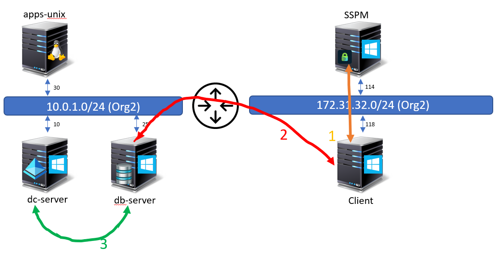

## Enabling Proxying
1. Navigate to Admin > Proxying > SSH Proxy tab
2. Enable SSH Proxy and click Save

    

3. Navigate to Admin > Proxying > RDP Proxy tab
4. Enable RDP Proxy and click Save
5. The RDP port has been set to 3390 as 3389, is taken by Windows self
6. Click Edit in the RDP Server Certificate

    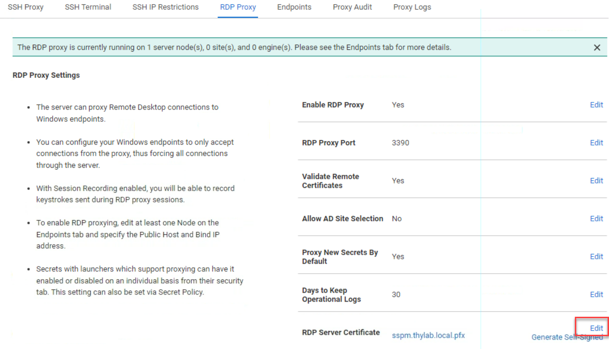

7. Click Change
8. Navigate to Downloads in the popup screen
9. Select the sspm.thylab.local certificate
10. Provide the password Thycotic
11. Click Save
12. As both orgnisations use self-signed certificates and might use the same computernames, small changes need to be made for RDP to work
    - Click Edit on Validate Remote Certificates and uncheck it
    - Click Edit on Allow AD Site Selection and check it
12. Click the Endpoints tab
13. Click Edit behind the SSPM machine
14. Fill the Public HOST IP as 172.31.32.114

    

15. Click Save
16. Under SITE NAME, click the Edit (to the far right) next to thylab.local
17. Enable SSH and RDP proxy, leave the default ports

    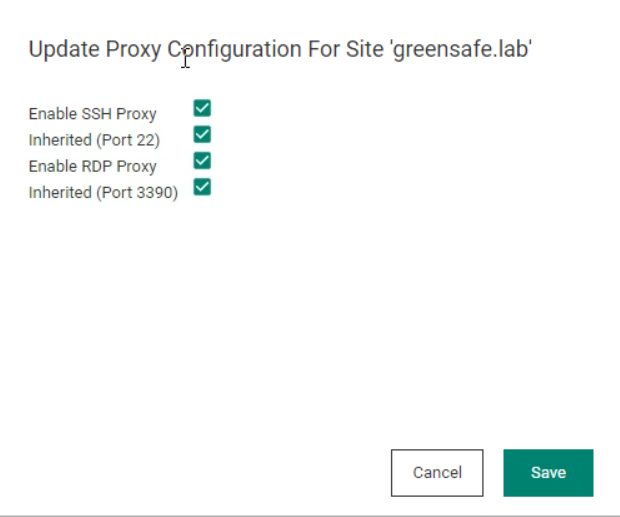

18. Click Save
19. Repeat the steps for the greensafe.lab site
20. Both sites should now have RDP and SSH enabled and respectively port 3390 and 22

    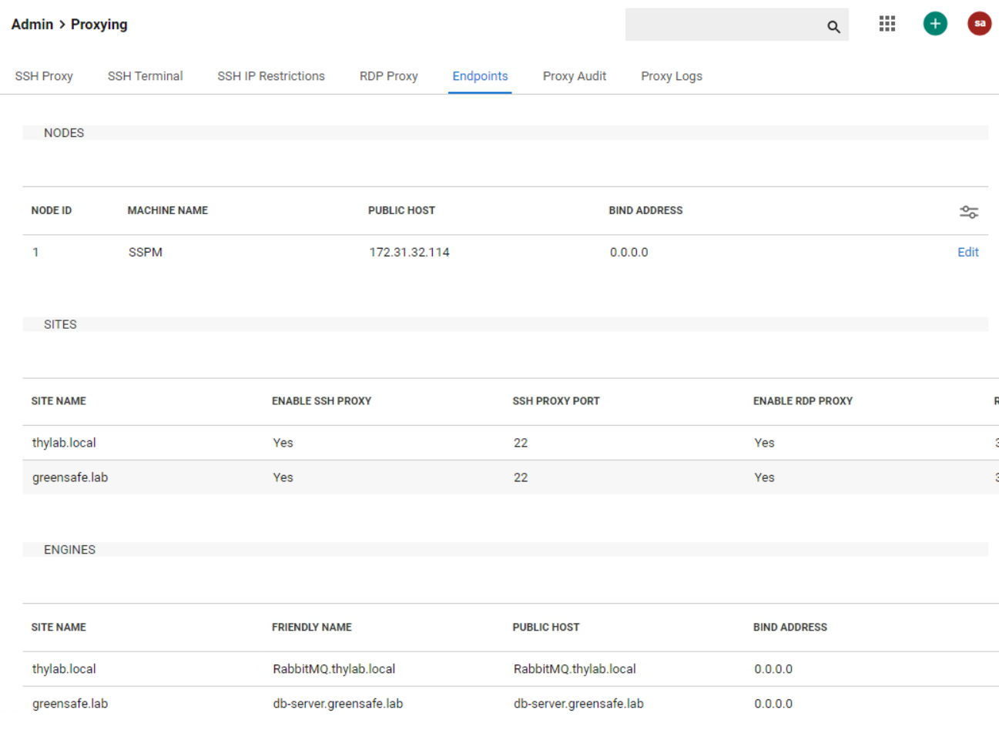

## Test the proxy

In this part of the lab we are going to check that we are using the proxy to connect to the server. Firstly SSH and then RDP connections. To connect to the remote machines secrets are needed. Then these secrets can be used to connect the machines using Secret Server and/or the DEs as proxy.

### Creating Extra Secrets
1. Navigate to Secrets > IT Team > IT - Unix Admin

    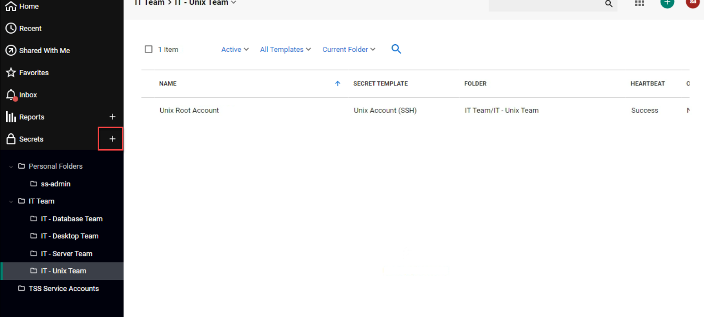

2. Create a secret with the following parameters:
    - Unix Account (SSH)
    - Secret name: Greensafe - Root account
    - Machine: apps-unix.greensafe.lab
    - Username: root
    - Password: password1
    - Site: greensafe.lab
3. Click Create Secret
4. click the Security Tab
5. See that the Enable proxy is enabled (scroll down to see the setting)
6. Navigate to Secrets > IT Team > IT - Server Admin
7. Create a secret with the following parameters:
    - Windows Account
    - Secret name: Greensafe - Domain Controller
    - Machine: dc-server
    - Username: Administrator
    - Password: Centr1fy
    - Site: greensafe.lab

    

8. Click Create Secret
9. Due to a policy that is running on this folder, comments have to be given. Click Comment and provide some text and click Check Out Secret
10. Under the Security Tab, make sure the Proxy is enabled, if not, make it so and return to the General tab

    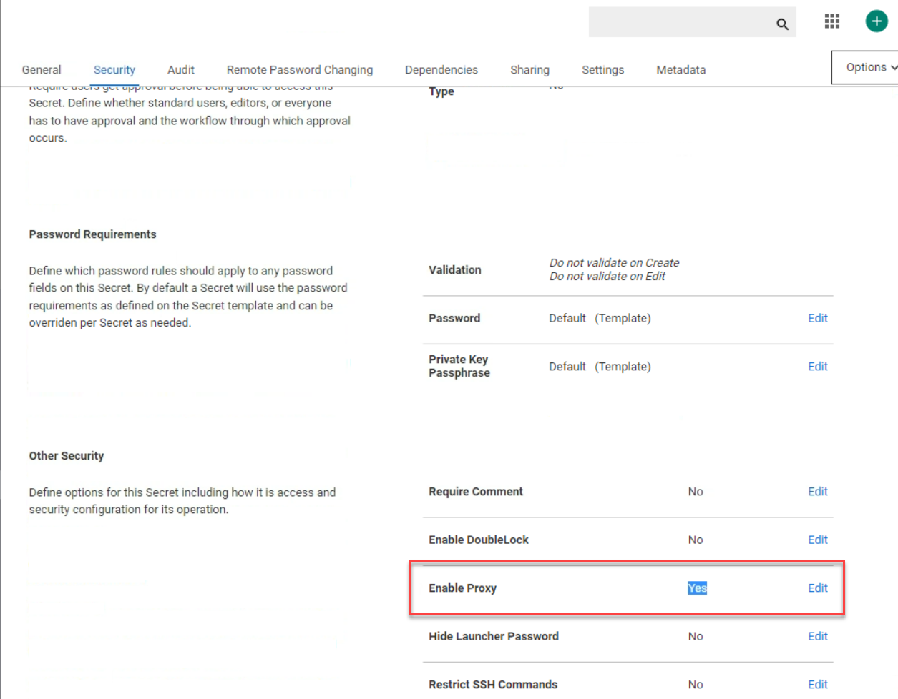

### Proxied SSH connection
1. Switch to the Client machine and login using the adm-training account
2. Open Chrome and navigate to the Secret Server UI (you can set chrome as the default browser) and login as ss-admin
3. Navigate to Secrets > IT Team > IT Unix team
4. Click the Greensafe - Root account secret
5. Open the PuTTY Launcher
6. ON the Protocol Handler Failed to Launch message, click Download 64-bit

    

7. Run the downloaded MSI, no interaction, other than the UAC, is needed
8. Click Cancel and relaunch the PuTTY Launcher
9. On the Open RDPWinBootstrapper screen that opens, check the box and click the Open RDPWinBootstrapper

    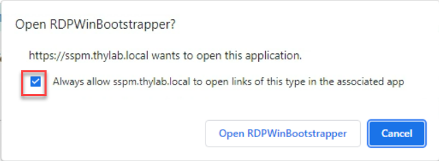

10. Click Yes on the warning for the connection
11. Click Accept on the Key
2. When you are logged into the Linux server, a banner has been shown that says **=== Welcome to the Secret Server SSH Proxy ===**. Also the temporary user name is shown in the screen (in the blue box)

    

3. Run ```netstat -a | grep ssh``` you will see that you have now a connection via the SSPM server and not direct

    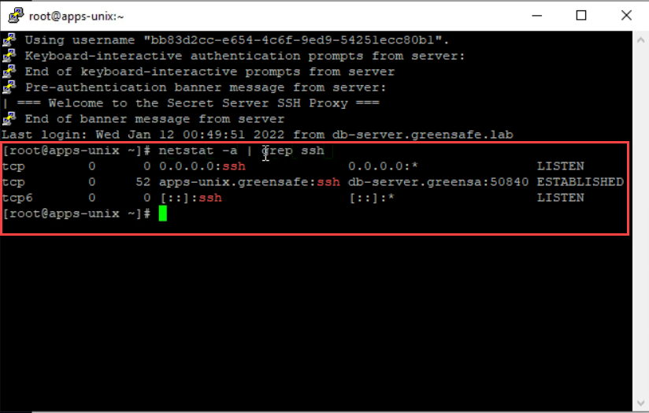

4. Logout from the server using CTRL+D

### Proxied RDP connection
1. Navigate to Secrets > IT Team > IT - Server Admin > Greensafe - Domain Controller and provide a comment
2. Launch the RDP launcher and you should see a connection being made to the Desktop of the dc-server
3. When you get Warning Messages, agree on all of them for the connection. This is due to self signed certificates that have not been embedded in the environment
3. Open a CMD prompt and type ```netstat -a | findstr /c:3389```
4. This command shows the RDP session that is established. Only from DB-SERVER (our DE) is shown, not the client machine

    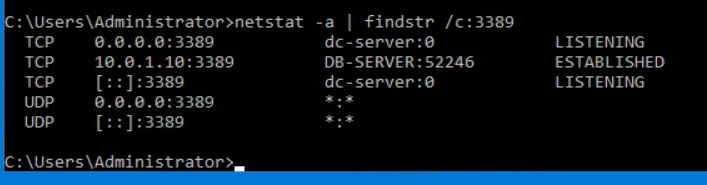

2. Close the session by signing out

# Secrets manipulation using folders
Now that both organisations have been discovered, scanned and the proxy connection is working, it's time to start organising the secrets and corresponding access rights to secrets. The combined IT Security has been defined as following:

- IT Admins from the Thylab domain are allowed to use and see ALL secrets to access ALL servers AND must comment with checkout why they need access to the Thylab servers. After the session closes, the password needs to be rotated
- IT Admins from the Greensafe domain are allowed to ONLY see the secrets of their Legacy environment and use them on their servers and are allowed to retrieve passwords
- The UNIX admins are allowed to see ALL unix related secrets and can use them to access ALL Unix related machines but are not allowed to see the passwords
- For all users
    - all sessions (RDP and SSH) MUST run proxied

## Define policies
To make sure possibilities are enforced upon users, polices can be used. The policies can be set on a per secret bases, or in a more scalable way on folders. 

1. Switch to the SSPM console and make sure you are logged in as ss-admin in the Secret Server UI
2. Navigate to Admin > Secret Policies
3. One policy already exists IT Server Team - Domain Admin Policy, click on the policy to see the settings
    - Remote Password Changing - Enforced - Enabled
    - Require Checkout - Default - Enabled
    - Custom Check Out Interval - Default - 120
    - Require Comment - Default - Enabled

    

4. Click Edit
5. Change the following for the policy
    - Name: Policy - Thylab comment on access to windows secrets
    - Description: Comments Required for access to the secrets and check out/in, RPC enabled
    - Auto change: Enforced and checked
    - Heartbeat Enabled: Enforced and checked
    - Require Check Out: Enforced and checked
    - Custom check Out Interval: Enforced and 60
    - Change Password on check In: Enforced and checked
    - Require Comment: Enforced and checked
    - Enable proxy: Enforced and checked

    

6. Click Save
7. Click OK
8. Click Back
8. Create a new policy by clicking Create New and use the following parameters:
    - Name: Policy - Proxy all sessions
    - Description: Policy to use only proxy connections
    - Enable proxy: Enforced and checked

    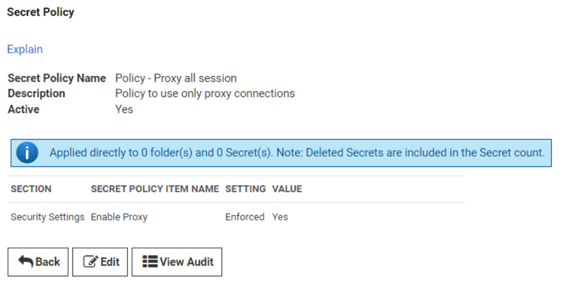

9. Click Save
10. Click Back
11. Create a new policy and use the following parameters:
    - Name: Policy - Unix hide password with proxy
    - Description: Policy for Unix systems to hide passwrod and use the proxy
    - Enable proxy: Enforced and checked
    - Hide Launcher Password: Enforced and checked

    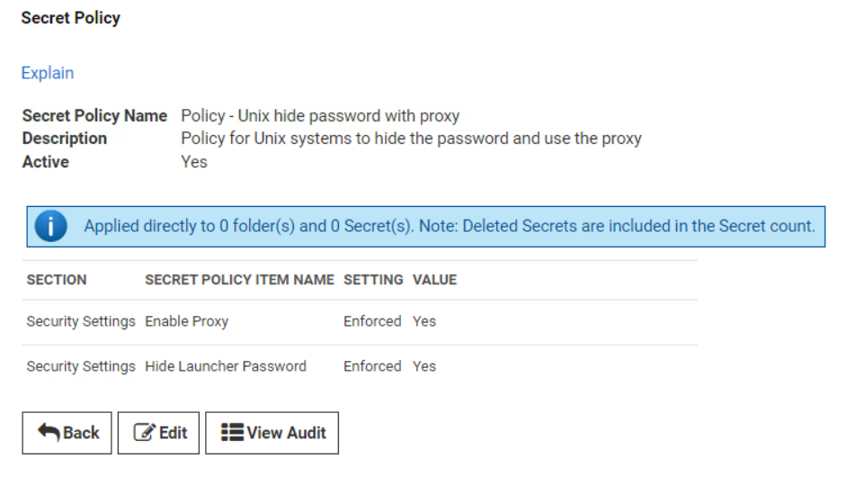

## Configure the new folder structure and policies
To be able to assign the correct rights, the folder structure needs to be more hierarchial than it is today. All is now from one organisation's PoV.
1. Navigate to Admin > Secrets
2. Right-click the IT Team folder and select Edit Folder
3. Click Edit under Folder permissions
4. Add Team_UNIX, Team_UNIXDBA, Team_IT and Team_Heldesk
5. Click Save
2. Navigate to Secrets > IT Team > IT - Server Team
3. Right-click the IT - Server Team folder and select Edit Folder
4. Click Edit next to Secret Policy and select Proxy all sessions
5. Click Save
11. Click Edit under Folder permissions
12. Add Team_IT and Team_Helpdesk
13. Click Save
14. Create a folder called Thylab under IT - Server Team by right clicking this folder and select Add Subfolder

    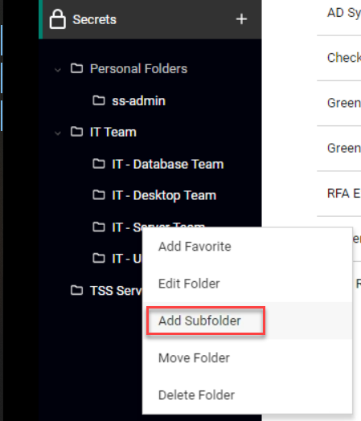

14. Navigate back to IT - Server Team
15. Select the secrets Checkout Example, RFA Example, Server team - Domain Admin and Click the Move icon

    

16. Navigate to IT Team > IT - Server Team > Thylab and click Move Secrets

    

17. Click Close after the Bulk Progress is ready

    

18. Only one secret should be left in the folder Greensafe - Domain Controller
18. Right-click the Thylab folder and select Edit Folder
19. Click Edit next to Secret Policy and select Policy - Thylab comment on access to windows secrets
20. Click Save
21. Click Edit under Folder permissions
22. Uncheck Inherit Permissions
23. Remove ALL greensafe.lab groups by clicking the Remove text next to the group
24. Click Save

    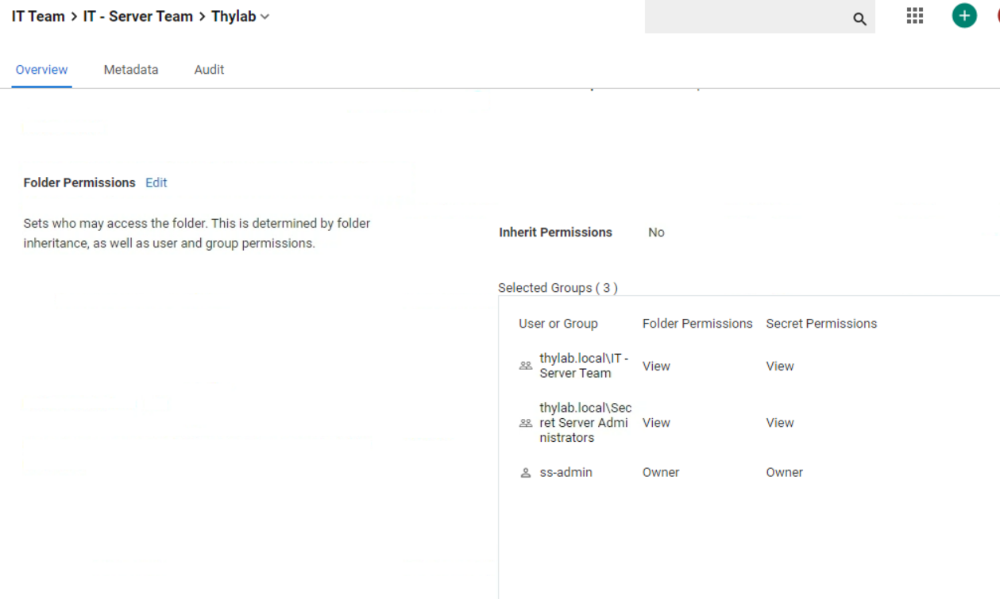

25. Right-click the IT - Unix Team folder and select Edit Folder
26. Click Edit next to Secret Policy and select Policy - Unix hide password with proxy
27. Click Save
28. Click Edit under Folder permissions
29. Add Team_UNIX, Team_UNIXDBA, Team_IT and Team_Heldesk
30. Click Save

    

## Add secret for the Greensafe domain
1. In the IT Secrets > IT - Server Team folder where there is only one secret add the following secret
    - Windows Account
    - Secret name: Greensafe - DB Server
    - Machine: db-server
    - Username: afoster
    - Password: Centr1fy
    - Site: greensafe.lab
2. Click Create Secret

## Test the configuration
Now that the setup is ready to be used, testing is in order. For this the client machine will be used

---

**Note** The passwords as you shown in the screenshots will be different per installation and will not reflect your infrastructure

---

1. Login to the client as adm-training and open the Secret Server UI (https://sspm.thylab.local/SecretServer) if it has been closed.
2. Logout the current user
3. Login as user krogers with Centr1fy in the Greensafe domain
4. Kim Rogers should only see the IT - Unix Team folder and the corresponding secrets

    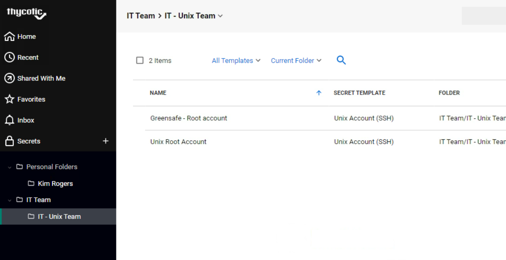

4. Click one of the secrets. The Password Field will not be shown as set by the policy

    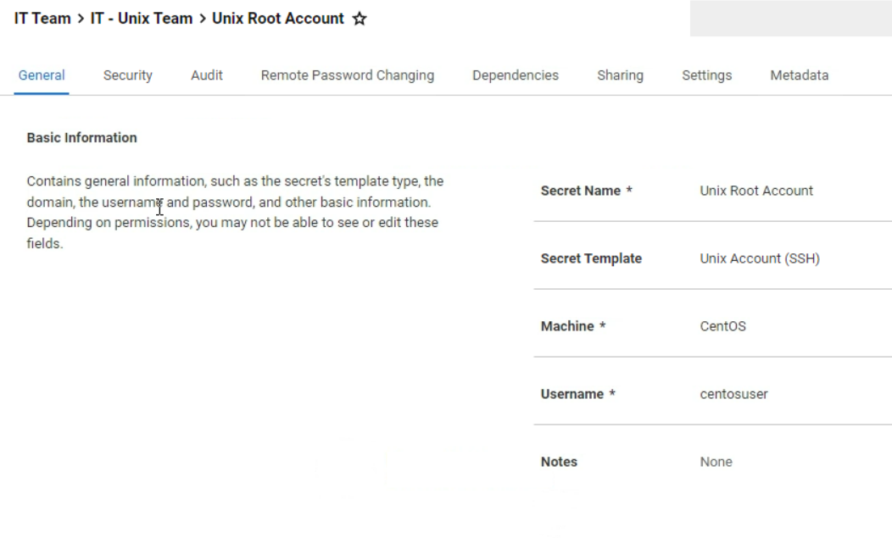

6. Open the Security tab
7. Scroll down and there is no way to uncheck the Enable proxy possibility
8. Navigate back to the General tab and run the PuTTY launcher and see that the proxy banner is shown. That proofs that the connection is made via the SSH proxy

    

9. Close the session using CTRL+D
10. Logout of the Secret Server UI by clicking the initials KR in the upper right corner and select Log Out
11. Login as LScott with Centr1fy and the Greensafe domain
12. She only has access to the Greensafe Windows servers and can see the password

    

13. Open the Security tab and see that the Enable Proxy is enabled and can not be unchecked
15. Run the RDP Launcher
16. Close the RDP session after you see the desktop
17. Logout of the Secret Server UI by clicking the initials LS in the upper right corner and select Log Out
18. Login the Secret Server UI as dhughes with Thycotic@2022! and the Thylab domain
19. This user should have besides the IT - Server Team folder also the Thylab folder

    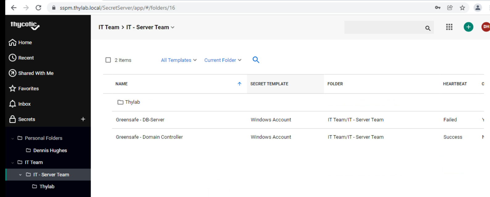

20. Navigate to the Thylab folder and open Server Team - Domain Admins secret
21. Due to the policy you have to leave a comment and check out the secret
22. Leave a comment abd click Check Out Secret
23. Click the EYE icon and see the current password as that right is given

    

24. Run the RDP Launcher and select any of the two servers you see and select thylab.local as the Proxy Site then click Launch Now

    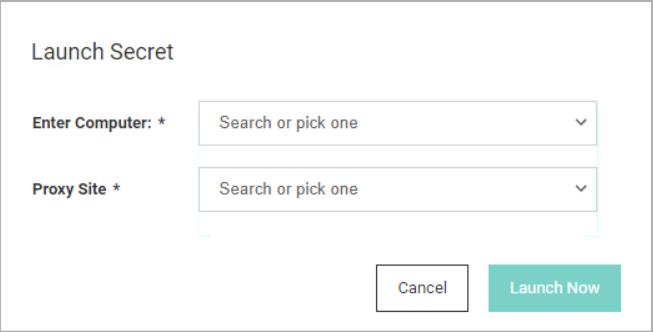

    ---

    **Note** The dropdown box is due to the Secret Template that is used at the time the secret has been created. We will dive deeper into this later in the lab

    ---

24. Sign out of the RDP session after you see the Desktop
25. Check the Secret back in using Options > Check In

    

26. Reopen the Secret and see that the password has been changed

    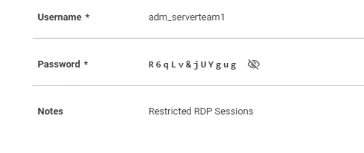

27. This is also conform the policy that we have defined and assigned to the folder


## Conclusion
As summary the three security settings:

- IT Admins from the Thylab domain are allowed to use and see ALL secrets to access ALL servers AND must comment with checkout why they need access to the Thylab servers. After the session closes, the password needs to be rotated
- IT Admins from the Greensafe domain are allowed to ONLY see the secrets of their Legacy environment and use them on their servers and are allowed to retrieve passwords
- The UNIX admins are allowed to see ALL unix related secrets and can use them to access ALL Unix related machines but are not allowed to see the passwords
- For all users
    - all sessions (RDP and SSH) MUST run proxied

During the testing of the configuration, the conclusion is that (proved by the running three scenarios using three different users) the configured policies work as requested.

# Teams
With Secret Server teams, administrators can create special groups called teams to restrict what users can see. A team bundles users and groups to assign them the same rules as to what other users and sites are visible to them. For example, a managed service provider could isolate their customers from seeing other customer’s user accounts or a large company could “firewall” their users by department. Site visibility can also be restricted by teams. 

The scenario we are solving is that Dennis Hughes and Joe Bloggs, even though they can see all Windows Servers in the Secret Server instance, we want to limit their view on the use of the Server Team - Domain Admin sercret to allow only one server. Also they can not have the choice of selecting which Proxy to use for the connection as that might lead into issues for them when they selected the wrong one and more WAN traffic, or even errors might occur. The rest of the IT Admins have to have normal use, not limited by anything.

Use the below diagram to understand what is being configured in this lab.


## Create a Team Role
1. In the Secret Server UI logged in as ss-admin, navigate to Admin > Roles
2. Create a role named Role - Teams Assigned, and set the following rights:
    - Add Secret
    - Allow Access Challenge
    - Assign Secret Policy
    - Copy Secret
    - Delete Secret
    - Delete Secrets from Reports
    - Edit Secret
    - Own Secret
    - Personal Folders
    - User Audit Expire Secrets
    - View About
    - View Advanced Dashboard
    - View Advanced Secret Options
    - View Launcher Password
    - View Password Requirements
    - View Secret
    - View Secret Audit
    - View Secret Password and Private Key History
3. Click Save

## Create Teams
1. In the Secret Server UI, navigate to Admin > Teams
2. Click Create Team
3. Use the following parameters:
    - Team Name: Thylab domain
    - Team Description: Thylab domain
4. Click Create Team
5. Click the Sites tab and click Edit
6. Check the Should restrict Sites
7. Under Add Site, select the thylab.lab site (the users available in Secret Server)

    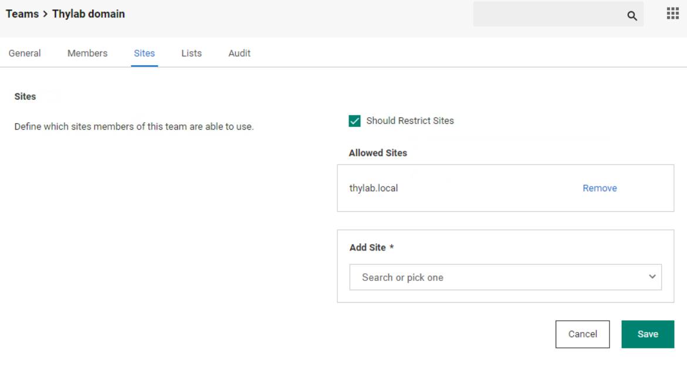

8. Click Save
9. Click Members tab and click Edit next to Members
10. Add user Joe Bloggs and Dennis Hughes to the team

    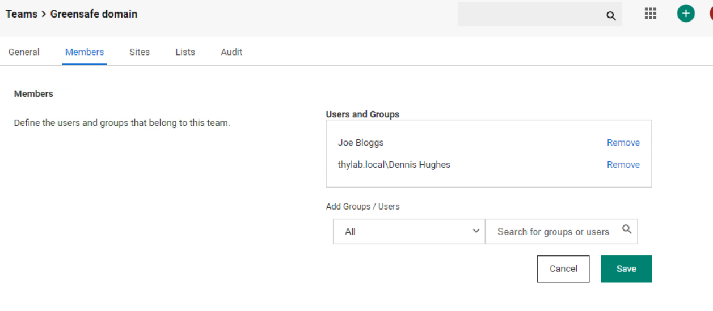

11. Click Save

## Assigning the Team role to the users
1. Navigate to Admin > Roles
2. Click Assign Roles
3. Make sure in the Role field, Role - Teams Assigned has been selected
4. Click Edit
5. Move thylab.local\Dennis Hughes and Joe BLoggs from the pane on the right hand side by selecting them and clicking the single left pointing arrow

    

6. Click Save Changes
7. In the Role field, change it to User
9. Move thylab.local\Dennis Hughes and Joe Bloggs from the pane on the left hand side by selecting them and clicking the single right pointing arrow

    

10. Click Save Changes


## Testing the set Teams
1. Switch to the Client machine and logout any user that is active in the Secret Server UI
2. Log back in as dhughes with the password Thycotic@2022! in the Thylab domain 
3. Navigate to Secrets > IT Team > IT - Server Team > Thylab
4. Open the Server team - Domain Admin secret
5. Fill out the Comment (as the policy requires this)
6. Run the RDP Launcher
7. Due to the teams restriction only the dropdown box for Enter Computer has been given
    
    

8. User JBloggs (Thycotic@2022! and then you need to change the password) has no access at all.
9. User hpatel with password Thycotic@2022! in the Thylab domain has the same limitation on the Enter Computer. This user should be able to type in the name of the server he wants to connect to.
10. As this is not what is needed, changes are to be made.

## Change to the existing list

One of the items that we can manipulate to limit the amount of servers a user can see is using a feature called Lists. These can be used to limit the possibilities for connections.

1. Switch back to the SSPM server and kae sure you are logged in to the Secret Server UI as ss-admin
2. Navigate to Admin > Lists
3. Open the Allowed Domain Servers- Restricted RDP Launcher
4. Remove DC1 and SSPM by clicking the three dots on the right side of the name and click Delete Option

    


5. Click Add > Create Option

    

6. In the Option Name provide RabbitMQ, leave the Parent Category as Uncategorized and click Save
    
    

7. Click Save

## Changing the Secret Template
As the existing secret Server team - Domain Admin secret has been created using a specific Secrets Template, changes need to be made. The outcome should be that the people in the IT team can see and use the secret with no limitation. Joe Bloggs and Dennis Hughes (a Junior Admin) should have a limitation to a secret. These changes are:

- Change the Secret Template that has been used while the Server team - Domain Admin was created
- Change the Group membership that Dennis Hughes has been assigned to in AD. This has been a mistake.
- Create a secret that uses the restricted list for its Launcher

1. In the Secret Server UI navigate to Secrets > IT Team > IT - Server Team > Thylab
2. Check the Server Team - Domain Admin and click the three dots

    

3. Select Convert Secret Template

    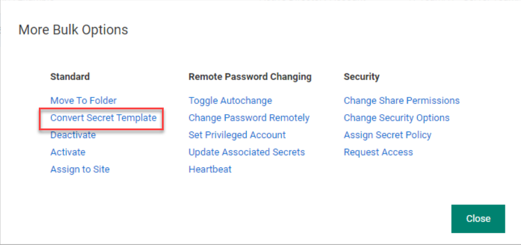

4. Select Active Directory Account, in the next screen leave all. The Allow Servers will be removed

    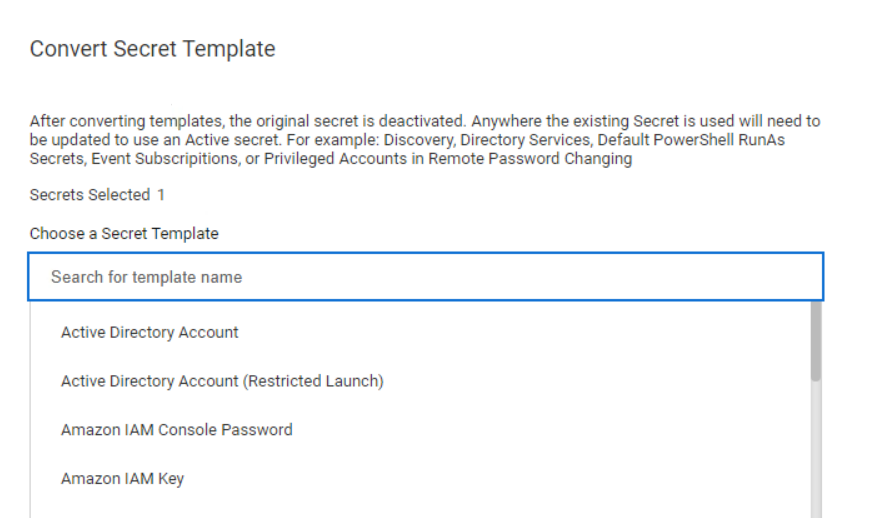

5. Click Create Secret
6. Wait till the Bulk Progress is ready and click Close

    

7. Click the + sign to create a new Secret
8. Select Active Directory Account (Restricted Launch)
9. Use the following parameters for the secret
    - Secret name: Restricted Servers
    - Domain: thylab.local
    - Username: adm_serverteam2
    - Password: Thycotic@2022!
    - Notes: Limited Server selection for the user to run the RDP Launcher
    - Allowed Servers: Allowed Domain Servers - Restricted RDP Launcher
    - Site: thylab.local

    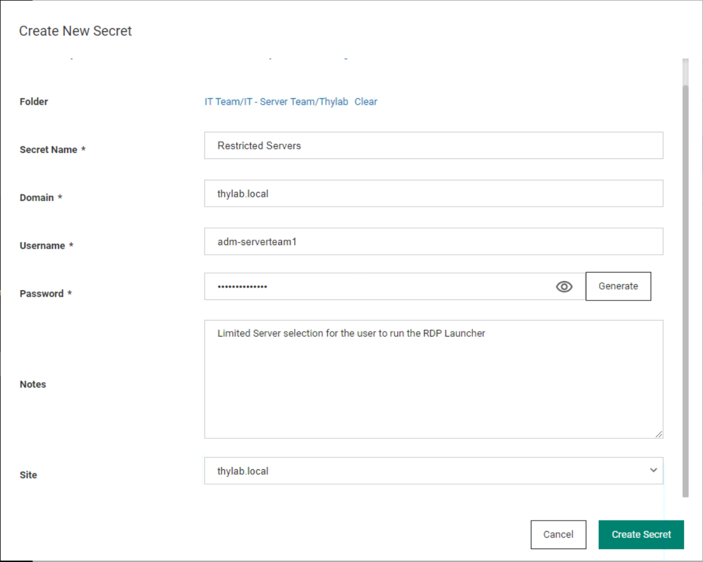

10. Click Create Secret
11. Provide a comment and click Check Out Secret
12. Click the Sharing Tab Click Edit 
12. Uncheck Inherit Permission from folder and remove all but the ss-admin account
13. Add accounts JBloggs and Dennis Hughes

    

14. Make sure both accounts have View/View rights (default)
15. Click Save

    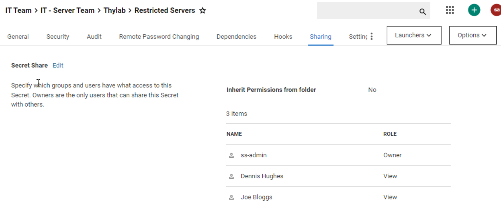

16. Check the secret back in

## Changing Dennis Hughes account
After a few weeks in Dennis has been given the full admin rights on all servers in the domain using Secret Server by putting his account in Active Directory in the IT- Team Server groups. To limit what he can do, his manager decided to take him out of the group and let him start slowly.

1. Login to the DC1 machine with the thylab\administrator account
2. Open Active Directory Users and Computers and find Dennis Hughes under Users

    

3. Double click the account and click Member Of
4. Remove the IT - Server Team from his account so that he becomes a normal Domain User
5. Click OK
6. Logout of the DC1 console and return to the SSPM machine
7. Back in the Secret Server UI navigate to Admin > Directory Services and click Sync Now to make the changes known to Secret Server
8. This Sync will disable Dennis' account that needs to be reneabled. Navigate to Admin > Users
9. Switch the Include Disabled to show the disabled users

    

10. Find DHughes and set the checkbox in front of him
11. Click the Select Bulk Action and select Enable Users

    

12. When asked to Confirm click OK and Close the Bulk Progress message
## Test the account
1. To test the effects of Teams, open the Client machine and log the current user out of the Secret Server UI
2. Log back is as DHughes in the Thylab domain
3. There is only one secret available, the one created earlier Restricted Servers, with no folders

    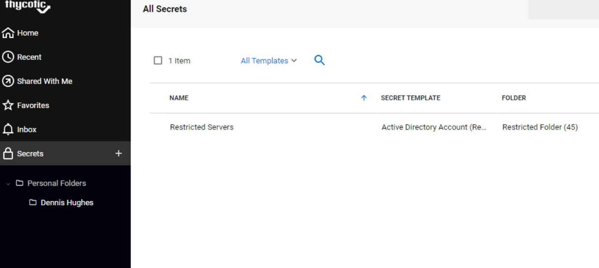

4. Open the Secret, click Enter Comment and enter some Comment (this due to policies set earlier)
5. Click the RDP Launcher
6. Due to the list and the used Secret Template, the user can only select a server. The possibility of providing a server is not possible

    

7. Click Launch Now
8. After clicking Connect and Yes the RDP session to the RabbitMQ should be shown
9. Close the session
10. Check the secret back in

# Summarize the lab

To summarize what has been done:
1. Setup a Site Connector based on RabbitMQ
2. Define a site thylab.local
3. Deploy a Distributed Engine in the site
4. Define a second site greensafe.lab
5. Deploy a Distributed Engine in the site
6. Run discovery on the second site for users and computers
7. Configure and test SSH and RDP proxied sessions
8. Creating and testing Secrets Policies
9. Creating and testing Secret Server Teams and their setting and how that impacts what users can/can't do using Lists and Site restrictions

The total network traffic with respect to the Secret Server, the RabbitMQ and the DEs is shown below

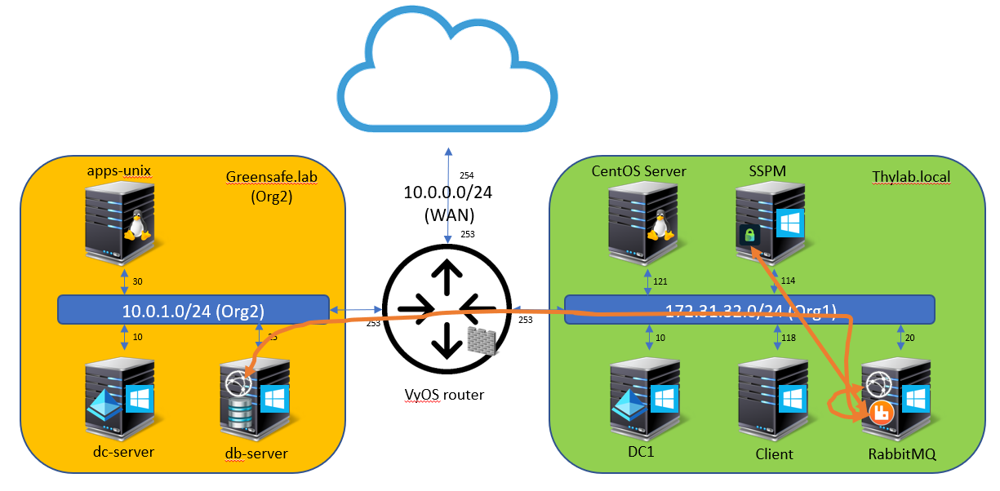

Which simplified is the same as the earlier shown picture

