# Secret Server advanced Lab

This lab will be a sequel to the Secret Server Training Lab where the thylab.local domain has been fully configured.

This lab is emulating a scenario in which an organisation (thylab.local) has merged with a second organisation (greensafe.lab domain) and the administrators for the first organisation need the ability to control the second AD using Secret Server.

Below is a diagram of the two organisation as it has been build in the lab infrastructure.


This lab will highlight the following topics:
1. Installing RabbitMQ as Site Connector
2. Use of Sites
3. Use of Distributed Engines
4. Use of Lists
5. Use of Teams
6. Use of the combination of Teams and lists
7. Hooks in secrets
9. Custom Discovery
10. Custom Remote Password Changer
11. Disaster Recovery (on-prem to on-prem)

# Configure Site Connector

A site Connector is what binds the Secret Server instance with its Distributed Engine(s). The Site Connector is using the message queueing mechanism to make sure jobs and results are exchanged in a modular fashion between the DEs and Secret Server. This also makes it possible to implement Secret Server as a High Availability solution.

The supported two Message Queueing (MQ) mechanisms are MemoryMQ and Rabbit MQ. The first one is suitable for very small or testing/demo installations. The problem with this MQ is that it runs in the memory of the Secret Server and is therefore limited. It can not be clustered is one of its limitations. The other solution, highly recommended, is using [RabbitMQ](https://rabitmq.com). This MQ is a dedicated instance that is specially built for the task and seen as one of the popular open source MQ.


## Installation process high level:
1. Configuration for the new Site Connector to be using RabbitMQ
2. Install RabbitMQ using the [RabbitMQ helper](https://docs.thycotic.com/ss/11.1.0/secret-server-setup/installation/installing-rabbitmq/index.md)
3. Configuration check on connectivity
4. Create site and install Distributed Engine in one site
5. Create Site and install Distributed Engine in second sites

## Configure Secret Server
1. Open the **SSPM** and login as **adm-training** 
2. Open Secret Server at **https://sspm.thylab.lab/SecretServer**
3. Login as **ss-admin** with the password **Delinea/4u**
4. You may be asked to reset the password. Use you own password as long as you remember it ;)..
5. Navigate to Administrattion > Setup & System Maintenance > Distributed Engine
6. Click **Configure** and **Edit**
8. Use the following settings for the Site Connector

    - Queue Type: RabbitMQ
    - Name: rabbitmq
    - Active: Checked
    - SSL: Unchecked
    - Host name: rabbitmq.thylab.local
    - Port: 5672

    

9. Click **Save**

## Installation of RabbitMQ
1. Open the **RabbitMQ** server and login as **adm-training**
2. Open **Chrome** and open the URL **https://thycoticdownloadsprod.blob.core.windows.net/ssintegrations/RabbitMQHelper/Delinea.RabbitMq.Helper.9.5.msi** to download the RabbitMQ Helper
3. Run the downloaded MSI file
4. Open Secret Server at https://sspm.thylab.lab/SecretServer 
5. Login as ss-admin with the password you set (this will log you out of the SSPM Secret Server UI if you refresh that browser on the SSPM server)
6. Navigate to Administrattion > Setup & System Maintenance > Distributed Engine
7. Click Configure
8. Click View Credentials. Keep this open as it needed in the next steps
   

9. Back at the RabbitMQ server, open Windows Explorer
10. Navigate to *%PROGRAMFILES% > Delinea Software Ltd > RabbitMq Helper* and run **Delinea.RabbitMq.Helper.exe**
11. This will open a PowerShell command line
12. Copy these lines into the PowerShell session:

```powershell
$cred = Get-Credential -Message "Enter the initial RabbitMq user username and password";
#if you don't want to be prompted you can hardcode your credential in the script
#$password = ConvertTo-SecureString “PlainTextPassword” -AsPlainText -Force
#$cred = New-Object System.Management.Automation.PSCredential (“CustomUserName”, $password)

Install-Connector `
    -Credential $cred `
    -UseDelineaMirror -Verbose
```
---

**Note**
This script assumes your environment has an internet connection. If not, please check https://thycotic.github.io/rabbitmq-helper/installation/ for you Scenario.

--- 
13. Hit Enter to execute the lines
14. The user name and the password are provided by the Secret Server as shown after clicking **View Credentials**
    
    

15. Copy the username and password in the Messagebox (you can click them and a popup box at the bottom of the screen will show telling it copied respectively the username and password) and click **OK**
16. When warnings are given on *Agree on Licenses*, type **Y and Enter**
17. This will Download, install and Configure RabbitMQ on the machine. The process takes approx. 5 minutes
18. The RabbitMQ Management webpage should open of RabbitMQ (just accept the IE11 settings and proceed by clicking the OK button). This means RabbitMQ has been installed and configured. You can close Internet Explorer as we don't need it. Also close the Powershell commandline.
    
    

19. Back in your Secret Server UI (on RabbitMQ), click **OK** to close the *Site Connector Credentials* screen
20. Click **Validate**, next to validated to make sure the RabbitMQ is correctly installed

    

21. In the next screen click **Validate**
22. Click **Save**

    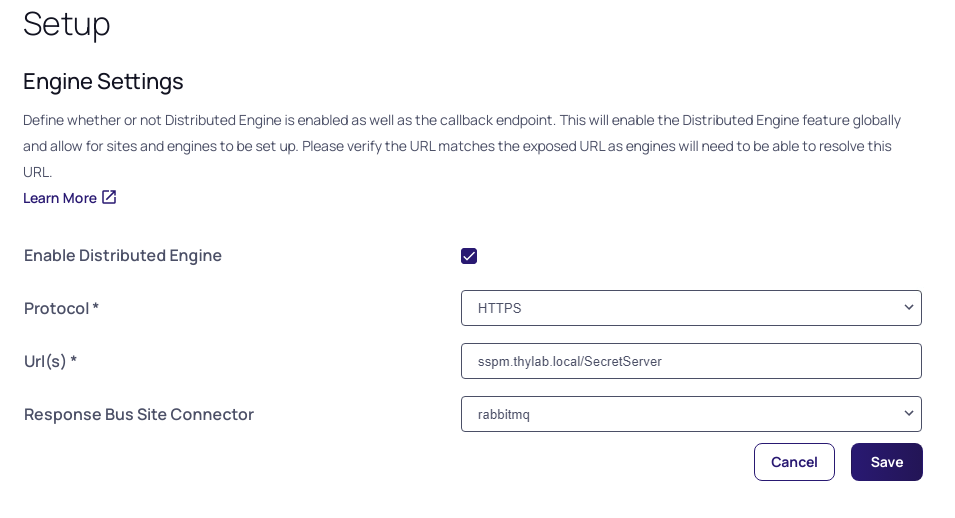

23. Click **Skip this Step** and click **OK** on the *Confirm Skipping Engine Download* warning
24. If no errors have been detected, you will be presented with the Site screen configuration

## Add thylab.local site
1. In the Site screen, click the **Add Site** button
   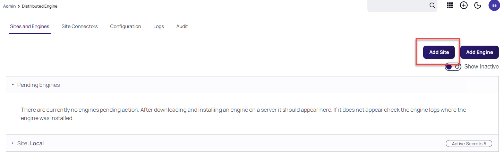

2. Name the site **thylab.local**
3. Set the Site Connector to rabbitmq
4. Set the Engine callback Interval to 30 (seconds). This is just for testing/demoing purpose. In production this would be 5 minutes, depending on the organization and the jobs that need to be run in the site.
    
    

5. Click **Add SIte****


## First Distributed Engine (DE)
1. Navigate to Administrattion > Setup & System Maintenance > Distributed Engine and click the **Add Engine** button. In the next screen make sure that:
    - Processor Architecture is 64-bit
    - Preconfigured Site: thylab.local

    

2. Click **Download Now**
3. After the download, goto the **Downloads** directory using **Windows Explorer** and Extract the download ZIP file (Right-click the file and Extract...)
4. When the extraction has been done, open the extract folder and run the setup.exe (no interaction is needed). On the UAC, click **Yes**

    

5. Close the Windows Explorer screen and **return to the Secret Server UI**
6. In **Site: thylab.local** there should be a amber "warning" of 1 Engine Pending

    

7. Move the mouse on top of the **RabbitMQ.thylab.local** server
8. On the right side of that DE, *click the three dots* and select **Activate**

    

9. Click OK in the confirmation message. This will now, if all configured correct, will have two green check marks. 

    

---

**NOTE**
You may have to refresh your browser to see the two green checks

---

10. Close the Browser screen and logout of the server as we are ready for now on this server

# Add second site

There is now one site (thylab.local) configured with a DE assigned to it. 


As the organisation has merged with a second organisation, Greensafe, we now need to configure Secret Server that there is another site that needs to be managed by Secret Server via a DE. This will be done by:

1. Defining another site
2. Install and assign a DE to the greensafe.lab site

## Add site
1. Open the console of the **db-server** server, login as **Alex Foster (afoster)** with the password **Centr1fy** and open the URL using Chrome (you can set Chrome as the default browser) **https://sspm.thylab.local/SecretServer** and login using the ss-admin account with your set password
2. Navigate to Administrattion > Setup & System Maintenance > Distributed Engine
1. Click **Add Site**
2. Name the site **greensafe.lab**
3. Set the Site Connector to rabbitmq

   

4. Set the Engine callback Interval to 30 (seconds). This is just for testing/demoing purpose. In production this would be 5 minutes, depending on the organization and the jobs that need to be run in the site.
5. Click **Add Site**

## Install a DE in the second infrastructure
Now that the second organisation is added as a site, it needs to be provided with a DE, that way Secret Server can communicate over port 443 with the Greensafe infrastructure using the distributed engine. An other reason for deploying a DE is that it will allow us to scan and run Remote Password Changers (RPC) decentralised in the Greensafe Infrastructure.

2. Navigate to Administrattion > Setup & System Maintenance > Distributed Engine
3. Click **Add Engine**
4. Check the Processor Architecture and make sue it says 64-bit
5. Set the Preconfigured site to greensafe.lab

    

6. Click **Download Now** to download a ZIP file
8. Open a Windows Explorer and navigate to Downloads
10. Extract the ZIP file and run the setup.exe Application

    

11. Close the Windows Explorer screens after the installation has finished
11. Return to the Secret Server UI and make sure you are at Administrattion > Setup & System Maintenance > Distributed Engine
12. After a few seconds, your deployed engine should be seen in the UI in the Pending Engines section. If the DE isn't shown, refresh your browser

    

13. Expand the **greensafe.lab** site
14. Hoover over the db-server.greensafe.lab engine and click the three dots on the right

    

15. Click **Activate** in the dropdown menu, and **OK**
16. If there is still a warning box next to the greensafe.lab site, refresh your browser
17. Your UI should look like the below screenshot if all went well

    

# Discovery of the second domain

Now that both organisations have been added to the Secret Server instance it is time to start the Discovery of the domains.


To be able to manage the second infrastructure via the DE, discovery needs to be configured for the Greensafe.lab  domain. After the discovery of Machine, Dependencies and Accounts the next configuration step can take place, defining the correct access rights to the Domain admins of the two different organisations.

## Adding secret for AD Sync Greensafe
1. Log out of the db-server
2. Switch back to the **SSPM server** and refresh your browser
3. Login as **ss-admin** (as we have been logged out due to the login on the db-server, re-login is needed)
4. Navigate to **Secrets >> > TSS Service Accounts** and **add a new secret** by clicking the **+** sign in the top top right corner next to the SS icon

  

5. Make sure the template to use is Active Directory
6. Use the following parameters
    - **Secret Name:** AD Sync Greensafe
    - **Domain:** greensafe.lab
    - **Username:** cfyadmin
    - **Password:** Centr1fy
    - **Notes:** Account used for Discovery Scan Greensafe
    - **Site:** greensafe.lab
7. Click **Create Secret**

## Configure Directory Service Greensafe

1. Navigate to **Administration >> > Users, Roles, Access > Directory Services**
2. Click **Add Domain > Active Directory Domain**
3. Use the following parameters
    - **Fully Qualified Domain Name:** greensafe.lab
    - **Friendly name:** Greensafe
    - **Synchronization Secret:** AD Sync Greensafe (be patient to get the full list of secrets available)
    - **Site:** greensafe.lab

    

4. Click **Validate & Save**
5. In the groups select the following groups:
    - Domain Admins
    - Team_Auditors
    - Team_Contractors
    - Team_Finance
    - Team_Helpdesk
    - Team_IT
    - Team_Sales
    - Team_Security
    - Team_UnixAdmins
    - Team_UNIXDBA
    - Team_WindowsDBA
6. Run **Sync Now**

## Configure and run Discovery Scanner for Greensafe
1. Navigate to **Administration >> > Actions > Discovery**
2. Click **Create Discovery Source > Active Directory**
3. Use the following parameters
    - **Discovery Source Name:** greensafe.lab
    - **Fully Qualified Domain Name:** greensafe.lab
    - **Friendly name:** Greensafe
    - **Discovery Secret:** AD Sync Greensafe
    - **Discovery Site:** greensafe.lab

    

4. Click **Create**
5. In the next step, under *Find Dependencies*, select all options

    

6. Click **Save**
7. Navigate back to **Administration >> > Actions > Discovery**
8. Click **Run Discovery Now > Run Discovery Scan**
9. Wait till the status from Running has switched to Last Run: Just Now

    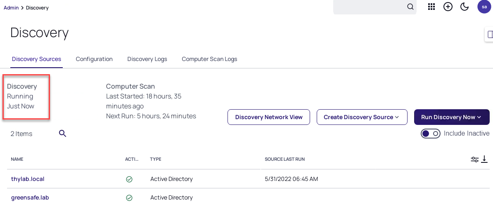

10. Repeat the same steps, but now Run Computer scan, this will detect local accounts

## See the discovered accounts
1. Click **Discovery Network View** 
2. You should now have two domains being mentioned
3. Expand both domain and have a look around. Click the tabs (Local Account, Public Keys, Service Accounts and Domain\Cloud Accounts) all should have some info.

    

4. This means the Discovery scan has run successfully and Secret Server can now start to control the accounts.

# Proxying SSH and RDP
To be able to connect to the second organisation Secret Server needs to be configured. There a couple a ways to do this. One is to keep the secrets in the Vault and use them to connect to the servers via RDP or SSH via the client machines of the users, but this will send the credentials over the network to the server. This means that the machine you are starting the connection from needs to have a direct connection to the server. 

Another option is to use the Secret Server instance and/or DE to proxy the connection towards the server. This will NOT have the user's machine connect directly to the server, but use the proxy as the endpoint of the connection. This last option is what is the most secure path. Credentials are NOT send towards the servers. Instead a temporary account is being used to make the connection to the server. After the session is done, the account will be deleted and there is no connection anymore possible to the server using that account.

## Overview of the traffic
Below diagram show the traffic for SSH and RDP and the involved machines from the infrastructure

### Scenario 1:
Connect to greensafe.lab ssh host, apps-unix.greensafe.lab, from the client VM in a SSH proxied connection

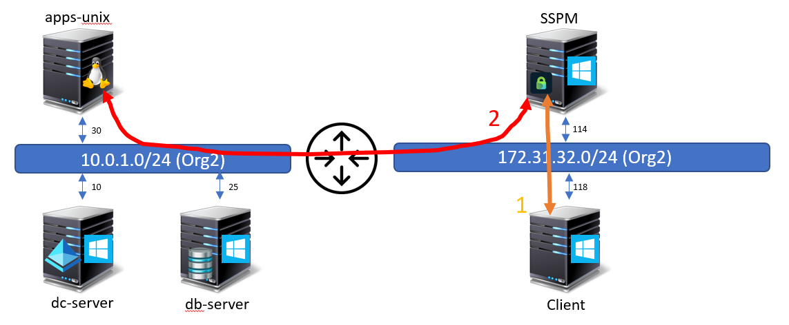

### Scenario 2:
Connect to greensafe.lab RDP host, dc-server.greensafe.lab, from the client VM in a RDP proxied connection


## Enabling Proxying
1. Navigate to **Administration >> > Actions > Proxying > SSH Proxy** tab and click **Edit** next to *Enable SSH Proxy*
2. Enable SSH Proxy and click **Save**

    

3. Navigate to **RDP Proxy** tab and click **Edit** next to *Enable RDP Proxy*
4. Enable RDP Proxy and click Save
5. The RDP port has been set to 3390 as 3389 is taken by Windows self
6. Click **Edit** next to *RDP Server Certificate*

    

7. Click **Change**
8. *Navigate to Downloads* in the popup screen
9. Select the **sspm.thylab.local** certificate
10. Provide the password **Thycotic**
11. Click **Save**
12. As both orgnisations use self-signed certificates and might use the same computernames, small changes need to be made for RDP to work
    - Click Edit on Validate Remote Certificates and uncheck it, then click **Save**
    - Click Edit on Allow AD Site Selection and check it, then click **Save**
12. Click the **Endpoints tab**
13. Click **Edit** behind the SSPM machine
14. Fill the *Public Hostname or IP* as **172.31.32.114**

    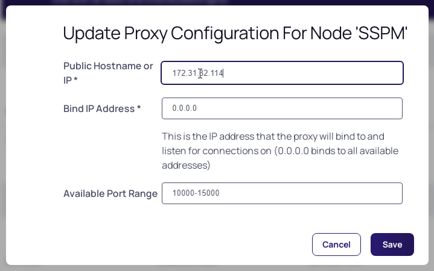

15. Click **Save**
16. Under **SITES**, click the **Edit** (to the far right) next to thylab.local
17. Enable SSH and RDP proxy, leave the default ports

    

18. Click **Save**
19. Repeat the steps for the greensafe.lab site
20. Both sites should now have RDP and SSH enabled and respectively port 3390 and 22

    

## Test the proxy

In this part of the lab we are going to check that we are using the proxy to connect to the server. Firstly SSH and then RDP connections. To connect to the remote machines secrets are needed. Then these secrets can be used to connect the machines using Secret Server and/or the DEs as proxy.

### Creating Extra Secrets
1. Navigate to Secrets >> > IT Team > IT - Unix Admin

    

2. Create a secret with the following parameters:
    - **Secret Template:** Unix Account (SSH)
    - **Secret name:** Greensafe - Root account
    - **Machine:** apps-unix.greensafe.lab
    - **Username:** root
    - **Password:** password1
    - **Site:** greensafe.lab

    

3. Click **Create Secret**
4. click the **Security Tab**
5. See that the Enable proxy is enabled (scroll down to see the setting)
6. Navigate to Secrets >> > IT Team > IT - Server Admin
7. Create a secret with the following parameters:
    - **Secret Template:** Windows Account
    - Secret name: Greensafe - Domain Controller
    - Machine: dc-server
    - Username: Administrator
    - Password: Centr1fy
    - Site: greensafe.lab

    

8. Click **Create Secret**
9. Due to a policy that is running on this folder, comments have to be given. Click **Comment** and provide some text and click **Check Out Secret**
10. Under the *Security Tab*, make sure the Proxy is enabled, if not, make it so and return to the General tab

    

---

**NOTE**
Make sure that the **apps-unix and CentOS Server** VMs are in a running state before proceeding!

---
### Proxied SSH connection
1. Switch to the **Client** machine and login using the **adm-training** account
2. Open Chrome and navigate to the Secret Server UI (you can set chrome as the default browser) and login as **ss-admin**
3. Navigate to **Secrets >> > IT Team > IT Unix team**
4. Click the **Greensafe - Root account** secret
5. Run the **PuTTY Launcher**
6. On the *Protocol Handler Failed to Launch* message, click **Download 64-bit**

    

7. Run the downloaded MSI, no interaction, other than the UAC, is needed
8. Click **Cancel** and relaunch the PuTTY Launcher
9. On the Open RDPWinBootstrapper screen that opens, check the box and click the Open RDPWinBootstrapper

    

10. Click **Yes** on the warning for the connection
11. Click **Accept** on the Putty Security Alert
2. When you are logged into the Linux server, a banner has been shown that says **=== Welcome to the Secret Server SSH Proxy ===**. Also the temporary user name is shown in the screen (in the blue box)

    

3. Run ```netstat -a | grep ssh``` you will see that you have now a connection via the Distributed Engine in the greensafe.lab domain (db-server.greensafe.lab) 

    

4. There is no direct connection from the client (172.31.32.118)

    

4. Logout from the server using CTRL+D

### Proxied RDP connection
1. Wile still being on the *Client VM*, navigate to **Secrets >> > IT Team > IT - Server Admin > Greensafe - Domain Controller** and provide a comment
2. Launch the RDP launcher and you should see a connection being made to the Desktop of the dc-server
3. When you get Warning Messages, agree on all of them for the connection. This is due to self signed certificates that have not been embedded in the environment
3. Open a CMD prompt and type ```netstat -a | findstr /c:3389```
4. This command shows the RDP session that is established. Only from DB-SERVER (our Distributed Engine in the domain) is shown, not the client machine

    

2. Close the session by signing out

# Secrets manipulation using folders
Now that both organisations have been discovered, scanned and the proxy connection is working, it's time to start organising the secrets and corresponding access rights to secrets. The combined IT Security has been defined as following:

- IT Admins from the Thylab domain are allowed to use and see ALL secrets to access ALL servers AND must comment with checkout why they need access to the Thylab servers. After the session closes, the password needs to be rotated
- IT Admins from the Greensafe domain are allowed to ONLY see the secrets of their Legacy environment and use them on their servers and are allowed to retrieve passwords
- The UNIX admins are allowed to see ALL unix related secrets and can use them to access ALL Unix related machines but are not allowed to see the passwords
- For all users
    - all sessions (RDP and SSH) MUST run proxied

## Define policies
To make sure possibilities are enforced upon users, polices can be used. The policies can be set on a per secret bases, or in a more scalable way on folders. 

1. Stay on the Client vm
2. Navigate to **Administration >> > Actions > Secret Policies**
3. One policy already exists **IT Server Team - Domain Admin Policy**, click on the policy to see the settings. Changing between the tabs have to be done.
    - **Remote Password Changing**
        - Auto Change - Default Only - Unchecked (= Enforced)
         
          

    - **Security tab**
        - Require Checkout - Yes - Default Only - Checked
        - Custom Check Out Interval - Default - 120
        - Require Comment - Yes - Default Only - Checked

          

4. Open the Summary Tab and click **Edit**
5. Change the following for the policy
    - **Name:** Policy - Thylab comment on access to Windows secrets
    - **Description:** Comments Required for access to the secrets and check out/in, RPC enabled

    

6. Click **Save**
7. Open the **Security** tab and set the following after clicking **Edit**
    - **Require Check Out:** Yes - Default Only - Unchecked
    - **Custom check Out Interval:** 60 - Default Only - Unchecked
    - **Change Password on check In:** Yes - Default Only - Unchecked
    - **Require Comment:** Yes - Default Only - Unchecked
    - **Enable proxy:** Yes - Default Only - Unchecked

    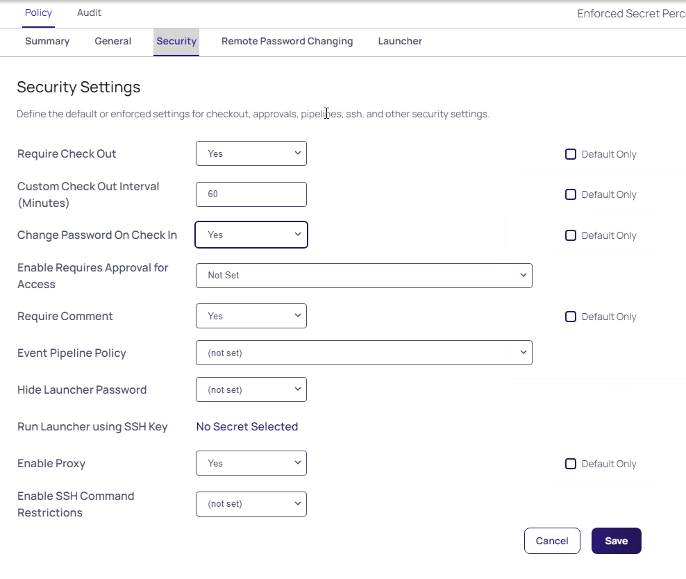

8. Click **Save** and click **OK** on the *Confirm* message
9. Open the **Remote Password Changing** tab and set the following after clicking **Edit**
    - Heartbeat Enabled: Yes - Default Only - Unchecked

    

6. Click **Save** and click **OK** on the *Confirm* message
7. Navigate to **Administration >> > Actions > Secret Policies**
8. Create a new policy by clicking **Add** and use the following parameters:
    - Name: Policy - Proxy all sessions
    - Description: Policy to use only proxy connections
    - Enabled: Checked
9. Open the **Security** tab and set the following after clicking **Edit**
    - **Enable Proxy:** Yes - Default Only - Unchecked

    

9. Click **Save** and click **OK** on the *Confirm* message
10. Click **Secret Policy** (in the top of the screen) to return to all the policies

    

11. Create a new policy and use the following parameters:
    - **Name:** Policy - Unix hide password with proxy
    - **Description:** Policy for Unix systems to hide passwords and use the proxy
    - **Enabled:** Checked
12. On the **Security** tab
    - **Hide Launcher Password:** Yes - Default Only - Unchecked
    - **Enable Proxy:** Yes - Default Only - Unchecked

    

13. Click **Save** and click **OK** on the *Confirm* message 

## Configure the new folder structure and policies
To be able to assign the correct rights, the folder structure needs to be more hierarchial than it is today. All is now from one organisation's PoV.
1. Navigate to **Secrets >>**
2. Right-click the *IT Team folder* and select **Edit Folder**
3. Click the *Permissions* tab and Click **Edit**
4. Add **Team_UNIXAdmins**, **Team_UNIXDBA**, Team_IT and **Team_Heldesk** by clicking them and dragging to the left where the other accounts are shown
5. Click **Save**
2. Navigate to **Secrets >> > IT Team > IT - Server Team**
3. Right-click the *IT - Server Team* folder and select **Edit Folder**
4. Click **Edit** next to *Secret Policy* and select **Proxy all sessions**
5. Click **Save**
11. Click the **Permissions** tba and click **Edit**
12. Add **Team_IT** and **Team_Helpdesk**
13. Click **Save**
14. Create a folder called **Thylab** under **IT - Server Team** by right clicking this folder and select **Add Subfolder**

    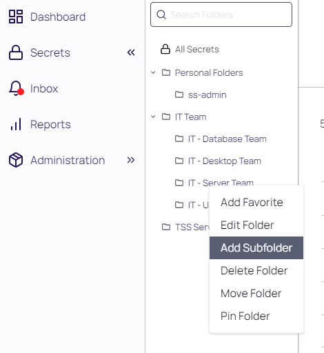

14. Navigate back to **IT - Server Team**
15. Select the secrets *Checkout Example, RFA Example, Server team - Domain Admin* and Click **Bulk Actions** at the bottom of the screen

    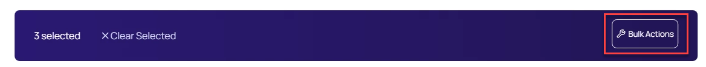

16. Click **Move To Folder**
16. Navigate to IT Team > IT - Server Team > Thylab and click **Move Secrets**

    

17. Click **Close** after the Bulk Progress is ready

    

18. Only one secret should be left in the folder **Greensafe - Domain Controller**
18. Right-click the **Thylab** folder and select **Edit Folder**
19. Click **Edit** next to *Secret Policy* and select **Policy - Thylab comment on access to Windows secrets**
20. Click **Permissions** tab
21. Click **Edit** 
22. **Uncheck** Inherit Permissions
23. Remove ALL greensafe.lab groups by clicking the Bin ico when hoovering over the account

    

24. Click **Save**
25. Right-click the *IT - Unix Team* folder and select **Edit Folder**
26. Click **Edit** next to *Secret Policy* and select **Policy - Unix hide password with proxy**
27. Click **Save**
20. Click **Permissions** tab
21. Click **Edit** 
29. Add **Team_UNIXAdmins, Team_UNIXDBA, Team_IT** and **Team_Heldesk**
30. Click Save

    

## Add secret for the Greensafe domain
1. In the *IT Secrets > IT - Server Team* folder where there is only one secret **add the following secret**
    - **Secret Template:** Windows Account
    - **Secret name:** Greensafe - DB Server
    - **Machine:** db-server
    - **Username:** afoster
    - **Password:** Centr1fy
    - **Site:** greensafe.lab

  

2. Click **Create Secret**

## Test the configuration
Now that the setup is ready to be used, testing is in order. For this test the client machine will be used.

---

**Note** The passwords as you shown in the screenshots will be different per installation and will not reflect your infrastructure

---

1. Logout the current user of the Secret Server UI by clicking the icon in the top right corner and select **Log Out**

  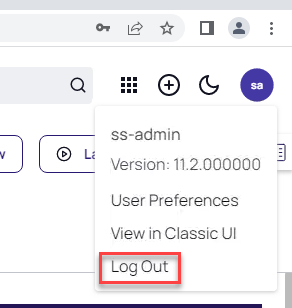

2. Click **Login**
3. Login as user **krogers** with **Centr1fy** in the **Greensafe** domain
4. Kim Rogers should only see the **IT Team > IT - Unix Team** folders and the corresponding secrets

    

4. Click one of the secrets. The Password Field will not be shown as set by the policy

    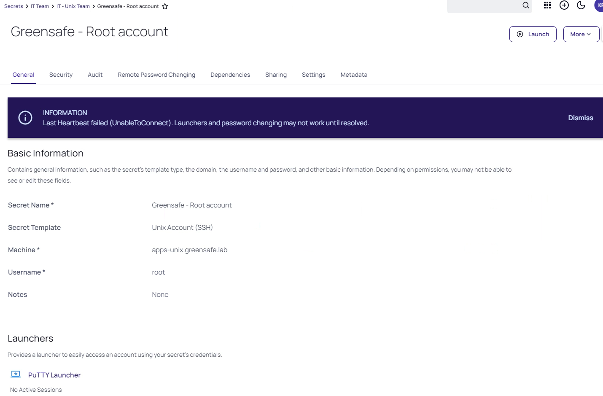

6. Open the **Security** tab
7. Scroll down and see that there is no way to make any changes to the settings
8. Navigate back to the **General** tab and run the **PuTTY launcher** and see that the proxy banner is shown. That proofs that the connection is made via the SSH proxy

    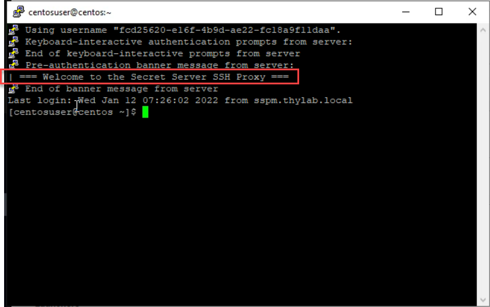

9. Close the session using **CTRL+D**
10. Logout of the Secret Server UI by *clicking the initials KR* in the upper right corner and select **Log Out**
11. Click **Log in** and log in as **LScott** with **Centr1fy** and the **Greensafe** domain
12. She only has access to the **Greensafe Windows servers** and *can see the password*

    

13. Open the **Security** tab and see that the **Enable Proxy** is enabled and **can not be unchecked**
15. Switch back to the **General** tab and run the **RDP Launcher**
16. Close the RDP session after you see the desktop
17. Logout of the Secret Server UI by clicking the initials LS in the upper right corner and select **Log Out**
18. Login the Secret Server UI as **dhughes** with **Thycotic@2022!** and the **Thylab** domain, click **Continue** on the *Welcome screen*
19. This user should have besides the **IT - Server Team** folder also the **Thylab** folder

    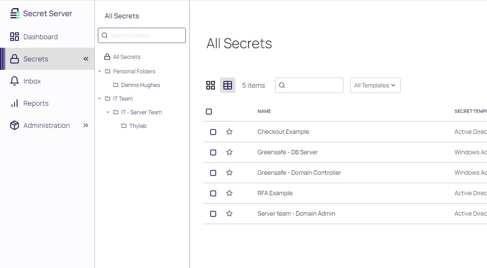

20. Navigate to the **Thylab** folder and open **Server Team - Domain Admins** secret
21. Due to the policy you have to leave a comment and check out the secret
22. Leave a comment and click **Check Out Secret**
23. Click the **EYE** icon and see the current password as that right is given

    

24. Run the RDP Launcher and select **any of the two servers** you see and select **thylab.local** as the Proxy Site then click **Launch Now**

    

    ---

    **Note** The dropdown box is due to the Secret Template that is used at the time the secret has been created. We will dive deeper into this later in the lab

    ---

24. Sign out of the RDP session after you see the Desktop
25. Check the Secret back in using **Time > Check In**

    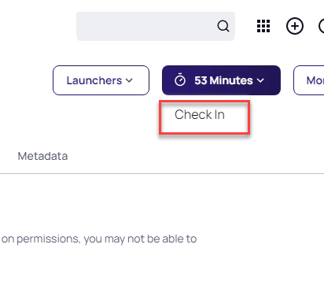

26. Reopen the Secret and see that the password has been changed

    

27. This is also conform the policy that we have defined and assigned to the folder


## Conclusion
As summary the three security settings:

- IT Admins from the Thylab domain are allowed to use and see ALL secrets to access ALL servers AND must comment with checkout why they need access to the Thylab servers. After the session closes, the password needs to be rotated
- IT Admins from the Greensafe domain are allowed to ONLY see the secrets of their Legacy environment and use them on their servers and are allowed to retrieve passwords
- The UNIX admins are allowed to see ALL unix related secrets and can use them to access ALL Unix related machines but are not allowed to see the passwords
- For all users
    - all sessions (RDP and SSH) MUST run proxied

During the testing of the configuration, the conclusion is that (proved by the running three scenarios using three different users) the configured policies work as requested.

# Teams
With Secret Server teams, administrators can create special groups called teams to restrict what users can see. A team bundles users and groups to assign them the same rules as to what other users and sites are visible to them. For example, a managed service provider could isolate their customers from seeing other customer’s user accounts or a large company could "firewall" their users by department. Site visibility can also be restricted by teams. 

The scenario we are solving is that Dennis Hughes and Joe Bloggs, even though they can see all Windows Servers in the Secret Server instance, we want to limit their view on the use of the Server Team - Domain Admin secret to allow only one server. Also they can not have the choice of selecting which Proxy to use for the connection as that might lead into issues for them when they selected the wrong one and more WAN traffic, or even errors might occur. The rest of the IT Admins have to have normal use, not limited by anything.

Use the below diagram to understand what is being configured in this lab.


## Create a Team Role
1. In the Secret Server UI log out from Denis Hughes' account and log back in as **ss-admin**, navigate to **Administration >> > Users, Roles, Access > Roles**
2. Create a role named **Role - Teams Assigned** by clicking **Create Role** and click on the newly created role. Set the following rights (on the **Permissions** tab):
    - Add Secret
    - Allow Access Challenge
    - Assign Secret Policy
    - Copy Secret
    - Delete Secret
    - Delete Secrets from Reports
    - Edit Secret
    - Own Secret
    - Personal Folders
    - User Audit Expire Secrets
    - View About
    - View Advanced Dashboard
    - View Advanced Secret Options
    - View Launcher Password
    - View Password Requirements
    - View Secret
    - View Secret Audit
    - View Secret Password and Private Key History
3. Click the **X** icon in the to be *Add Permission* navbar

   

## Create Teams
1. In the Secret Server UI, navigate to **Administration >> > user, Roles, Access > Teams**
2. Click **Create Team**
3. Use the following parameters:
    - Team Name: Thylab domain
    - Team Description: Thylab domain
4. Click **Create Team**
5. Click the **Sites** tab and click **Edit**
6. Check the **Should Restrict Sites**
7. Under Add Site, select the **thylab.lab** site (the users available in Secret Server)

    

8. Click **Save**
9. Click *Members* tab and click **Edit** next to Members
10. Add user Joe Bloggs and Dennis Hughes to the team

    

11. Click **Save**

## Assigning the Team role to the users
1. Navigate to **Administration >> > User, Roles, Access > Roles**
2. Click **Role - Teams Assigned**
3. Open the **Assingment** tab, if you are not on it
4. Click **Add**
5. Drag **thylab.local\Dennis Hughes** and **Joe Bloggs** from the pane on the right hand side
6. Close the **Add Users and Groups** panel to "save" the changes
7. Click the **Roles** text in the top of the screen and click the **User Role**
9. Delete **thylab.local\Dennis Hughes** and **Joe Bloggs** from the pane by hoovering over their names and click the **Bin** icon

    

## Testing the set Teams
1. Log out from the Secret Server UI
2. Log back in as **dhughes** with the password **Thycotic@2022!** in the **Thylab** domain 
3. Navigate to **Secrets >> > IT Team > IT - Server Team > Thylab**
4. Open the **Server team - Domain Admin** secret
5. Fill out the Comment (as the policy requires this)
6. Run the **RDP Launcher**
7. Due to the teams restriction only the dropdown box for **Enter Computer** has been given
    
    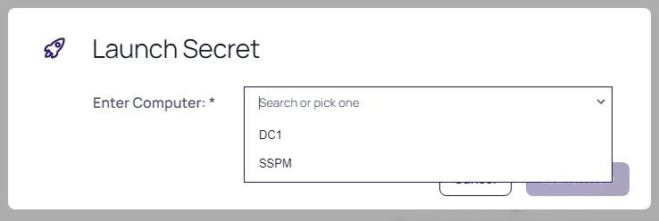

8. Click **Cancel**, **Check in the secret** and **log out** of the UI
8. Login as user JBloggs (**Thycotic/4u**) on the **Local** domain has no access at all. 

   ---
   
   **NOTE**
   You will have to change the password of this user

   ---

9. Log out Joe Bloggs
9. Log in as user **hpatel** with password **Thycotic@2022!** in the **Thylab** domain has no limitation on using the **Server team - Domain Admin** Secret other than the dropdown list of the server to connect to. Click **Cancel**
1. Log out hpatel

## Change to the existing list

One of the items that we can manipulate to limit the amount of servers a user can see is using a feature called Lists. These can be used to limit the possibilities for connections.

1. Log in to the Secret Server UI as ss-admin
2. Navigate to **Administration >> > Ations > Lists**
3. Open the **Allowed Domain Servers- Restricted RDP Launcher**
4. Remove DC1 and SSPM by clicking the three dots on the right side of the name and click **Delete** Option, click **OK** on the warning screen

    


5. Click Add > Create Option

    

6. In the Option Name provide **RabbitMQ**, leave the *Parent Category* as **Uncategorized** and click **Save**
    
    

7. Click **Save**

## Changing the Secret Template
As the existing secret Server team - Domain Admin secret has been created using a specific Secret Template, changes need to be made. The outcome should be that the people in the IT team can see and use the secret with no limitation. Joe Bloggs and Dennis Hughes (a Junior Admin) should have a limitation to a secret. These changes are:

- Change the Secret Template that has been used while the Server team - Domain Admin was created
- Change the Group membership that Dennis Hughes has been assigned to in AD. This has been a mistake.
- Create a secret that uses the restricted list for its Launcher

1. Log in the Secret Server UI as **ss-admin** and navigate to **Secrets >> > IT Team > IT - Server Team > Thylab**
2. Check the **Server Team - Domain Admin** and click **Bul Actions** in the bottom of the screen

    

3. Select **Convert Secret Template**

    

4. Select **Active Directory Account**, in the next screen leave all default. The *Allow Servers will be removed*

    

5. Click **Create Secret**
6. Wait till the Bulk Progress is ready and click **Close**

    

7. Click the + sign to create a new Secret
8. Select **Active Directory Account (Restricted Launch)**
9. Use the following parameters for the secret
    - Secret name: Restricted Servers
    - Domain: thylab.local
    - Username: adm_serverteam2
    - Password: Thycotic@2022!
    - Notes: Limited Server selection for the user to run the RDP Launcher
    - Allowed Servers: Allowed Domain Servers - Restricted RDP Launcher
    - Site: thylab.local

    

10. Click **Create Secret**
11. Provide a comment and click **Check Out Secret**
12. Click the **Sharing** tab click **Edit** 
12. Uncheck *Inherit Permission* from folder and *remove all but the ss-admin account*
13. Add accounts JBloggs and Dennis Hughes

    

13. Click **Add**
14. Make sure both accounts have *View rights* (default)
15. Click **Save**

    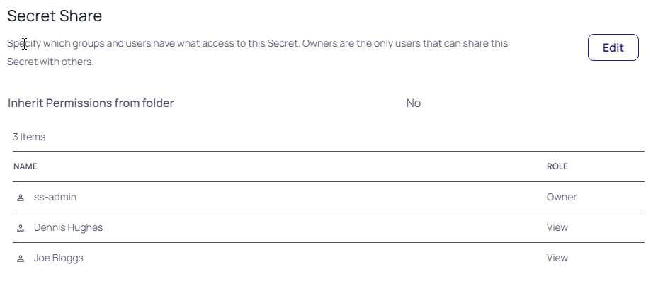

16. Check the secret back in

## Changing Dennis Hughes account
After a few weeks in Dennis has been given the full admin rights on all servers in the domain using Secret Server by putting his account in Active Directory in the IT- Team Server groups. To limit what he can do, his manager decided to take him out of the group and let him start slowly.

1. Login to the **DC1** machine with the **thylab\administrator** account
2. Open **Active Directory Users and Computers** and find **Dennis Hughes under Users**

    

3. Double click the account and click **Member Of**
4. Remove the **IT - Server Team** from his account so that he becomes a normal Domain User. Click **Yes** on the warning message
5. Click **OK**
6. Logout of the DC1 console and return to the Client machine
7. Back in the Secret Server UI navigate to **Administration >> > Users, Roles, Access > Directory Services** and click **Sync Now** to make the changes known to Secret Server
8. This Sync will disable Dennis' account that needs to be reneabled. Navigate to **Administration >> > Users, Roles, Access > User Management**
9. Switch the **Include Disabled** to show the disabled users

    

10. Find **DHughes** and set the checkbox in front of him. To get the checkbox, hoover over the account
11. Click the **Select Bulk Action** and select **Enable Users**

    

12. When asked to Confirm click **OK** and **Close** the Bulk Progress message
## Test the account
1. To test the effects of Teams, log the current user out of the Secret Server UI
2. Log back is as **DHughes** in the **Thylab** domain
3. There is only one secret available, the one created earlier Restricted Servers, with no folders

    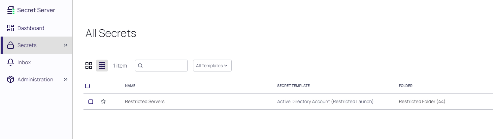

4. Open the Secret, click Enter Comment and enter some Comment (this due to policies set earlier)
5. Click the **RDP Launcher**
6. Due to the list and the used Secret Template, the user can only select a server. The possibility of providing a server is not possible

    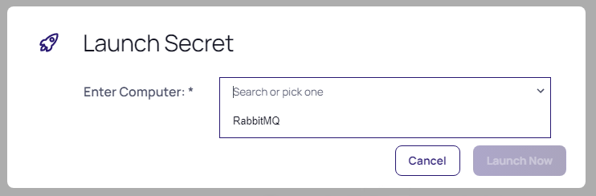

7. Click **Launch Now**
8. After clicking **Connect** and **Yes** the RDP session to the RabbitMQ should be shown
9. Close the session
10. Check the secret back in

# Hooks in secrets

In addition to changing the password on check in, secret owners can also specify administrator-created PowerShell scripts, called hooks, to run before or after checkout and check in. These are accessed from the Hooks tab of the secret, which only shows if checkout is enabled and PowerShell scripts have been created by an admin.

This part of the lab will go over the following steps
1. Create scripts that we need for the check out/- in hooks
2. Create a helper secret
3. Define Hooks for a secret

The scripts that we will create are to enable an Domain account needed to connect to a Windows server on a Check Out action and disble the account on the Check In action. A reason for this might be that the account is to powerfull to be enabled all the time. By disabling the account, a possible attack or unwanted usage can be countered. The account that we are going to use is **thylab\adm_serverteam3**. 

---

**NOTE**
This is just an example. As the programming language is going to be PowerShell, much more powerfull routines can be created on Checkou/-In situations

---


## Create the scripts

1. While still being on the Client VM, navigate to **Administration >> > Actions > Scripts: PowerShell, SQL, SSH**
2. Click **+ Create New**

  

3. Use the following information for the fields:
   - **Name:** Enable AD User
   - **Description:** Enabling AD User
   - **Category:** Password Changing
   - **Script:** Copy the below snipplet

     ```powershell
         [System.Net.ServicePointManager]::SecurityProtocol = [System.Net.SecurityProtocolType]::Tls12
         $GetUserStatus = Get-ADUser -Identity $Args[0]
         if ($GetUserStatus.Enabled -eq $false){
             $GetUserStatus | Set-ADUser -Enabled $true}
         
         Else {
             return
             }    
     ```
    
    

4. Click **OK** to save the script
5. Click **+ Create New**
6. Use the following information for the fields:
   - **Name:** Disable AD User
   - **Description:** Disabling AD User
   - **Category:** Password Changing
   - **Script:** Copy the below snipplet

     ```powershell
         [System.Net.ServicePointManager]::SecurityProtocol = [System.Net.SecurityProtocolType]::Tls12
         $GetUserStatus = Get-ADUser -Identity $Args[0]
         if ($GetUserStatus.Enabled -eq $true){
             $GetUserStatus | Set-ADUser -Enabled $false}
         
         Else {
             return
             }    
     ```
    
    

7. Click **OK** to save the script
8. Two scripts should now be shown

    

---

**NOTE**
To prepare the environment for PowerShell remote executinon, the following steps have been run on the Domain Controller (DC1 -> Domain GPO). [PowerShell and Delinea Secret Server](https://docs.delinea.com/ss/11.1.0/authentication/configuring-credssp-for-winrm-with-powershell/index.md). As the DE will run the PowerShell commands, we have installed RSAT on the RabbitMQ server and added the account (thylab\svc_secretserver) to the Remote Management User group.

---

## Create a helper Secret

As we are trying to change the password for a member of the Domain Admins group, only a Domain Admin is entitled to do so ([Protected Groups and Security Descriptor Propagator](https://social.technet.microsoft.com/wiki/contents/articles/22331.adminsdholder-protected-groups-and-security-descriptor-propagator.aspx)). Create a new secret for the Domain admin using the following parameters in **Secrets >> > TSS Service Accounts**:

- **Secret Template:** Active Directory Account
- **Secret Name:** Domain Admin
- **Domain:** thylab
- **Username:** administrator
- **Password:** Thycotic@2022!
- **Site:** Local
## Create a secret with hooks
This part is where we are going to use the scripts and the helper Secret. First we need to create a secret and then we define the hooks that need to be assigned. Lastly we are going to test the secret and the hooks.
### Create the secret
1. Navigate to **Secrets >> > IT - Team > IT - Server team > Thylab**
2. Create a new secret with the following parameters:

   - **Secret Template:** Active Directory Account
   - **Secret Name:** ADM_ServerTeam3
   - **Domain:** thylab
   - **Username:** adm_serverteam3
   - **Password:** Thycotic@2022!
   - **Site:** Local

   

3. Click **Create Secret**
4. Due to the policy, click **Comment**, provide some comment and click **Check Out**
5. Open the **Remote Password Changing** tab and click in the *RPC / Autochange* section , **Edit** 
6. Check the *Privileged Account Credentials* and slect the **Domain Admin** secret
7. Set the *Next Password* to **Randomly Generated**

   

6. Click **Save**

### Test the secret
1. Check the Heartbeat status of the secret. If that is Success, your all good to proceed to the next paragraph. 

   

---

**Only If not successfull** make sure that your solve the issue by:

1. Launch the RDP Launcher and make sure we can login to the **DC1** with the Site set to **thylab.local** using the secret.
2. If the connection fails, open the DC Console, and login using the **THYLAB\Administrator** account and reset the **adm_serverteam3** password using **Active Directory Users and Computers**. Make sure the password matches **Thycotic@2022!**. The account can be found in the DemoAccounts OU. Leave the DC1 console open as we need it in a bit.
   
3. Check the password in the secret for any typos.
3. Do not proceed before the RDP session works AND the Heartbeat is successfull.

---

4. If you haven't opened the DC console open it now.

### Assign the hooks


1. Open the **Hooks** tab
2. Click **Create New Hook**
3. In the DropDown box, select under *PowerShell*; **Enable AD User**

    

4. Click **Save**
5. Fill out the following parameters in the next screen that pops up:
   - **PRE/POST:** POST
   - **Event Action:** Check Out
   - **Name:** Enable AD User
   - **Description:** Enable AD User
   - **Arguments:** $USERNAME
   - **Privilgede Account:** Domain Admin

    

6. Click **Save**
2. Click **Create New Hook**
3. In the DropDown box, select under *PowerShell*; **Disable AD User**
4. Click **Save**
5. Fill out the following parameters in the next screen that pops up:
   - **PRE/POST:** POST
   - **Event Action:** Check In
   - **Name:** Disable AD User
   - **Description:** Disable AD User
   - **Arguments:** $USERNAME
   - **Privilgede Account:** Domain Admin

6. Click **Save**
7. There should now be two hooks available
    
   

8. Click the time and select **Check in**
9. Switch to the DC1 console and open the **Active Directory Users and COmputers** UI
10. Navigate to **thylab.local > DemoAccounts** and you should see the adm_serverteam3 account as being disabled (the down pointing arrow)
    
    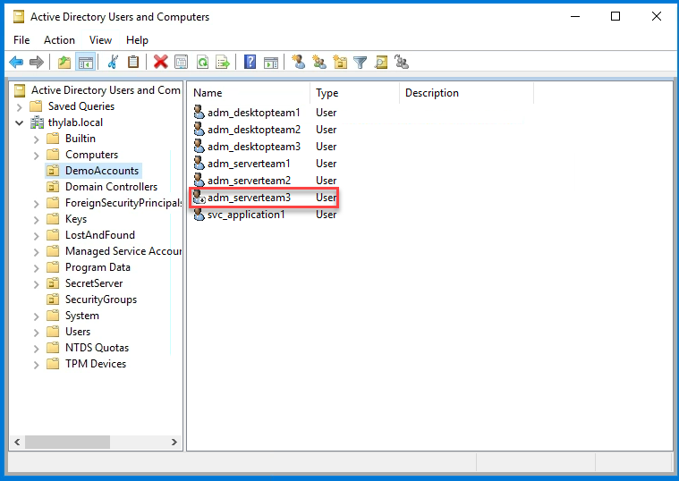

11. Switch back to the client and open the secret again you just created
12. Enter **Enter Comment** and click the **Checkout Secret**
13. Without doing anything, switch back to the DC1 console and refresh the UI
14. The account will no be enabled due to the checkout of the secret

    

15. Check the secret back in

As you have seen in this part of the lab, PowerShell scripts can be used to do some powerfull stuff. In this case it was "just" en-/disable an account on Checkout, but there are lots of other things that can be done. Think about a script which creates a firewall change using an API call so the user can login to the SSH server that is behind this firewall. After the secret has been checked-in the change will be reverted.

# Custom Discovery

For this part of the lab we are going to Scan for the SQL Server logins that have been defined in the Database that the SSPM server is using. The floowing steps are to be taken:

1. Create a new PowerShell Script
2. Create a new Scan Template
3. Create a new Discovery Scanner that uses the Scan Template and the PowerShell script
4. Run the Discovery scanner

## Create the PowerShell script

1. While still being on the Client VM, navigate to **Administration >> > Actions > Scripts: PowerShell, SQL, SSH**
2. Click **+ Create New**

  

3. Use the following information for the fields:
   - **Name:** SQL Login Discovery
   - **Description:** SQL Login Discovery Scanner
   - **Category:** Discovery Scanner
   - **Script:** Copy the below snipplet

   ``` powershell

         <#
          .SYNOPSIS
          Discovery script for finding all SQL Logins on a the target machine
          .EXAMPLE
          Expected arguments: $TARGET $[1]$DOMAIN $[1]$USERNAME $[1]$PASSWORD
          .EXAMPLE
          Expected arguments: $TARGET $[1]$USERNAME $[1]$PASSWORD
          Use lines 32/33 or 36/37 based on account type
          .NOTES
          Depends upon dbatools module being installed on the Secret Server Web Node or the Distributed Engine
          Reference: https://www.powershellgallery.com/packages/dbatools/
          Tested with version 1.0.107
          logPath variable below used for troubleshooting if required, file is written to this path with errors.
          A file for each server will be created, and overwritten on each run.
      #>
      $logPath = 'C:\scripts'
      echo $args[1]+"\"+$args[2]
      $TargetServer = ($args[0].Split("."))[0]
      
      $logFile = "$logPath\$($TargetServer)_findsqllogins.txt"
      Write-Output "[$(Get-Date -Format yyyyMMdd)] Processing Targeting machine: $TargetServer" | Out-File $logFile -Force
      
      <# Based on credential type of argument #>
      # Windows Domain with domain name
      $Username = $args[1]+"\"+$args[2]
      $Password = $args[3]
      
      # Windows Domain without domain name
      #$Username = $args[1]
      #$Password = $args[2]
      
      # Using SQL Login Account privileged account
      # $Username = $params[1]
      # $Password = $params[2]
      
      if ( $Username -and $Password ) {
          $passwd = $Password | ConvertTo-SecureString -AsPlainText -Force
          $sqlCred = New-Object System.Management.Automation.PSCredential -ArgumentList $Username,$passwd
          Write-Output "[$(Get-Date -Format yyyyMMdd)] Using Privileged Account: $($sqlCred.Username)" | Out-File $logFile -Force
      }
      
      $ProgressPreference = 'SilentlyContinue'
      if (-not (Get-InstalledModule dbatools)) {
          Write-Output "[$(Get-Date -Format yyyyMMdd)] dbatools module not found" | Out-File $logFile -Force
          throw "The module dbatools is required for this script. Please run 'Install-Module dbatools' in an elevated session on your Distributed Engine and/or Web Node."
      } else {
          Import-Module dbatools -Force
          <# disable dbatools commands attempting to resolve the target name #>
          $null = Set-DbatoolsConfig -FullName commands.resolve-dbanetworkname.bypass -Value $true
      }
      
      <# Find all the SQL Server instances #>
      try {
          <# Depends upong Discovery Account #>
          $p = @{
              ComputerName    = $TargetServer
              ScanType        = 'SqlService'
              EnableException = $true
          }
          $sqlEngines = Find-DbaInstance @p
          Write-Output "[$(Get-Date -Format yyyyMMdd)] SQL Instances found: $($sqlEngines.SqlInstance -join ',')" | Out-File $logFile -Force
      } catch {
          if (Test-Path $logPath) {
              Write-Output "[$(Get-Date -Format yyyyMMdd)] Issue finding SQL Instances on $TargetServer - $($_.Exception.Message)" | Out-File $logFile -Force
          } else {
              Write-Output "[$(Get-Date -Format yyyyMMdd)] Issue finding SQL Instances on $TargetServer - $($_.Exception.Message)"
          }
          throw "Issue finding SQL instances on $TargetServer - $_"
      }
      
      if ($sqlEngines) {
          foreach ($engine in $sqlEngines) {
              $sqlInstanceValue = $engine.SqlInstance
              try {
                  <#
                      Connect to each instance found
                  #>
                  $p = @{
                      SqlInstance   = $sqlInstanceValue
                      SqlCredential = $sqlCred
                      ErrorAction   = 'Stop'
                  }
                  try {
                      $cn = Connect-DbaInstance @p
                      Write-Output "[$(Get-Date -Format yyyyMMdd)] Connected to SQL Server Instance: $sqlInstanceValue" | Out-File $logFile -Force
                  } catch {
                      if (Test-Path $logPath) {
                          Write-Output "[$(Get-Date -Format yyyyMMdd)] Issue connecting to $sqlInstanceValue - $($_.Exception.Message)" | Out-File $logFile -Force
                      } else {
                          Write-Output "[$(Get-Date -Format yyyyMMdd)] Issue connecting to $sqlInstanceValue - $($_.Exception.Message)"
                      }
                      continue
                  }
      
                  <#
                      Find the logins on the instance
                  #>
                  $p = @{
                      SqlInstance     = $cn
                      Type            = 'SQL'
                      ExcludeFilter   = '##*'
                      EnableException = $true
                  }
                  $logins = Get-DbaLogin @p
                  Write-Output "[$(Get-Date -Format yyyyMMdd)] SQL Server Logins count: $($logins.Count)" | Out-File $logFile -Force
              } catch {
                  if (Test-Path $logPath) {
                      if (Test-Path $logFile) { $append = $true }
                      Write-Output "[$(Get-Date -Format yyyyMMdd)] Issue connecting to $sqlInstanceValue - $($_.Exception.Message)" | Out-File $logFile -Append:$append
                  } else {
                      Write-Output "[$(Get-Date -Format yyyyMMdd)] Issue connecting to $sqlInstanceValue - $($_.Exception.Message)"
                  }
                  continue
              }
      
              <# Output object for Discovery #>
              foreach ($login in $logins) {
                  Write-Output "[$(Get-Date -Format yyyyMMdd)] SQL Server Login found: $login" | Out-File $logFile -Force
                  [PSCustomObject]@{
                      Machine  = $login.Parent.Name
                      Username = $login.Name
                  }
              }
              return [PSCustomObject]
          }
      }
   ```
2. Click **Ok**

## Create a new scan template

1. Navigate to **Adminitration >> >Actions > Discovery**
2. Open the **Configuration** tab
3. Click **Discovery Configuration Options > Extensible Discovery**
   
   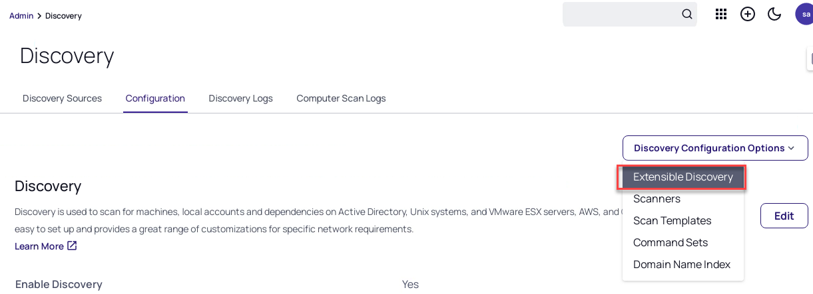

4. Click in the *Scan Templates* **Configure Scan Templates** and open the **Accounts** tab
5. Click **+ Create New Scan Template**
6. Use the following parameters for the new screen that appears:

   1. **Name:** SQL Logins
   2. **Scan Type:** no change
   3. **Parent Scan Template:** no change
   4. **FIELD NAME** Fill out the following

      **Machine**
      **Username**

  The configuration should look like the below screenshot:

   

7. Click **Save**
  
## Create a new Discovery scanner

1. Navigate to **Adminitration >> >Actions > Discovery**
2. Open the **Configuration** tab
3. Click **Discovery Configuration Options > Extensible Discovery**
4. In the *Discovery Scanners* section click **Configure Discovery Scanners**
5. Click the **Accounts** tab and click **+ Create New Scanner**
6. Provide the following parameters for the new scanner

   - **Name:** SQL Login Discovery Scanner
   - **Description:** SQL Login Discovery Scanner
   - **Active:** Checked
   - **Discovery Type:** Find Local Accounts
   - **Base Scanner:** PowerShell Discovery
   - **Allow OU Input:** unchecked
   - **Input Template:** Windows Computer
   - **Output Template:** SQL Login
   - **Script:** SQL Login Discovery
   - **Script Arguments:** $target $[1]$Domain $[1]$Username $[1]$Password

   

7. Click **Ok**

## Run the new Discovery Scanner

Now that we have paved the way, we need to tell the Discovery Scanner to also run the new Scanner.

1. Navigate to **Administration >> > Discovery**
2. Click the **thylab.local** domain and click **Scanner Settings**

   

3. In the *FIND ACCOUNTS* section, click **+Add New Account Scanner**
4. Click on the **+** symbol to add the scanner

   

5. Click **OK**
6. The new scanner should be mentioned in the list of *FIND ACCOUNTS*

   

7. Click the **BACK** button the return back to the domain
8. In the top of the screen, click **Admin > Discovery**
9. Click **Run Discovery Now > Run Computer Scan** to run the scanner including the SQL Scanner
10. Wait till the Computer Scan has ended. It should read **Just Now**
11. Click on **Discovery Network View**
12. In the new window, make sure you have **Local Accounts** selected and click **Computers** in the **thylab.local** domain
13. In the Line that shows SSPM you will see the **sa** account and **SQL Login** as the scan template

    

14. Click **Back** to return back to the Discovery overview

---

**Remark**

Using this method, Extensible (custom) Discovery, anything that can be "discovered" by using a PowerShell script, can be created for resources which are not available Out-Off-The-Box. To read more on Extensible (Custom) Discovery, including some examples, can be found [here](https://docs.thycotic.com/ss/11.1.0/discovery/extensible-discovery/index.md).

---

# Custom Remote Password Changer

Secret Server has already the most common password changers built-in. In some cases the available password changers are not enough and a custom one has to be created. This lab will show the process of creating such a custom Remote Password Changer (RPC) for the VyOS router that is conncting the two domain and the internet together. The following steps will be explained:

1. Create a RPC
2. Create a new Secret Templates and use the RPC
3. Create a new secret with the newly created Secret Template

## Create a RPC

1. Navigate go **Administration >> > Actions > Remote Password Changing Configuration**
2. Click **Configure Password Changers**

   

3. Scroll all the way down and clik **+ New**
4. As *Base Password Changer* slect **Unix Account Custom (SSH)** and name it **VyOS router**

   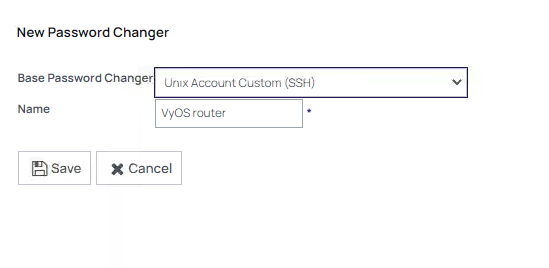

5. Click **Save**
6. In the new screen in the *Password Change Commands* use the following parameters (**leave all settings default unless told otherwise!!!**):

   - **Remove all current Commands by clicking the delete icon (metal bin)**

     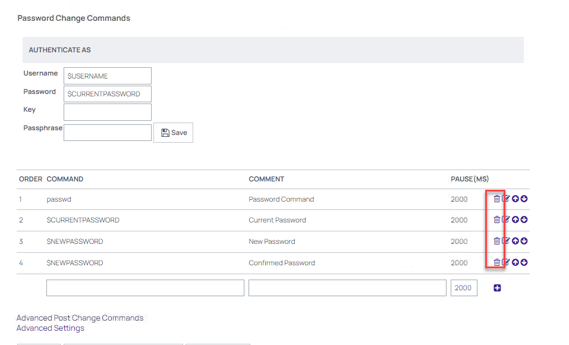
   - Use the following commands (add new by clicking the **+** symbol at the end of the command):

     | Command                                                                          | Comment                 | Pause |
     |----------------------------------------------------------------------------------|-------------------------|-------|
     | configure                                                                        | Open configuration mode | 2000  |
     | set system login user \$USERNAME authentication plaintext-password \$NEWPASSWORD | Set the new password    | 2000  |
     | commit                                                                           | Commit the change       | 2000  |
     | save                                                                             | Save the change         | 2000  |
     | exit                                                                             | Leave the config mode   | 2000  |

7. The configuration should look like the below screenshot

   

8. Click **Back**
9. In the new screen, Click the **left** **Test Action** button to check that we can use the connection with some paramters. Use the following parameters:
   
   

   - **Username:** vyos
   - **Password:** Thycotic@2022!
   - **MACHINE:** vyos.thylab.local
   - **Leave the rest of the fields default**

   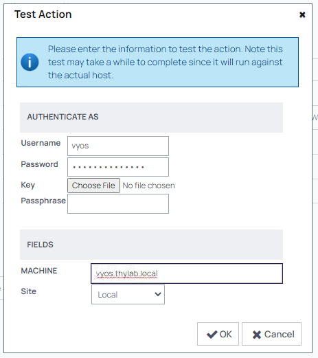

10. Click **OK**. This will run the test and should return **Password Verify was Successful**

    

11. Click the **right** **Test Action** button to check the commands provided to change the password
12. Use the following parameters in the fields:

    - **Username:** vyos
    - **Password:** Thycotic@2022!
    - **MACHINE:** vyos.thylab.local
    - **$USERNAME:** vyos
    - **$NEWPASSWORD:** Delinea/4u
    - **Leave the rest of the fields default**

    

13. Click **OK** to test the built RPC. After a few seconds you will receive **Console Output** message in green meaning this test was successful

    


14. Click the **left** **Test Action** button again to check that we can use the connection with the new password. Use the following parameters:
   
    - **Username:** vyos
    - **Password:** Delinea/4u
    - **MACHINE:** vyos.thylab.local
    - **Leave the rest of the fields default**

15. This should result in a successful **Password verify**
16. Rerun the **right** **Test Action** button and set the password back to **Thycotic@2022!** so we are back at the beginning situation.As the RPC is now working

Now that the RPC is working, the next step is to create anew Secret Template that is going to be used for the secret for the VyOS router

## Create a Secret Template and use the RPC

1. Navigate to **Administration >> > Actions > Secret Templates**
2. Click **Create Template** and use the **Name** VyOS - Custom RPC

   

3. Click **Save**
4. In the new screen click the *Fields* tab and click **Add Field**
5. Use the following parameters:

   - **Name:** Username
   - **Field Slug Name:** *Auto populated*
   - **Description:** Username
   - **Data Type:** Text

   

6. Click **Save**
7. Repeat steps 4 til 6 and use the following parameters

   | Name     | Field Slug Name | Description  | Data Type |
   |----------|-----------------|--------------|-----------|
   | Password | password        | Password     | Password  |
   | Machine  | machine         | Machine name | Text      |

8. The fields definition should look like the below screenshot

   

9. Click the *Mapping* tab and click **Edit**
10. Enable RPC by setting the checkbox
11. Set the following parameters:

    - **Password Type to use:** VyOS router *(the name of the created RPC)*
    - **Machine Name:** Machine
    - **Password:** Password
    - **User Name:** Username

    

12. Click **Save**
13. Click **Add Mapping** to add a launcher to the Template
14. Select **PuTTY** in the mapping type and map the fields to the required information (Port; use default and set 22)

    

15. Click **Save**

Now that we have the RCP assigned to a newly created Secret Template it is time to create the secret for the VyOS Router

## Create the secret

1. Navigate to **Secrets >> > IT Team > IT - Server Team > Thylab**
2. Create a new secret from the new Secret Template named **VyOS - Custom RPC**

   

3. Name the new secret **VyOS - Router - Custom RPC**
4. Fill out the rest of the fields using the known information. The secret should look like the below screenshot

   

5. Click **Create Secret**
6. As there is a policy on the folder, click **Enter Comment**, give some information and click **Check Out Secret** to open the secret
7. Run the **PuTTY Launcher** to check we can connect to the VyOS router. THis will open a SSH session and the console shold be shown.

   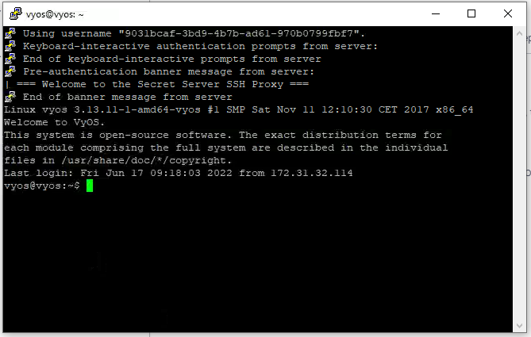

8. Close the session by using ```<CTRL>+d```
9. Click the EYE icon next to the password to see the password and try to remember it.
   
   

10. The policy has stated that on Check in the password MUST be changed. Click the **Time left** and click **Check In** this will trigger a password reset and wait approx. 30 seconds before proceeding. The RPC needs 20 seconds to run (*2000ms per command as stated in the RPC Pause*).

    ---
    
    **Note**
    If you don't wait the 30 seconds, a message is shown that there is a *pending password change*. After this has run successfully, you will be forced to do a Check Out again!
    
    ---

11. Open the secret again, click **Enter Comment**, give some information and click **Check Out Secret**
12. Click the EYE icon next to the password to see the new password that has been set. 

   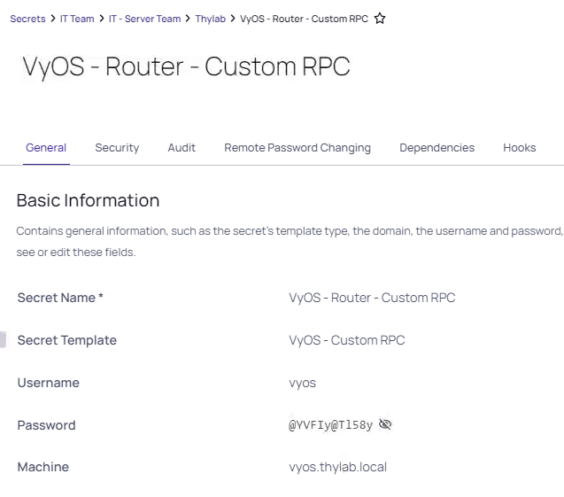

13. Run the **PuTTY Launcher** to make sure it works using the new password. This will open the console to the VyOS router as shown earlier, but now using the new password.

As you have found, it is relatively easy to create your own RPCs. Especially in situation where the default, or OOTB, RPCs are not enough this can come in handy...

# Disaster Recovery

Since version 11.2 of Delinea Secret Server, Disaster Recovery (DR) has been added. This option makes it possible to have a standby instance available for Secrets. This part of the lab is on how to setup DR between On-Prem instances. The following scenario's can be setup in real life and are supported:

- On-Prem to Secret Server Cloud
- Secret Server Cloud to On-Prem
- Secret Server Cloud to Secret Server Cloud
- Secret Server Cloud to On-Prem (but is an edge case)

---

**Remark**

In the DR scenario's the receiving side of the solution is PULLING the secrets. This means that in the last scenario, On-Prem to Secret Server Cloud, the On-Prem instance needs to aacessible AND have a valid certificate! Without this, that scenario can NOT be implemented.

In the current version the following can be replicated:

- Secrets
- Secret Templates
- Folders
- Launchers
- Roles

---

The following steps are described:

1. Set the correct role permissions for DR
2. Create a User Group that can access the Replicated information
3. Setup DR
4. Test DR

## Set the correct role permissions

As the DR permissions is by default not enabled  in any of the OOTB roles, it needs to be assigned to a role. The Administrator is going to be assigned this permission.

1. Open the console of **sspm-dr**
2. Start Chrome and open the UI at **https://sspm-dr.greensafe.lab/SecretServer**
3. Login using the below information:
 
   - **Username:** ss_admin
   - **Password:** *Provided by trainer*

4. Navigate to **Administration >> > Users, Roles, Access > Roles**
5. Click **Administrator**
6. Click the *Permissions* tab
7. Click **Add** and add the **Administer Disaster Recovery** permission

   

8. Close the panel on the right hand side by clicking the **X** in the topright corner
9. Refresh the browser and navigate to **Administration >> > Setup & System Maintenace** a new option will now be available **Disaster Recovery**

   

7. Open a new tab in Chrome and navigate to **https://sspm.thylab.local/SecretServer** and login as **ss-admin** with the corresponding password
8. Repeat steps 4 - 9 to set the permissions on the sspm server

## Create User Group

To make sure the Replication is only available for a certain group of people and not all, a group will be created and users will be assigned to the group that are alloowed to see/access the replicated secrets. As the DR side is a clean installtion, only the ss_admin account does exist. As this lab is about how to setup DR bewteen Secret Server instances, we are going to assign the ss_admin account to the group.

1. Switch back to the sspm-dr UI tab in Chrome, navigate to **Administration >> > Users, Roles, Access > Roles**
2. Click the *Groups* tab and click **Create Group**
3. Name the Group **DR-Users**
4. In the new window click **Add** to add the **ss_admin** user
## Setup DR

Now that we have the permissions set on both systems and we have a group, we can start to configure the DR.

1. Switch back to the sspm-dr UI tab, the first tab in Chrome and navigate to **Administration >> > Setup & System Maintenace**
2. Click on **Disaster Recovery** and **make sure you are in the *Incoming Configuration***
3. Click **Edit**
4. Set the following parameters:

   - **Enabled:** Checked
   - **Data Source URL:** https://sspm.thylab.local/SecretServer
   - **Group:** DR Users
   - **Data Source Key:** To get this Key, follow the next steps:

     1. Switch to the Second tab where the SSPM UI is located
     2. Click *Disaster Recovery* after you navigated to **Administration >> > Setup & System Maintenace**
     3. Click *Outgoing Configuration* tab
     4. Click **Outgoing Setup Steps**
     5. In the new screen, click **Copy Data Source Key**

        

     6. Switch back to the first tab (sspm-dr UI) and copy the information

        

5. Click **Save**
6. Switch back to the sspm UI and while still in **Disaster recovery**, refresh the browser. A message will be shown in the *Outgoing Configuration* tab
7. For the replication to be able to run, a Data Store Path has to be set. Click the text **< Not Set >** and set the path to **C:\Windows\Temp**

   

8. Click **Save**
9. Click the *Small Down Pointing arrow* next to the **Data Replica** to see details

   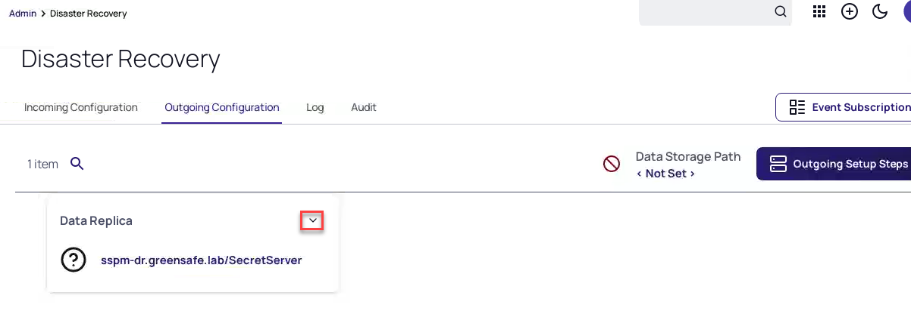

10. In the details click the **Approve** button, also in the **Confirm Approve Data Replica** screen that apears

    

11. The status should change to Enabled with a Green checkbox in front of it

    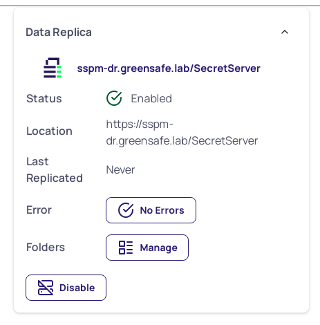

12. Switch back to the sspm-dr UI in Chrome and a message is shown stating *"This instance of Secret Server is a replica. Any changes made here will not be reflected in the main instance."*
13. Click **Test Connection** and a new screen will appear that the Connection was approved

    

14. Click **Close**
15. Click Secrets in the left hand side navigation bar and see that there are no secrets available

    

16. Navigate back to **Administration >> > Setup & System Maintenace > Disaster Recovery**
17. Click **Run data Replication** to start the replication
18. Click **Run Now** in the *Confirm Run data Replication Now* screen
19. Click **Close** in the Data Replication screen to close the screen
20. Click **Secrets** and after a few seconds all Folders, including all personal ones, and their corresponding secrets will be available in the sspm-dr UI

    

--- 
# Summarize the lab

To summarize what has been done:
1. Setup a Site Connector based on RabbitMQ
2. Define a site thylab.local
3. Deploy a Distributed Engine in the site
4. Define a second site greensafe.lab
5. Deploy a Distributed Engine in the site
6. Run discovery on the second site for users and computers
7. Configure and test SSH and RDP proxied sessions
8. Creating and testing Secrets Policies
9. Creating and testing Secret Server Teams and their setting and how that impacts what users can/can't do using Lists and Site restrictions
10. Create hooks on check out/in actions
12. Custom discovery to discover SQL Server accounts
13. Create a custom RPC for the existing VyOS router
14. Setup and use Disater Recovery of the Secret Server between the two domains

The total network traffic with respect to the Secret Server, the RabbitMQ and the DEs is shown below


Which simplified is the same as the earlier shown picture

