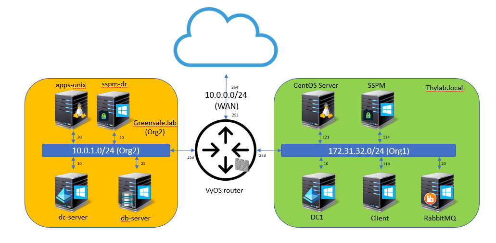
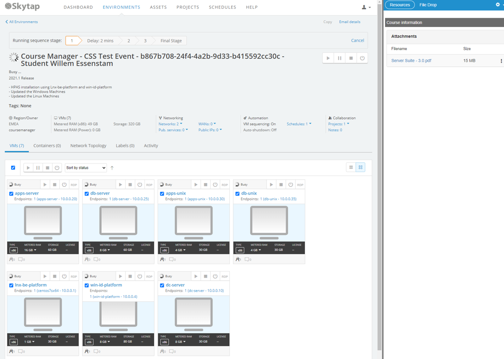
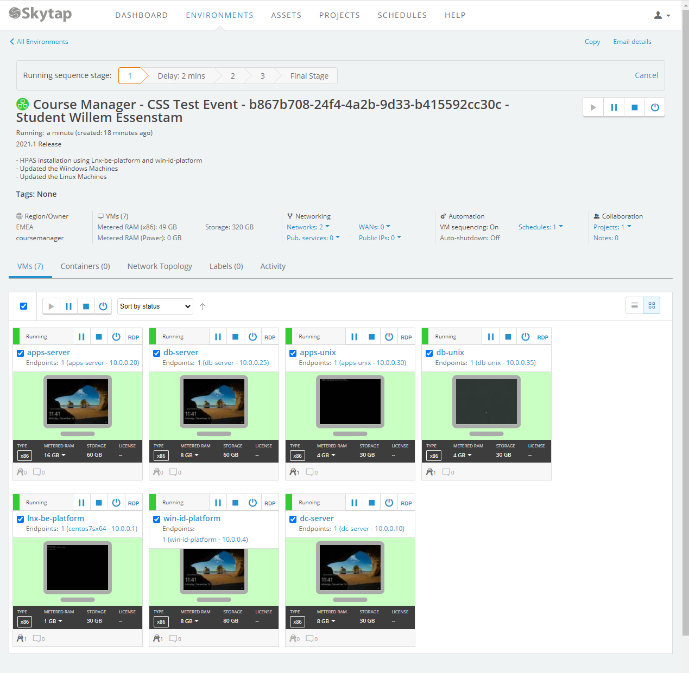

.. title:: Delinea - Server and Cloud Suite Partner training

.. toctree::
  :maxdepth: 2
  :caption: Secret Server
  :name: _Secret_Server
  :hidden:

  lab1/lab1
  lab2/lab2
  lab3/lab3
  lab4/lab4
  lab5/lab5
  lab6/lab6
  lab7/lab7
  lab8/lab8
  lab9/lab9
  lab10/lab10
  lab11/lab11
  
.. _getting_started_index:

----------
Welcome!!!
----------

Welcome to Delinea's Partner training on Secret Server Advanced!!!

Secret Server advanced Lab
--------------------------

This lab will be a sequel to the Secret Server Training Lab where the thylab.local domain has been fully configured.

This lab is emulating a scenario in which an organisation (thylab.local) has merged with a second organisation (greensafe.lab domain) and the administrators for the first organisation need the ability to control the second AD using Secret Server.

Below is a diagram of the two organisation as it has been build in the lab infrastructure.

This lab will highlight the following topics:

#. Installing RabbitMQ as Site Connector
#. Use of Sites and Distributed Engines
#. Discovery of the second site
#. Proxying SSH and RDP sessions
#. Secrets Manipulation using folders
#. Use of Teams and lists
#. Hooks in secrets
#. Custom Discovery
#. Custom Remote Password Changer
#. Disaster Recovery (on-prem to on-prem)

Skytap
++++++

This workshop runs from a Skytap environment in the EMEA region. To present you with a basic set of how to use the environment, please read this small guide..

Access to your environment
**************************

You should have received an email that you have been invited to an online training session.

.. figure:: images/lab001.png

Click the link as you see it mentioning in the email. You may be asked to provided an extra password to login to your ask your training for that password.... Welcome to the world of security :)

Starting your environment
*************************

Once in your environment you will see in the top right corner a "Play" button which you must click if your environment has not started. It will take approx 5-10 minutes for the environment to start.

Check your environment
**********************

After all VMs have started, the screenshot is an example, click on the VM that is mentioned in the lab. This will open the VM in a new browser tab so you can interact with the VM. Another option is to use the RDP link. This will download an RDP file that you can open in your RDP application like MS Terminal Services. This also works for Linux based machine. 

Working with your environment
*****************************

Once you have the VM open in a Browser window, you will get the Skytap Toolbar (click the arrow if you don’t see it or want to hide it). 

.. figure:: images/lab004.png

From left to right:

1. The two screens icon; clicking this icon provides the possibility to switch consoles between VMs
2. The "pause"/ "stop" / "power" button; Resp. suspend, stop and poweroff/on the current VM
3. Ctrl-Alt-Del button; send the Ctrl-Alt-Del command to the VM
4. Keybord (EN) icon; switch between keyboard layouts. The VMs are built on EN-UK layout!
5. Keys icon; any password that have been defined, you can use the button to insert the password
6. Clipboard icon; exchange clipboard info between the VM and the machine you are working on
7. The screen "diagonal" icon; Go full screen for the current VM
8. Different screensizes icon; resize the screen to presetted sizes
9. The "Wifi" icon; connection strength

Support to your environment
***************************

Your instructor can help you "remotely". He/she is able to connect to your environment and discuss together where the issue is. When he/she connects to your environment the mouse movements are seen on your screen. Don't be scared it is not a virus, it's your instructor!!!

  
  

  
<H1 style="color:#00FF59">HAVE FUN!!!!</H1>

