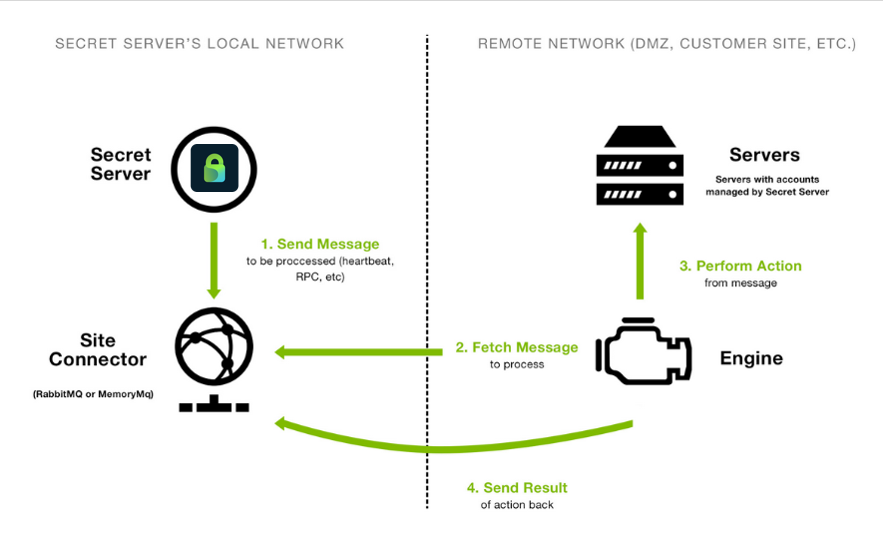
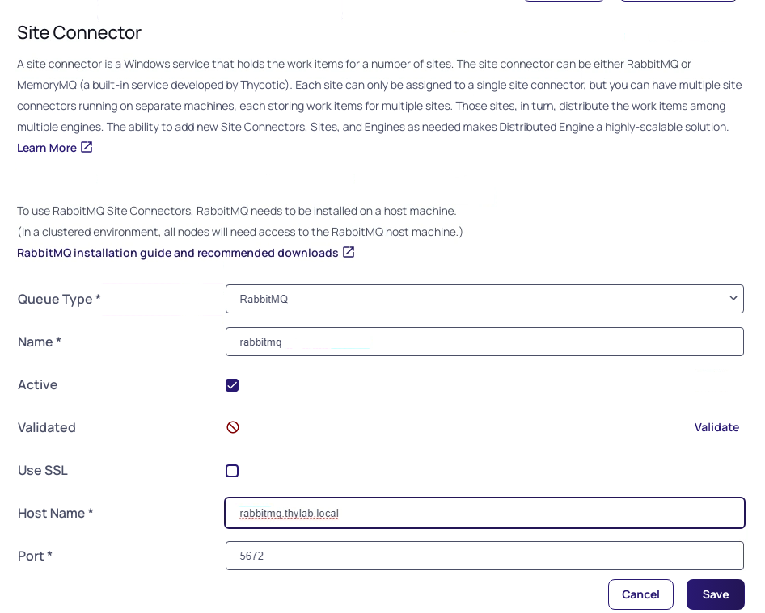
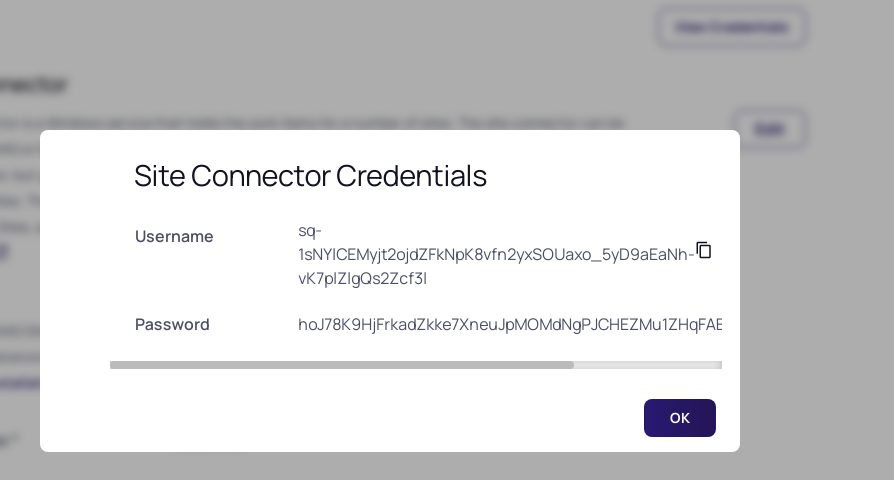
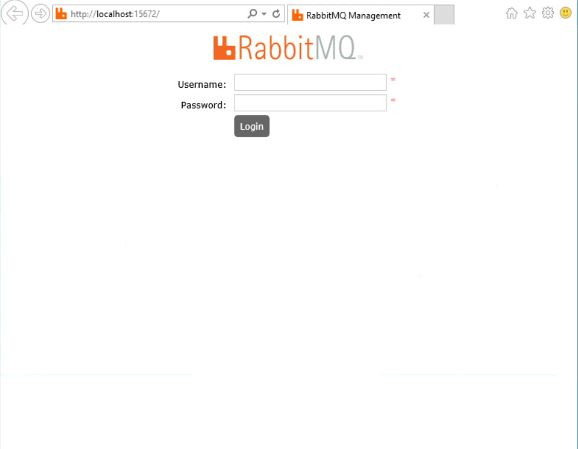
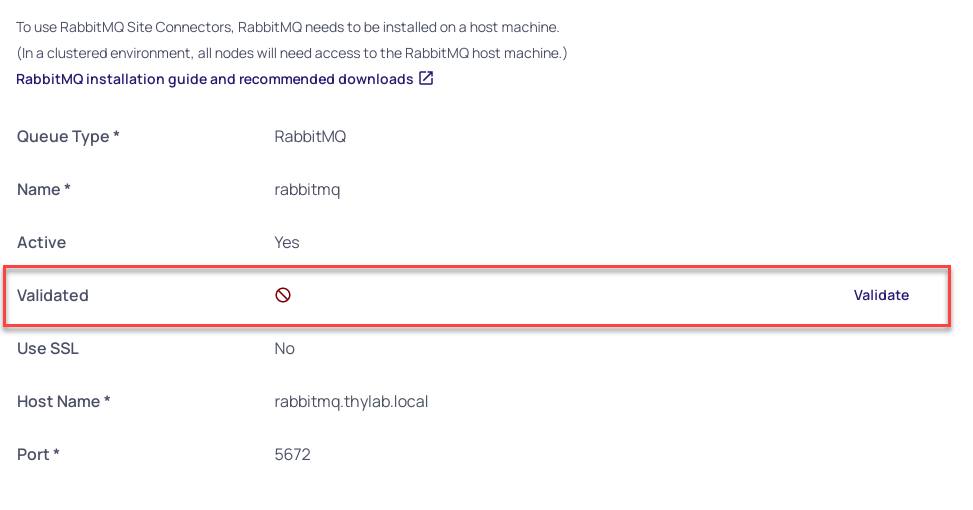
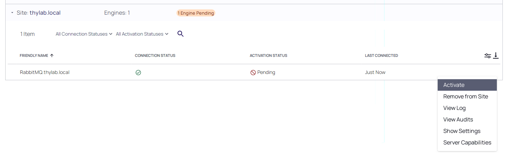

# Configure Site Connector

A site Connector is what binds the Secret Server instance with its Distributed Engine(s). The Site Connector is using the message queueing mechanism to make sure jobs and results are exchanged in a modular fashion between the DEs and Secret Server. This also makes it possible to implement Secret Server as a High Availability solution.

The supported two Message Queueing (MQ) mechanisms are MemoryMQ and Rabbit MQ. The first one is suitable for very small or testing/demo installations. The problem with this MQ is that it runs in the memory of the Secret Server and is therefore limited. It can not be clustered is one of its limitations. The other solution, highly recommended, is using [RabbitMQ](https://rabitmq.com). This MQ is a dedicated instance that is specially built for the task and seen as one of the popular open source MQ.




## Installation process high level:
1. Configuration for the new Site Connector to be using RabbitMQ
2. Install RabbitMQ using the [RabbitMQ helper](https://docs.thycotic.com/ss/11.1.0/secret-server-setup/installation/installing-rabbitmq/index.md)
3. Configuration check on connectivity
4. Create site and install Distributed Engine in one site
5. Create Site and install Distributed Engine in second sites

## Configure Secret Server
1. Open the **SSPM** and login as **adm-training** 
2. Open Secret Server at **https://sspm.thylab.local/SecretServer**
3. Login as **ss-admin** with the password **Delinea/4u**
4. You may be asked to reset the password. Use you own password as long as you remember it ;)..
5. Navigate to Administrattion > Setup & System Maintenance > Distributed Engine
6. Click **Configure** and **Edit**
8. Use the following settings for the Site Connector

    - Queue Type: RabbitMQ
    - Name: rabbitmq
    - Active: Checked
    - SSL: Unchecked
    - Host name: rabbitmq.thylab.local
    - Port: 5672

    

9. Click **Save**

## Installation of RabbitMQ
1. Open the **RabbitMQ** server and login as **adm-training**
2. Open **Chrome** and open the URL **https://thycoticdownloadsprod.blob.core.windows.net/ssintegrations/RabbitMQHelper/Delinea.RabbitMq.Helper.9.5.msi** to download the RabbitMQ Helper
3. Run the downloaded MSI file
4. Open Secret Server at https://sspm.thylab.local/SecretServer 
5. Login as ss-admin with the password you set (this will log you out of the SSPM Secret Server UI if you refresh that browser on the SSPM server)
6. Navigate to **Administration >> > Setup & System Maintenance > Distributed Engine**
7. Click **Configure**
8. Click **View Credentials**. Keep this open as it needed in the next steps
   
   

9. Back at the RabbitMQ server, open Windows Explorer
10. Navigate to *%PROGRAMFILES% > Delinea Software Ltd > RabbitMq Helper* and run **Delinea.RabbitMq.Helper.exe**
11. This will open a PowerShell command line
12. Copy these lines into the PowerShell session:

    ```powershell
    $cred = Get-Credential -Message "Enter the initial RabbitMq user username and password";
    #if you don't want to be prompted you can hardcode your credential in the script
    #$password = ConvertTo-SecureString “PlainTextPassword” -AsPlainText -Force
    #$cred = New-Object System.Management.Automation.PSCredential (“CustomUserName”, $password)
    
    Install-Connector `
        -Credential $cred `
        -UseDelineaMirror -Verbose
    ```
    
    ---
    
    **Note**
    This script assumes your environment has an internet connection. If not, please check https://thycotic.github.io/rabbitmq-helper/installation/ for you Scenario.
    
    ---
     
13. Hit Enter to execute the lines
14. The user name and the password are provided by the Secret Server as shown after clicking **View Credentials**
    
    

15. Copy the username and password in the Messagebox (you can click them and a popup box at the bottom of the screen will show telling it copied respectively the username and password) and click **OK**
16. When warnings are given on *Agree on Licenses*, type **Y and Enter**
17. This will Download, install and Configure RabbitMQ on the machine. The process takes approx. 5 minutes
18. The RabbitMQ Management webpage should open of RabbitMQ (just accept the IE11 settings and proceed by clicking the OK button). This means RabbitMQ has been installed and configured. You can close Internet Explorer as we don't need it. Also close the Powershell commandline.
    
    

19. Back in your Secret Server UI (on RabbitMQ), click **OK** to close the *Site Connector Credentials* screen
20. Click **Validate**, next to validated to make sure the RabbitMQ is correctly installed

    

21. In the next screen click **Validate**
22. Click **Save**

    

23. Click **Skip this Step** and click **OK** on the *Confirm Skipping Engine Download* warning
24. If no errors have been detected, you will be presented with the Site screen configuration

## Add thylab.local site
1. In the Site screen, click the **Add Site** button
   
   

2. Name the site **thylab.local**
3. Set the Site Connector to rabbitmq
4. Set the Engine callback Interval to 30 (seconds). This is just for testing/demoing purpose. In production this would be 5 minutes, depending on the organization and the jobs that need to be run in the site.
    
    

5. Click **Add SIte****


## First Distributed Engine (DE)


1. Navigate to Administrattion > Setup & System Maintenance > Distributed Engine and click the **Add Engine** button. In the next screen make sure that:
    - Processor Architecture is 64-bit
    - Preconfigured Site: thylab.local

    

2. Click **Download Now**
3. After the download, goto the **Downloads** directory using **Windows Explorer** and Extract the download ZIP file (Right-click the file and Extract...)
4. When the extraction has been done, open the extract folder and run the setup.exe (no interaction is needed). On the UAC, click **Yes**

    

5. Close the Windows Explorer screen and **return to the Secret Server UI**
6. In **Site: thylab.local** there should be a amber "warning" of 1 Engine Pending

    

7. *Expand the thylab.local site* and move the mouse on top of the **RabbitMQ.thylab.local** server
8. On the right side of that DE, *click the three dots* and select **Activate**

    

9. Click OK in the confirmation message. This will now, if all configured correct, will have two green check marks. 

    

---

**NOTE**
You may have to refresh your browser to see the two green checks

---

10. Close the Browser screen and logout of the server as we are ready for now on this server

  
  <HR>
  <center><H1 style="color:#00FF59">This concludes this part of the lab</H1></center>