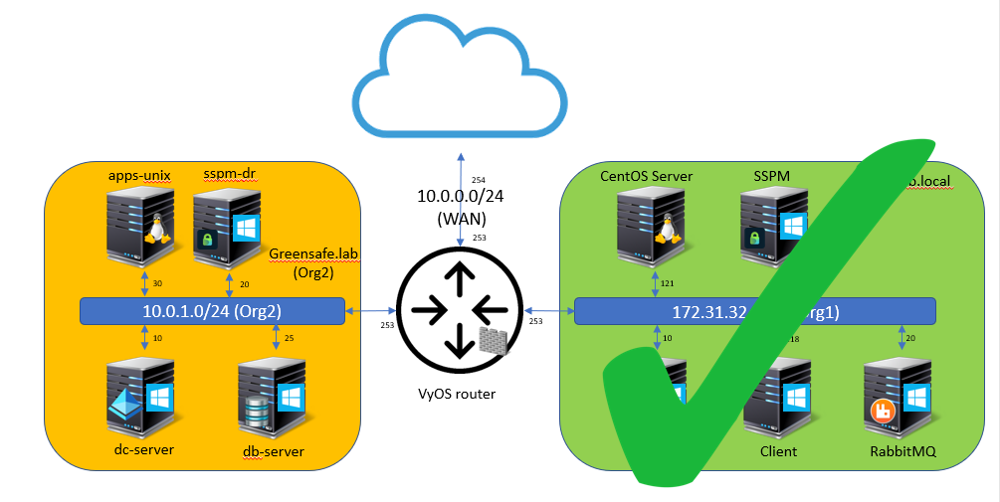
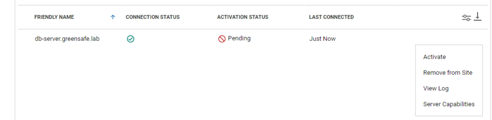
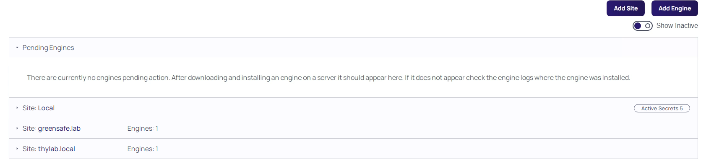

# Add second site

There is now one site (thylab.local) configured with a DE assigned to it. 

As the organisation has merged with a second organisation, Greensafe, we now need to configure Secret Server that there is another site that needs to be managed by Secret Server via a DE. This will be done by:

1. Defining another site
2. Install and assign a DE to the greensafe.lab site

## Add site
1. Open the console of the **db-server** server, login as **Alex Foster (afoster)** with the password **Centr1fy** and open the URL using Chrome (you can set Chrome as the default browser) **https://sspm.thylab.local/SecretServer** and login using the ss-admin account with your set password
2. Navigate to Administrattion > Setup & System Maintenance > Distributed Engine
1. Click **Add Site**
2. Name the site **greensafe.lab**
3. Set the Site Connector to rabbitmq

   

4. Set the Engine callback Interval to 30 (seconds). This is just for testing/demoing purpose. In production this would be 5 minutes, depending on the organization and the jobs that need to be run in the site.
5. Click **Add Site**

## Install a DE in the second infrastructure
Now that the second organisation is added as a site, it needs to be provided with a DE, that way Secret Server can communicate over port 443 with the Greensafe infrastructure using the distributed engine. An other reason for deploying a DE is that it will allow us to scan and run Remote Password Changers (RPC) decentralised in the Greensafe Infrastructure.

2. Navigate to Administrattion > Setup & System Maintenance > Distributed Engine
3. Click **Add Engine**
4. Check the Processor Architecture and make sue it says 64-bit
5. Set the Preconfigured site to greensafe.lab

    

6. Click **Download Now** to download a ZIP file
8. Open a Windows Explorer and navigate to Downloads
10. Extract the ZIP file and run the setup.exe Application

    

11. Close the Windows Explorer screens after the installation has finished
11. Return to the Secret Server UI and make sure you are at Administrattion > Setup & System Maintenance > Distributed Engine
12. After a few seconds, your deployed engine should be seen in the UI in the Pending Engines section. If the DE isn't shown, refresh your browser

    

13. Expand the **greensafe.lab** site
14. Hoover over the db-server.greensafe.lab engine and click the three dots on the right

    

15. Click **Activate** in the dropdown menu, and **OK**
16. If there is still a warning box next to the greensafe.lab site, refresh your browser
17. Your UI should look like the below screenshot if all went well

    

  
  

  
<H1 style="color:#00FF59">This concludes this part of the lab</H1>
