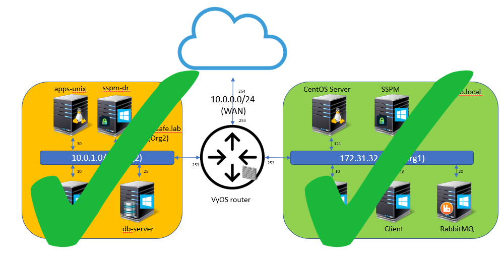
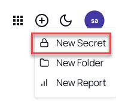
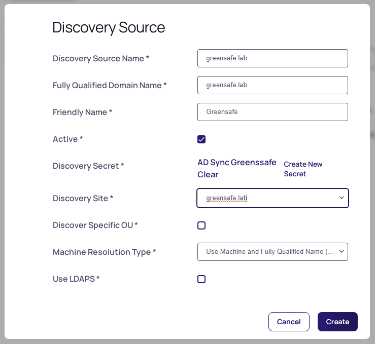
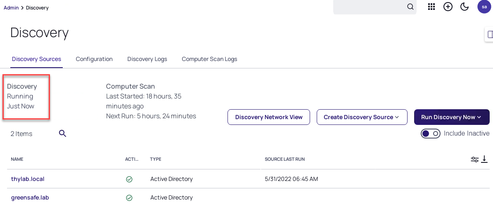
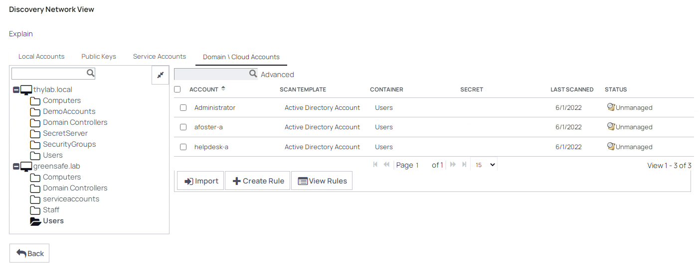

# Discovery of the second domain

Now that both organisations have been added to the Secret Server instance it is time to start the Discovery of the domains.

To be able to manage the second infrastructure via the DE, discovery needs to be configured for the Greensafe.lab  domain. After the discovery of Machine, Dependencies and Accounts the next configuration step can take place, defining the correct access rights to the Domain admins of the two different organisations.

## Adding secret for AD Sync Greensafe
1. Log out of the db-server
2. Switch back to the **SSPM server** and refresh your browser
3. Login as **ss-admin** (as we have been logged out due to the login on the db-server, re-login is needed)
4. Navigate to **Secrets >> > TSS Service Accounts** and **add a new secret** by clicking the **+** sign in the top top right corner next to the SS icon

  

5. Make sure the template to use is Active Directory
6. Use the following parameters
    - **Secret Name:** AD Sync Greensafe
    - **Domain:** greensafe.lab
    - **Username:** cfyadmin
    - **Password:** Centr1fy
    - **Notes:** Account used for Discovery Scan Greensafe
    - **Site:** greensafe.lab
7. Click **Create Secret**

## Configure Directory Service Greensafe

1. Navigate to **Administration >> > Users, Roles, Access > Directory Services**
2. Click **Add Domain > Active Directory Domain**
3. Use the following parameters
    - **Fully Qualified Domain Name:** greensafe.lab
    - **Friendly name:** Greensafe
    - **Synchronization Secret:** AD Sync Greensafe (be patient to get the full list of secrets available)
    - **Site:** greensafe.lab

    

4. Click **Validate & Save**
5. In the groups select the following groups:
    - Domain Admins
    - Team_Auditors
    - Team_Contractors
    - Team_Finance
    - Team_Helpdesk
    - Team_IT
    - Team_Sales
    - Team_Security
    - Team_UnixAdmins
    - Team_UNIXDBA
    - Team_WindowsDBA
6. Run **Sync Now**

## Configure and run Discovery Scanner for Greensafe
1. Navigate to **Administration >> > Actions > Discovery**
2. Click **Create Discovery Source > Active Directory**
3. Use the following parameters
    - **Discovery Source Name:** greensafe.lab
    - **Fully Qualified Domain Name:** greensafe.lab
    - **Friendly name:** Greensafe
    - **Discovery Secret:** AD Sync Greensafe
    - **Discovery Site:** greensafe.lab

    

4. Click **Create**
5. In the next step, under *Find Dependencies*, select all options

    

6. Click **Save**
7. Navigate back to **Administration >> > Actions > Discovery**
8. Click **Run Discovery Now > Run Discovery Scan**
9. Wait till the status from Running has switched to Last Run: Just Now

    

10. Repeat the same steps, but now Run Computer scan, this will detect local accounts

## See the discovered accounts
1. Click **Discovery Network View** 
2. You should now have two domains being mentioned
3. Expand both domain and have a look around. Click the tabs (Local Account, Public Keys, Service Accounts and Domain\Cloud Accounts) all should have some info.

    

4. This means the Discovery scan has run successfully and Secret Server can now start to control the accounts.

.. raw:: html
  
  

  
<H1 style="color:#00FF59">This concludes this part of the lab</H1>
