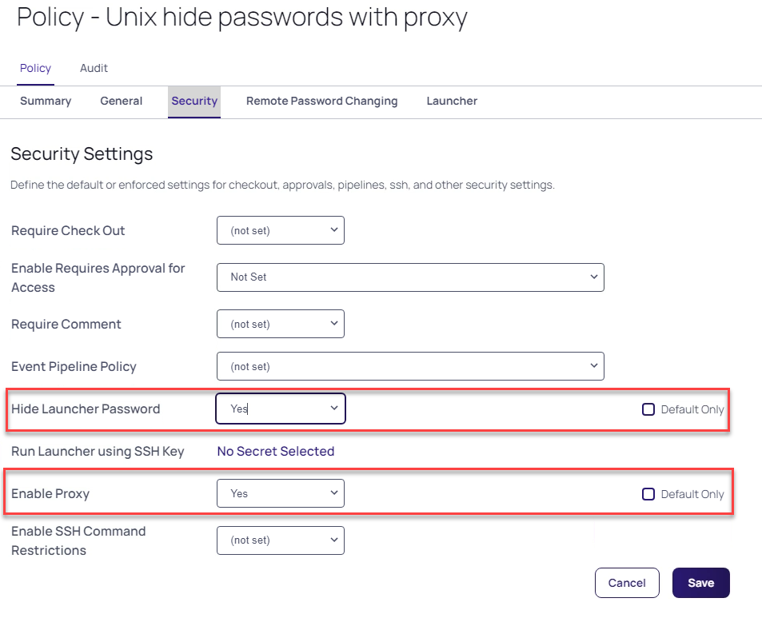
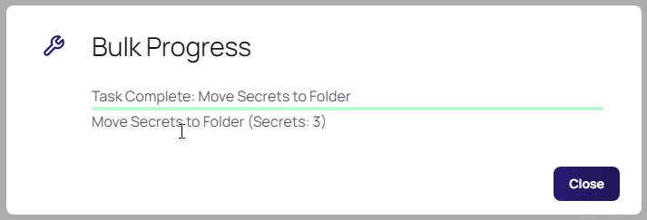
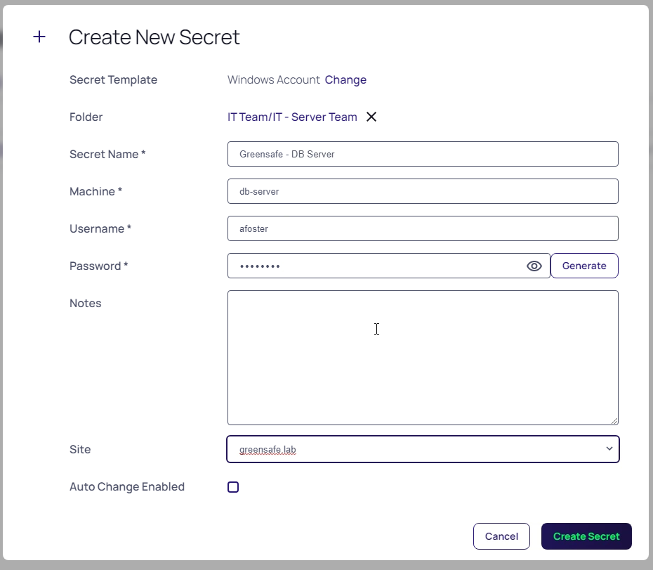
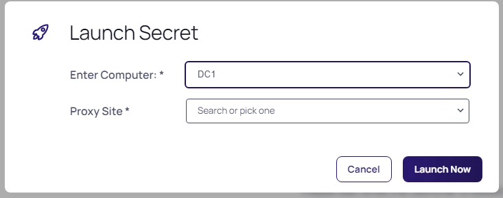

# Secrets manipulation using folders
Now that both organisations have been discovered, scanned and the proxy connection is working, it's time to start organising the secrets and corresponding access rights to secrets. The combined IT Security has been defined as following:

- IT Admins from the Thylab domain are allowed to use and see ALL secrets to access ALL servers AND must comment with checkout why they need access to the Thylab servers. After the session closes, the password needs to be rotated
- IT Admins from the Greensafe domain are allowed to ONLY see the secrets of their Legacy environment and use them on their servers and are allowed to retrieve passwords
- The UNIX admins are allowed to see ALL unix related secrets and can use them to access ALL Unix related machines but are not allowed to see the passwords
- For all users
    - all sessions (RDP and SSH) MUST run proxied

## Define policies
To make sure possibilities are enforced upon users, polices can be used. The policies can be set on a per secret bases, or in a more scalable way on folders. 

1. Stay on the Client vm
2. Navigate to **Administration >> > Actions > Secret Policies**
3. One policy already exists **IT Server Team - Domain Admin Policy**, click on the policy to see the settings. Changing between the tabs have to be done.
    - **Remote Password Changing**
        - Auto Change - Default Only - Unchecked (= Enforced)
         
          

    - **Security tab**
        - Require Checkout - Yes - Default Only - Checked
        - Custom Check Out Interval - Default - 120
        - Require Comment - Yes - Default Only - Checked

          

4. Open the Summary Tab and click **Edit**
5. Change the following for the policy
    - **Name:** Policy - Thylab comment on access to Windows secrets
    - **Description:** Comments Required for access to the secrets and check out/in, RPC enabled

    

6. Click **Save**
7. Open the **Security** tab and set the following after clicking **Edit**
    - **Require Check Out:** Yes - Default Only - Unchecked
    - **Custom check Out Interval:** 60 - Default Only - Unchecked
    - **Change Password on check In:** Yes - Default Only - Unchecked
    - **Require Comment:** Yes - Default Only - Unchecked
    - **Enable proxy:** Yes - Default Only - Unchecked

    

8. Click **Save** and click **OK** on the *Confirm* message
9. Open the **Remote Password Changing** tab and set the following after clicking **Edit**
    - Heartbeat Enabled: Yes - Default Only - Unchecked

    

6. Click **Save** and click **OK** on the *Confirm* message
7. Navigate to **Administration >> > Actions > Secret Policies**
8. Create a new policy by clicking **Add** and use the following parameters:
    - Name: Policy - Proxy all sessions
    - Description: Policy to use only proxy connections
    - Enabled: Checked
9. Open the **Security** tab and set the following after clicking **Edit**
    - **Enable Proxy:** Yes - Default Only - Unchecked

    

9. Click **Save** and click **OK** on the *Confirm* message
10. Click **Secret Policy** (in the top of the screen) to return to all the policies

    

11. Create a new policy and use the following parameters:
    - **Name:** Policy - Unix hide password with proxy
    - **Description:** Policy for Unix systems to hide passwords and use the proxy
    - **Enabled:** Checked
12. On the **Security** tab
    - **Hide Launcher Password:** Yes - Default Only - Unchecked
    - **Enable Proxy:** Yes - Default Only - Unchecked

    

13. Click **Save** and click **OK** on the *Confirm* message 

## Configure the new folder structure and policies
To be able to assign the correct rights, the folder structure needs to be more hierarchial than it is today. All is now from one organisation's PoV.
1. Navigate to **Secrets >>**
2. Right-click the *IT Team folder* and select **Edit Folder**
3. Click the *Permissions* tab and Click **Edit**
4. Add **Team_UNIXAdmins**, **Team_UNIXDBA**, Team_IT and **Team_Heldesk** by clicking them and dragging to the left where the other accounts are shown
5. Click **Save**
2. Navigate to **Secrets >> > IT Team > IT - Server Team**
3. Right-click the *IT - Server Team* folder and select **Edit Folder**
4. Click **Edit** next to *Secret Policy* and select **Proxy all sessions**
5. Click **Save**
11. Click the **Permissions** tba and click **Edit**
12. Add **Team_IT** and **Team_Helpdesk**
13. Click **Save**
14. Create a folder called **Thylab** under **IT - Server Team** by right clicking this folder and select **Add Subfolder**

    

14. Navigate back to **IT - Server Team**
15. Select the secrets *Checkout Example, RFA Example, Server team - Domain Admin* and Click **Bulk Actions** at the bottom of the screen

    

16. Click **Move To Folder**
16. Navigate to IT Team > IT - Server Team > Thylab and click **Move Secrets**

    

17. Click **Close** after the Bulk Progress is ready

    

18. Only one secret should be left in the folder **Greensafe - Domain Controller**
18. Right-click the **Thylab** folder and select **Edit Folder**
19. Click **Edit** next to *Secret Policy* and select **Policy - Thylab comment on access to Windows secrets**
20. Click **Permissions** tab
21. Click **Edit** 
22. **Uncheck** Inherit Permissions
23. Remove ALL greensafe.lab groups by clicking the Bin ico when hoovering over the account

    

24. Click **Save**
25. Right-click the *IT - Unix Team* folder and select **Edit Folder**
26. Click **Edit** next to *Secret Policy* and select **Policy - Unix hide password with proxy**
27. Click **Save**
20. Click **Permissions** tab
21. Click **Edit** 
29. Add **Team_UNIXAdmins, Team_UNIXDBA, Team_IT** and **Team_Heldesk**
30. Click Save

    

## Add secret for the Greensafe domain
1. In the *IT Secrets > IT - Server Team* folder where there is only one secret **add the following secret**
    - **Secret Template:** Windows Account
    - **Secret name:** Greensafe - DB Server
    - **Machine:** db-server
    - **Username:** afoster
    - **Password:** Centr1fy
    - **Site:** greensafe.lab

  

2. Click **Create Secret**

## Test the configuration
Now that the setup is ready to be used, testing is in order. For this test the client machine will be used.

---

**Note** The passwords as you shown in the screenshots will be different per installation and will not reflect your infrastructure

---

1. Logout the current user of the Secret Server UI by clicking the icon in the top right corner and select **Log Out**

  

2. Click **Login**
3. Login as user **krogers** with **Centr1fy** in the **Greensafe** domain
4. Kim Rogers should only see the **IT Team > IT - Unix Team** folders and the corresponding secrets

    

4. Click one of the secrets. The Password Field will not be shown as set by the policy

    

6. Open the **Security** tab
7. Scroll down and see that there is no way to make any changes to the settings
8. Navigate back to the **General** tab and run the **PuTTY launcher** and see that the proxy banner is shown. That proofs that the connection is made via the SSH proxy

    

9. Close the session using **CTRL+D**
10. Logout of the Secret Server UI by *clicking the initials KR* in the upper right corner and select **Log Out**
11. Click **Log in** and log in as **LScott** with **Centr1fy** and the **Greensafe** domain
12. She only has access to the **Greensafe Windows servers** and *can see the password*

    

13. Open the **Security** tab and see that the **Enable Proxy** is enabled and **can not be unchecked**
15. Switch back to the **General** tab and run the **RDP Launcher**
16. Close the RDP session after you see the desktop
17. Logout of the Secret Server UI by clicking the initials LS in the upper right corner and select **Log Out**
18. Login the Secret Server UI as **dhughes** with **Thycotic@2022!** and the **Thylab** domain, click **Continue** on the *Welcome screen*
19. This user should have besides the **IT - Server Team** folder also the **Thylab** folder

    

20. Navigate to the **Thylab** folder and open **Server Team - Domain Admins** secret
21. Due to the policy you have to leave a comment and check out the secret
22. Leave a comment and click **Check Out Secret**
23. Click the **EYE** icon and see the current password as that right is given

    

24. Run the RDP Launcher and select **any of the two servers** you see and select **thylab.local** as the Proxy Site then click **Launch Now**

    

    ---

    **Note** The dropdown box is due to the Secret Template that is used at the time the secret has been created. We will dive deeper into this later in the lab

    ---

24. Sign out of the RDP session after you see the Desktop
25. Check the Secret back in using **Time > Check In**

    

26. Reopen the Secret and see that the password has been changed

    

27. This is also conform the policy that we have defined and assigned to the folder

## Conclusion
As summary the three security settings:

- IT Admins from the Thylab domain are allowed to use and see ALL secrets to access ALL servers AND must comment with checkout why they need access to the Thylab servers. After the session closes, the password needs to be rotated
- IT Admins from the Greensafe domain are allowed to ONLY see the secrets of their Legacy environment and use them on their servers and are allowed to retrieve passwords
- The UNIX admins are allowed to see ALL unix related secrets and can use them to access ALL Unix related machines but are not allowed to see the passwords
- For all users
    - all sessions (RDP and SSH) MUST run proxied

During the testing of the configuration, the conclusion is that (proved by the running three scenarios using three different users) the configured policies work as requested.

.. raw:: html
  
  

  
<H1 style="color:#00FF59">This concludes this part of the lab</H1>
