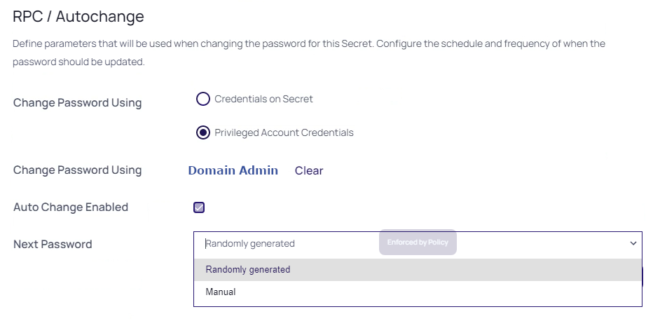
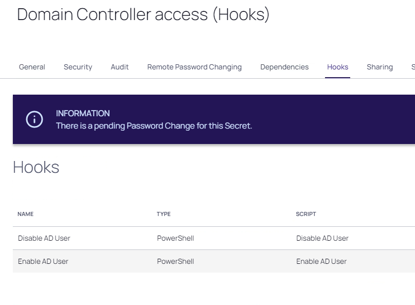

# Hooks in secrets

In addition to changing the password on check in, secret owners can also specify administrator-created PowerShell scripts, called hooks, to run before or after checkout and check in. These are accessed from the Hooks tab of the secret, which only shows if checkout is enabled and PowerShell scripts have been created by an admin.

This part of the lab will go over the following steps
1. Create scripts that we need for the check out/- in hooks
2. Create a helper secret
3. Define Hooks for a secret

The scripts that we will create are to enable an Domain account needed to connect to a Windows server on a Check Out action and disble the account on the Check In action. A reason for this might be that the account is to powerfull to be enabled all the time. By disabling the account, a possible attack or unwanted usage can be countered. The account that we are going to use is **thylab\adm_serverteam3**. 

---

**NOTE**
This is just an example. As the programming language is going to be PowerShell, much more powerfull routines can be created on Checkou/-In situations

---


## Create the scripts

1. While still being on the Client VM, navigate to **Administration >> > Actions > Scripts: PowerShell, SQL, SSH**
2. Click **+ Create New**

  

3. Use the following information for the fields:
   - **Name:** Enable AD User
   - **Description:** Enabling AD User
   - **Category:** Password Changing
   - **Script:** Copy the below snipplet

     ```powershell
         [System.Net.ServicePointManager]::SecurityProtocol = [System.Net.SecurityProtocolType]::Tls12
         $GetUserStatus = Get-ADUser -Identity $Args[0]
         if ($GetUserStatus.Enabled -eq $false){
             $GetUserStatus | Set-ADUser -Enabled $true}
         
         Else {
             return
             }    
     ```
    
    

4. Click **OK** to save the script
5. Click **+ Create New**
6. Use the following information for the fields:
   - **Name:** Disable AD User
   - **Description:** Disabling AD User
   - **Category:** Password Changing
   - **Script:** Copy the below snipplet

     ```powershell
         [System.Net.ServicePointManager]::SecurityProtocol = [System.Net.SecurityProtocolType]::Tls12
         $GetUserStatus = Get-ADUser -Identity $Args[0]
         if ($GetUserStatus.Enabled -eq $true){
             $GetUserStatus | Set-ADUser -Enabled $false}
         
         Else {
             return
             }    
     ```
    
    

7. Click **OK** to save the script
8. Two scripts should now be shown

    

---

**NOTE**
To prepare the environment for PowerShell remote executinon, the following steps have been run on the Domain Controller (DC1 -> Domain GPO). [PowerShell and Delinea Secret Server](https://docs.delinea.com/ss/11.1.0/authentication/configuring-credssp-for-winrm-with-powershell/index.md). As the DE will run the PowerShell commands, we have installed RSAT on the RabbitMQ server and added the account (thylab\svc_secretserver) to the Remote Management User group.

---

## Create a helper Secret

As we are trying to change the password for a member of the Domain Admins group, only a Domain Admin is entitled to do so ([Protected Groups and Security Descriptor Propagator](https://social.technet.microsoft.com/wiki/contents/articles/22331.adminsdholder-protected-groups-and-security-descriptor-propagator.aspx)). Create a new secret for the Domain admin using the following parameters in **Secrets >> > TSS Service Accounts**:

- **Secret Template:** Active Directory Account
- **Secret Name:** Domain Admin
- **Domain:** thylab
- **Username:** administrator
- **Password:** Thycotic@2022!
- **Site:** Local
## Create a secret with hooks
This part is where we are going to use the scripts and the helper Secret. First we need to create a secret and then we define the hooks that need to be assigned. Lastly we are going to test the secret and the hooks.
### Create the secret
1. Navigate to **Secrets >> > IT - Team > IT - Server team > Thylab**
2. Create a new secret with the following parameters:

   - **Secret Template:** Active Directory Account
   - **Secret Name:** ADM_ServerTeam3
   - **Domain:** thylab
   - **Username:** adm_serverteam3
   - **Password:** Thycotic@2022!
   - **Site:** Local

   

3. Click **Create Secret**
4. Due to the policy, click **Comment**, provide some comment and click **Check Out**
5. Open the **Remote Password Changing** tab and click in the *RPC / Autochange* section , **Edit** 
6. Check the *Privileged Account Credentials* and slect the **Domain Admin** secret
7. Set the *Next Password* to **Randomly Generated**

   

6. Click **Save**

### Test the secret
1. Check the Heartbeat status of the secret. If that is Success, your all good to proceed to the next paragraph. 

   

---

**Only If not successfull** make sure that your solve the issue by:

1. Launch the RDP Launcher and make sure we can login to the **DC1** with the Site set to **thylab.local** using the secret.
2. If the connection fails, open the DC Console, and login using the **THYLAB\Administrator** account and reset the **adm_serverteam3** password using **Active Directory Users and Computers**. Make sure the password matches **Thycotic@2022!**. The account can be found in the DemoAccounts OU. Leave the DC1 console open as we need it in a bit.
   
3. Check the password in the secret for any typos.
3. Do not proceed before the RDP session works AND the Heartbeat is successfull.

---

4. If you haven't opened the DC console open it now.

### Assign the hooks


1. Open the **Hooks** tab
2. Click **Create New Hook**
3. In the DropDown box, select under *PowerShell*; **Enable AD User**

    

4. Click **Save**
5. Fill out the following parameters in the next screen that pops up:
   - **PRE/POST:** POST
   - **Event Action:** Check Out
   - **Name:** Enable AD User
   - **Description:** Enable AD User
   - **Arguments:** $USERNAME
   - **Privilgede Account:** Domain Admin

    

6. Click **Save**
2. Click **Create New Hook**
3. In the DropDown box, select under *PowerShell*; **Disable AD User**
4. Click **Save**
5. Fill out the following parameters in the next screen that pops up:
   - **PRE/POST:** POST
   - **Event Action:** Check In
   - **Name:** Disable AD User
   - **Description:** Disable AD User
   - **Arguments:** $USERNAME
   - **Privilgede Account:** Domain Admin

6. Click **Save**
7. There should now be two hooks available
    
   

8. Click the time and select **Check in**
9. Switch to the DC1 console and open the **Active Directory Users and COmputers** UI
10. Navigate to **thylab.local > DemoAccounts** and you should see the adm_serverteam3 account as being disabled (the down pointing arrow)
    
    

11. Switch back to the client and open the secret again you just created
12. Enter **Enter Comment** and click the **Checkout Secret**
13. Without doing anything, switch back to the DC1 console and refresh the UI
14. The account will no be enabled due to the checkout of the secret

    

15. Check the secret back in

As you have seen in this part of the lab, PowerShell scripts can be used to do some powerfull stuff. In this case it was "just" en-/disable an account on Checkout, but there are lots of other things that can be done. Think about a script which creates a firewall change using an API call so the user can login to the SSH server that is behind this firewall. After the secret has been checked-in the change will be reverted.


.. raw:: html
  
  <HR>
  <center><H1 style="color:#00FF59">This concludes this part of the lab</H1></center>