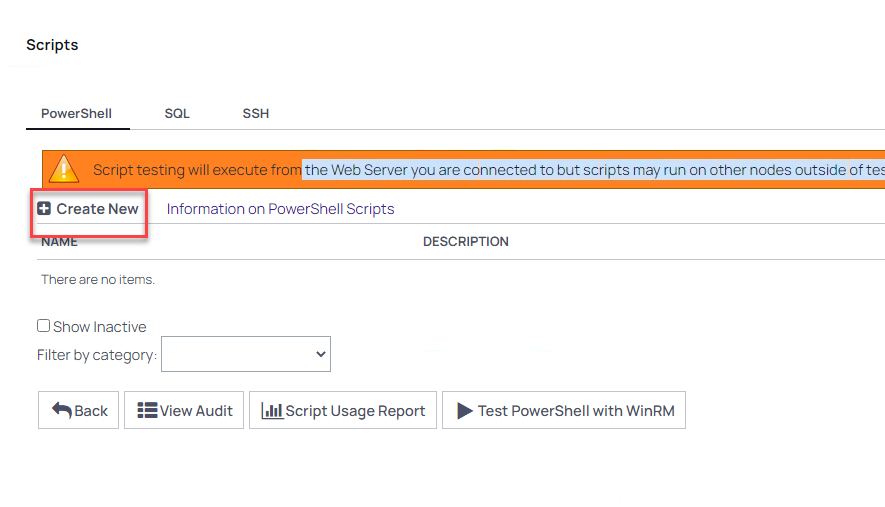
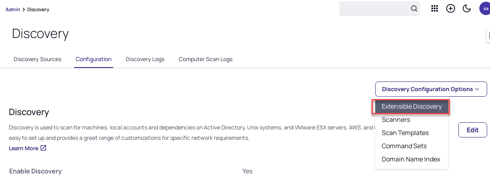
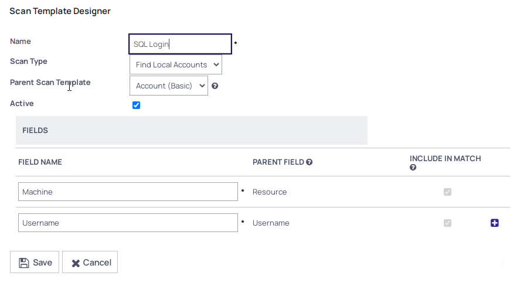
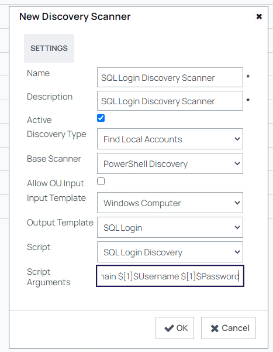
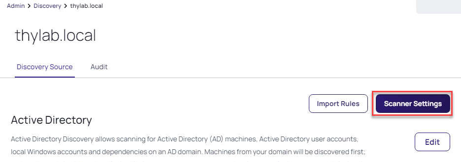
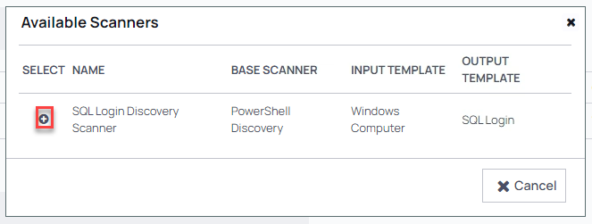
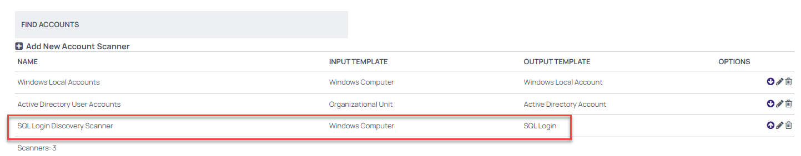
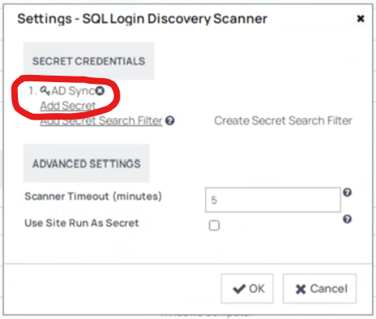
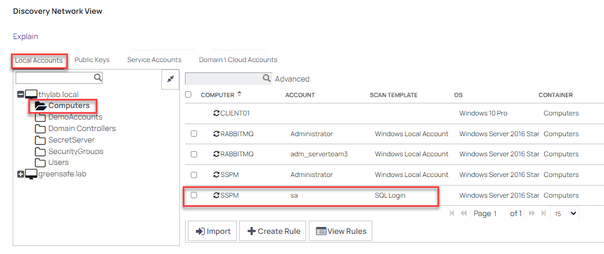

# Custom Discovery

For this part of the lab we are going to Scan for the SQL Server logins that have been defined in the Database that the SSPM server is using. The floowing steps are to be taken:

1. Create a new PowerShell Script
2. Create a new Scan Template
3. Create a new Discovery Scanner that uses the Scan Template and the PowerShell script
4. Run the Discovery scanner

## Create the PowerShell script

1. While still being on the Client VM, navigate to **Administration >> > Actions > Scripts: PowerShell, SQL, SSH**
2. Click **+ Create New**

  

3. Use the following information for the fields:
   - **Name:** SQL Login Discovery
   - **Description:** SQL Login Discovery Scanner
   - **Category:** Discovery Scanner
   - **Script:** Copy the below snipplet

   ``` powershell

         <#
          .SYNOPSIS
          Discovery script for finding all SQL Logins on a the target machine
          .EXAMPLE
          Expected arguments: $TARGET $[1]$DOMAIN $[1]$USERNAME $[1]$PASSWORD
          .EXAMPLE
          Expected arguments: $TARGET $[1]$USERNAME $[1]$PASSWORD
          Use lines 32/33 or 36/37 based on account type
          .NOTES
          Depends upon dbatools module being installed on the Secret Server Web Node or the Distributed Engine
          Reference: https://www.powershellgallery.com/packages/dbatools/
          Tested with version 1.0.107
          logPath variable below used for troubleshooting if required, file is written to this path with errors.
          A file for each server will be created, and overwritten on each run.
      #>
      $logPath = 'C:\scripts'
      echo $args[1]+"\"+$args[2]
      $TargetServer = ($args[0].Split("."))[0]
      
      $logFile = "$logPath\$($TargetServer)_findsqllogins.txt"
      Write-Output "[$(Get-Date -Format yyyyMMdd)] Processing Targeting machine: $TargetServer" | Out-File $logFile -Force
      
      <# Based on credential type of argument #>
      # Windows Domain with domain name
      $Username = $args[1]+"\"+$args[2]
      $Password = $args[3]
      
      # Windows Domain without domain name
      #$Username = $args[1]
      #$Password = $args[2]
      
      # Using SQL Login Account privileged account
      # $Username = $params[1]
      # $Password = $params[2]
      
      if ( $Username -and $Password ) {
          $passwd = $Password | ConvertTo-SecureString -AsPlainText -Force
          $sqlCred = New-Object System.Management.Automation.PSCredential -ArgumentList $Username,$passwd
          Write-Output "[$(Get-Date -Format yyyyMMdd)] Using Privileged Account: $($sqlCred.Username)" | Out-File $logFile -Force
      }
      
      $ProgressPreference = 'SilentlyContinue'
      if (-not (Get-InstalledModule dbatools)) {
          Write-Output "[$(Get-Date -Format yyyyMMdd)] dbatools module not found" | Out-File $logFile -Force
          throw "The module dbatools is required for this script. Please run 'Install-Module dbatools' in an elevated session on your Distributed Engine and/or Web Node."
      } else {
          Import-Module dbatools -Force
          <# disable dbatools commands attempting to resolve the target name #>
          $null = Set-DbatoolsConfig -FullName commands.resolve-dbanetworkname.bypass -Value $true
      }
      
      <# Find all the SQL Server instances #>
      try {
          <# Depends upong Discovery Account #>
          $p = @{
              ComputerName    = $TargetServer
              ScanType        = 'SqlService'
              EnableException = $true
          }
          $sqlEngines = Find-DbaInstance @p
          Write-Output "[$(Get-Date -Format yyyyMMdd)] SQL Instances found: $($sqlEngines.SqlInstance -join ',')" | Out-File $logFile -Force
      } catch {
          if (Test-Path $logPath) {
              Write-Output "[$(Get-Date -Format yyyyMMdd)] Issue finding SQL Instances on $TargetServer - $($_.Exception.Message)" | Out-File $logFile -Force
          } else {
              Write-Output "[$(Get-Date -Format yyyyMMdd)] Issue finding SQL Instances on $TargetServer - $($_.Exception.Message)"
          }
          throw "Issue finding SQL instances on $TargetServer - $_"
      }
      
      if ($sqlEngines) {
          foreach ($engine in $sqlEngines) {
              $sqlInstanceValue = $engine.SqlInstance
              try {
                  <#
                      Connect to each instance found
                  #>
                  $p = @{
                      SqlInstance   = $sqlInstanceValue
                      SqlCredential = $sqlCred
                      ErrorAction   = 'Stop'
                  }
                  try {
                      $cn = Connect-DbaInstance @p
                      Write-Output "[$(Get-Date -Format yyyyMMdd)] Connected to SQL Server Instance: $sqlInstanceValue" | Out-File $logFile -Force
                  } catch {
                      if (Test-Path $logPath) {
                          Write-Output "[$(Get-Date -Format yyyyMMdd)] Issue connecting to $sqlInstanceValue - $($_.Exception.Message)" | Out-File $logFile -Force
                      } else {
                          Write-Output "[$(Get-Date -Format yyyyMMdd)] Issue connecting to $sqlInstanceValue - $($_.Exception.Message)"
                      }
                      continue
                  }
      
                  <#
                      Find the logins on the instance
                  #>
                  $p = @{
                      SqlInstance     = $cn
                      Type            = 'SQL'
                      ExcludeFilter   = '##*'
                      EnableException = $true
                  }
                  $logins = Get-DbaLogin @p
                  Write-Output "[$(Get-Date -Format yyyyMMdd)] SQL Server Logins count: $($logins.Count)" | Out-File $logFile -Force
              } catch {
                  if (Test-Path $logPath) {
                      if (Test-Path $logFile) { $append = $true }
                      Write-Output "[$(Get-Date -Format yyyyMMdd)] Issue connecting to $sqlInstanceValue - $($_.Exception.Message)" | Out-File $logFile -Append:$append
                  } else {
                      Write-Output "[$(Get-Date -Format yyyyMMdd)] Issue connecting to $sqlInstanceValue - $($_.Exception.Message)"
                  }
                  continue
              }
      
              <# Output object for Discovery #>
              foreach ($login in $logins) {
                  Write-Output "[$(Get-Date -Format yyyyMMdd)] SQL Server Login found: $login" | Out-File $logFile -Force
                  [PSCustomObject]@{
                      Machine  = $login.Parent.Name
                      Username = $login.Name
                  }
              }
              return [PSCustomObject]
          }
      }
   ```
2. Click **Ok**

## Create a new scan template

1. Navigate to **Adminitration >> >Actions > Discovery**
2. Open the **Configuration** tab
3. Click **Discovery Configuration Options > Extensible Discovery**
   
   

4. Click in the *Scan Templates* **Configure Scan Templates** and open the **Accounts** tab
5. Click **+ Create New Scan Template**
6. Use the following parameters for the new screen that appears:

   1. **Name:** SQL Logins
   2. **Scan Type:** no change
   3. **Parent Scan Template:** no change
   4. **FIELD NAME** Fill out the following

      **Machine**
      **Username**

  The configuration should look like the below screenshot:

   

7. Click **Save**
  
## Create a new Discovery scanner

1. Navigate to **Adminitration >> >Actions > Discovery**
2. Open the **Configuration** tab
3. Click **Discovery Configuration Options > Extensible Discovery**
4. In the *Discovery Scanners* section click **Configure Discovery Scanners**
5. Click the **Accounts** tab and click **+ Create New Scanner**
6. Provide the following parameters for the new scanner

   - **Name:** SQL Login Discovery Scanner
   - **Description:** SQL Login Discovery Scanner
   - **Active:** Checked
   - **Discovery Type:** Find Local Accounts
   - **Base Scanner:** PowerShell Discovery
   - **Allow OU Input:** unchecked
   - **Input Template:** Windows Computer
   - **Output Template:** SQL Login
   - **Script:** SQL Login Discovery
   - **Script Arguments:** $target $[1]$Domain $[1]$Username $[1]$Password

   

7. Click **Ok**

## Run the new Discovery Scanner

Now that we have paved the way, we need to tell the Discovery Scanner to also run the new Scanner.

1. Navigate to **Administration >> > Discovery**
2. Click the **thylab.local** domain and click **Scanner Settings**

   

3. In the *FIND ACCOUNTS* section, click **+Add New Account Scanner**
4. Click on the **+** symbol to add the scanner

   

5. Click **OK**
6. The new scanner should be mentioned in the list of *FIND ACCOUNTS*

   

7. Click the Pencil icon next to the right of the line that mentions **SQL Login Discovery Scanner**
7. In the next screen click **Add Secret** and select the AD Sync secret

   

7. Click on **OK** now the Scanner will be run using the set secret

7. Click the **BACK** button the return back to the domain
7. Open the Windows Explorer and create a folder on the **C:\\** called **scripts**
7. Back in the Secret Server UI, in the top of the screen, click **Admin > Discovery**
9. Click **Run Discovery Now > Run Computer Scan** to run the scanner including the SQL Scanner
10. Wait till the Computer Scan has ended. It should read **Just Now**
11. Click on **Discovery Network View**
12. In the new window, make sure you have **Local Accounts** selected and click **Computers** in the **thylab.local** domain
13. In the Line that shows SSPM you will see the **sa** account and **SQL Login** as the scan template

    

14. Click **Back** to return back to the Discovery overview

---

**Remark**

Using this method, Extensible (custom) Discovery, anything that can be "discovered" by using a PowerShell script, can be created for resources which are not available Out-Off-The-Box. To read more on Extensible (Custom) Discovery, including some examples, can be found [here](https://docs.thycotic.com/ss/11.1.0/discovery/extensible-discovery/index.md).

---


  
  <HR>
  <center><H1 style="color:#00FF59">This concludes this part of the lab</H1></center>