# Custom Remote Password Changer

Secret Server has already the most common password changers built-in. In some cases the available password changers are not enough and a custom one has to be created. This lab will show the process of creating such a custom Remote Password Changer (RPC) for the VyOS router that is conncting the two domain and the internet together. The following steps will be explained:

1. Create a RPC
2. Create a new Secret Templates and use the RPC
3. Create a new secret with the newly created Secret Template

## Create a RPC

1. Navigate go **Administration >> > Actions > Remote Password Changing Configuration**
2. Click **Configure Password Changers**

   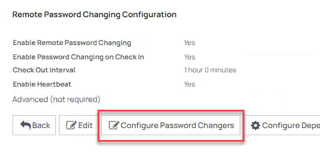

3. Scroll all the way down and clik **+ New**
4. As *Base Password Changer* slect **Unix Account Custom (SSH)** and name it **VyOS router**

   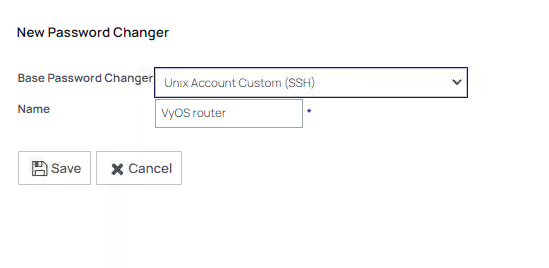

5. Click **Save**
6. In the new screen in the *Password Change Commands* use the following parameters (**leave all settings default unless told otherwise!!!**):

   - **Remove all current Commands by clicking the delete icon (metal bin)**

     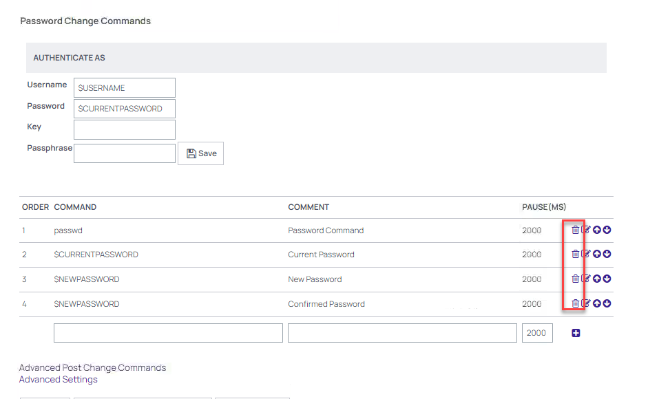
   - Use the following commands (add new by clicking the **+** symbol at the end of the command):

     | Command                                                                          | Comment                 | Pause |
     |----------------------------------------------------------------------------------|-------------------------|-------|
     | configure                                                                        | Open configuration mode | 2000  |
     | set system login user \$USERNAME authentication plaintext-password \$NEWPASSWORD | Set the new password    | 2000  |
     | commit                                                                           | Commit the change       | 2000  |
     | save                                                                             | Save the change         | 2000  |
     | exit                                                                             | Leave the config mode   | 2000  |

7. The configuration should look like the below screenshot

   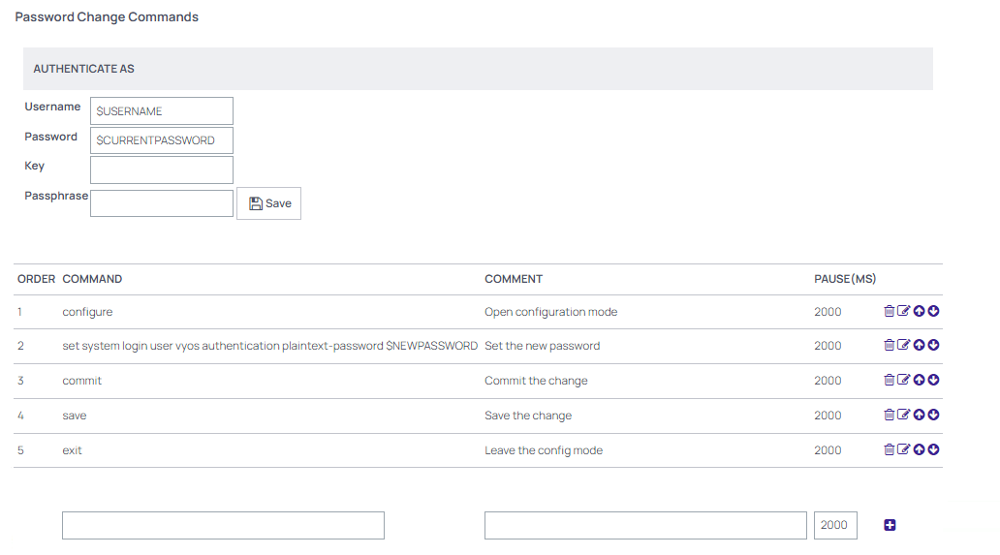

8. Click **Back**
9. In the new screen, Click the **left** **Test Action** button to check that we can use the connection with some paramters. Use the following parameters:
   
   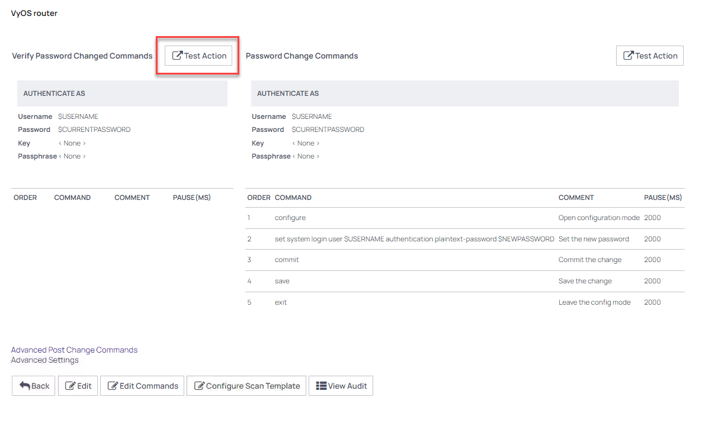

   - **Username:** vyos
   - **Password:** Thycotic@2022!
   - **MACHINE:** vyos.thylab.local
   - **Leave the rest of the fields default**

   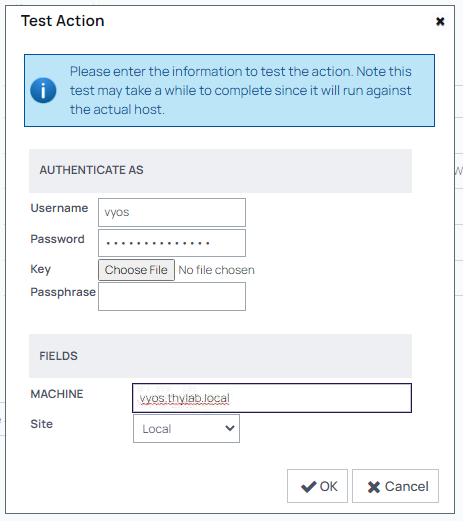

10. Click **OK**. This will run the test and should return **Password Verify was Successful**

    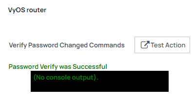

11. Click the **right** **Test Action** button to check the commands provided to change the password
12. Use the following parameters in the fields:

    - **Username:** vyos
    - **Password:** Thycotic@2022!
    - **MACHINE:** vyos.thylab.local
    - **$USERNAME:** vyos
    - **$NEWPASSWORD:** Delinea/4u
    - **Leave the rest of the fields default**

    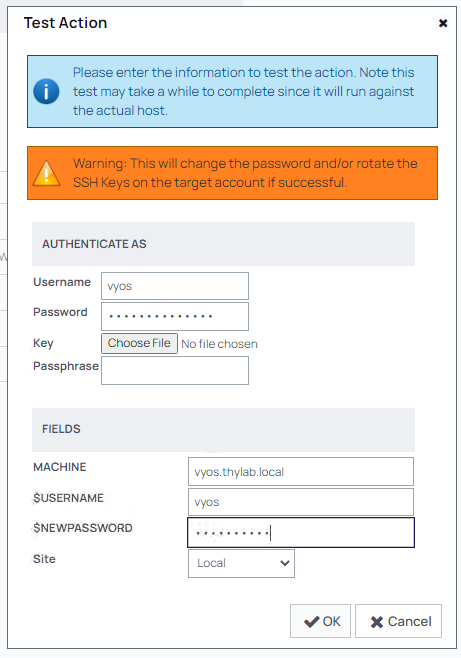

13. Click **OK** to test the built RPC. After a few seconds you will receive **Console Output** message in green meaning this test was successful

    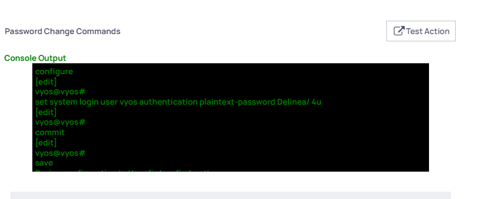


14. Click the **left** **Test Action** button again to check that we can use the connection with the new password. Use the following parameters:
   
    - **Username:** vyos
    - **Password:** Delinea/4u
    - **MACHINE:** vyos.thylab.local
    - **Leave the rest of the fields default**

15. This should result in a successful **Password verify**
16. Rerun the **right** **Test Action** button and set the password back to **Thycotic@2022!** so we are back at the beginning situation.As the RPC is now working

Now that the RPC is working, the next step is to create anew Secret Template that is going to be used for the secret for the VyOS router

## Create a Secret Template and use the RPC

1. Navigate to **Administration >> > Actions > Secret Templates**
2. Click **Create Template** and use the **Name** VyOS - Custom RPC

   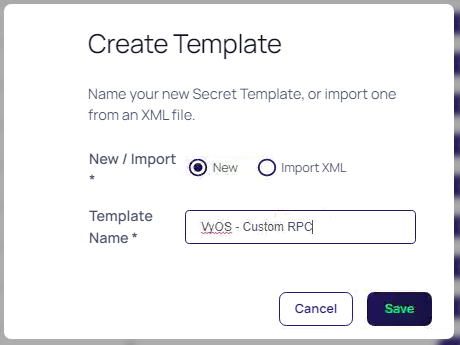

3. Click **Save**
4. In the new screen click the *Fields* tab and click **Add Field**
5. Use the following parameters:

   - **Name:** Username
   - **Field Slug Name:** *Auto populated*
   - **Description:** Username
   - **Data Type:** Text

   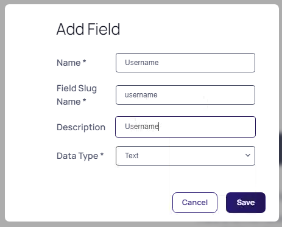

6. Click **Save**
7. Repeat steps 4 til 6 and use the following parameters

   | Name     | Field Slug Name | Description  | Data Type |
   |----------|-----------------|--------------|-----------|
   | Password | password        | Password     | Password  |
   | Machine  | machine         | Machine name | Text      |

8. The fields definition should look like the below screenshot

   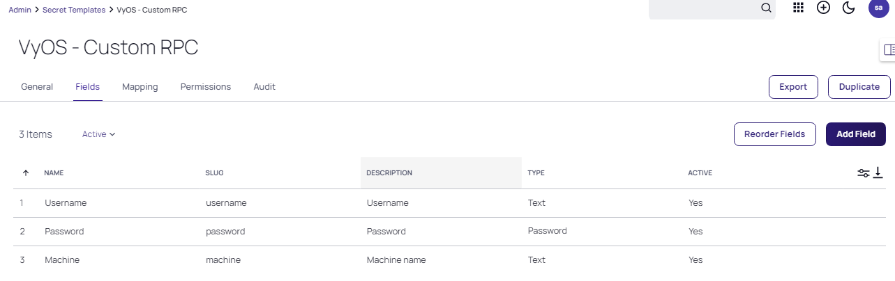

9. Click the *Mapping* tab and click **Edit**
10. Enable RPC by setting the checkbox
11. Set the following parameters:

    - **Password Type to use:** VyOS router *(the name of the created RPC)*
    - **Machine Name:** Machine
    - **Password:** Password
    - **User Name:** Username

    

12. Click **Save**
13. Click **Add Mapping** to add a launcher to the Template
14. Select **PuTTY** in the mapping type and map the fields to the required information (Port; use default and set 22)

    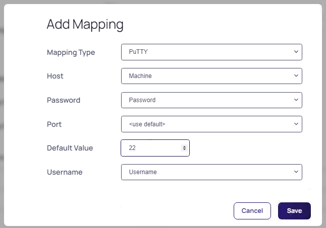

15. Click **Save**

Now that we have the RCP assigned to a newly created Secret Template it is time to create the secret for the VyOS Router

## Create the secret

1. Navigate to **Secrets >> > IT Team > IT - Server Team > Thylab**
2. Create a new secret from the new Secret Template named **VyOS - Custom RPC**

   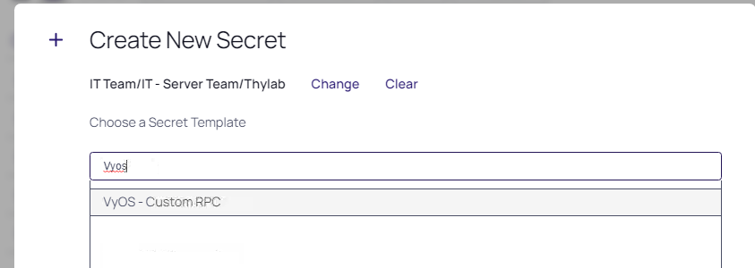

3. Name the new secret **VyOS - Router - Custom RPC**
4. Fill out the rest of the fields using the known information. The secret should look like the below screenshot

   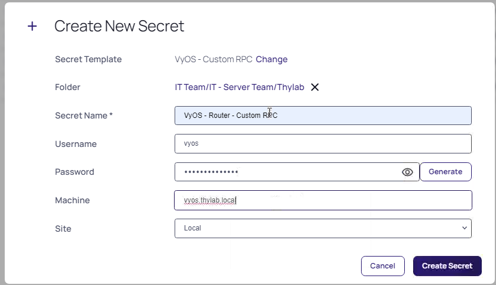

5. Click **Create Secret**
6. As there is a policy on the folder, click **Enter Comment**, give some information and click **Check Out Secret** to open the secret
7. Run the **PuTTY Launcher** to check we can connect to the VyOS router. THis will open a SSH session and the console shold be shown.

   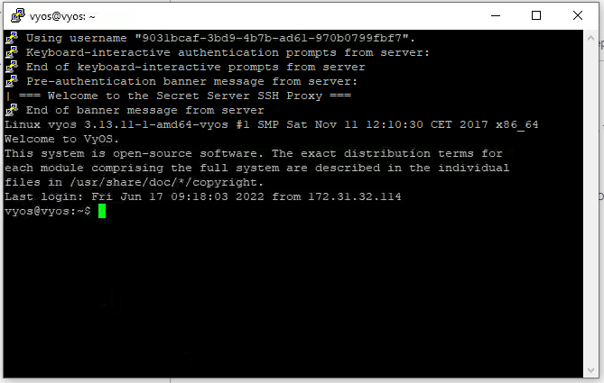

8. Close the session by using ```<CTRL>+d```
9. Click the EYE icon next to the password to see the password and try to remember it.
   
   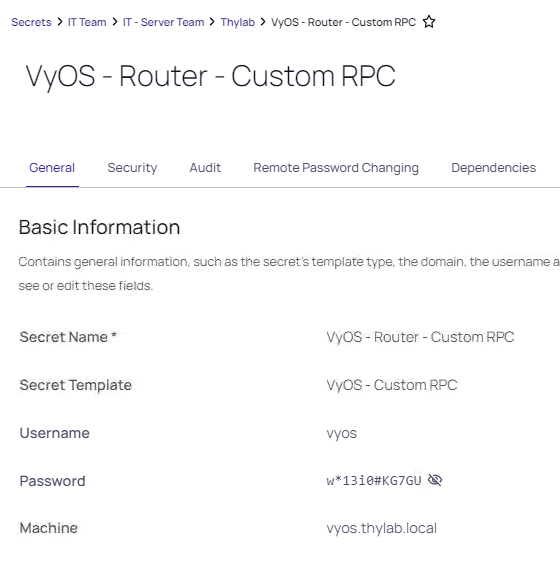

10. The policy has stated that on Check in the password MUST be changed. Click the **Time left** and click **Check In** this will trigger a password reset and wait approx. 30 seconds before proceeding. The RPC needs 20 seconds to run (*2000ms per command as stated in the RPC Pause*).

    ---
    
    **Note**
    If you don't wait the 30 seconds, a message is shown that there is a *pending password change*. After this has run successfully, you will be forced to do a Check Out again!
    
    ---

11. Open the secret again, click **Enter Comment**, give some information and click **Check Out Secret**
12. Click the EYE icon next to the password to see the new password that has been set. 

   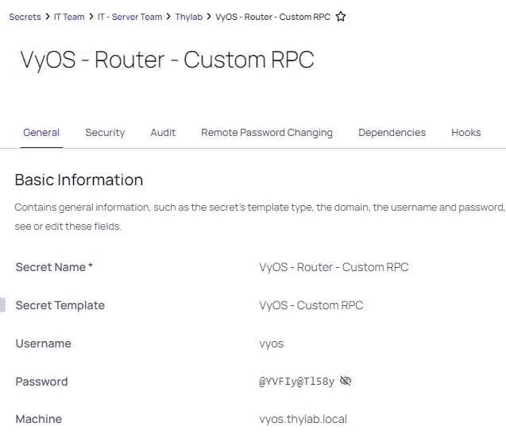

13. Run the **PuTTY Launcher** to make sure it works using the new password. This will open the console to the VyOS router as shown earlier, but now using the new password.

As you have found, it is relatively easy to create your own RPCs. Especially in situation where the default, or OOTB, RPCs are not enough this can come in handy...

.. raw:: html
  
  <HR>
  <center><H1 style="color:#00FF59">This concludes this part of the lab</H1></center>